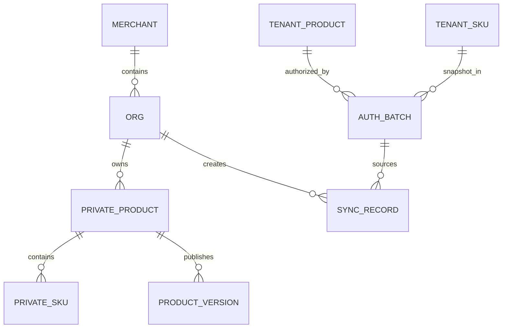

# 商户端商品中心 PRD

| 项目 | 内容 |
| --- | --- |
| 文档名称 | 商户端商品中心 PRD |
| 版本 | V1.0 |
| 日期 | 2026-09-20 |
| 适用范围 | 食联网数智餐饮平台 · 商户端「商品中心」 |
| 关联文档 | 《租户端商品中心下放与半成品标准食材生成 PRD》V1.0、《数智餐饮运营管理平台—商品中心 PRD》V1.1、《租户端菜谱管理与授权 PRD》V2.0、《商户端菜谱管理 PRD》V1.0 |
| 配套原型 | 商户端原型 `原型线上发布/merchant` |
| 文档性质 | 第一期产品需求基线（页面 / 筛选 / 字段 / 交互级） |

## 1. 文档目的与范围

本文档定义商户端新增一级菜单【商品中心】的产品规格，覆盖信息架构、页面结构、列表字段、筛选项、按钮、交互流程、校验规则、数据来源与状态流转。

本文档的定位：

- 与《租户端商品中心下放与半成品标准食材生成 PRD》配套：租户端负责「维护运营商品与SKU并向商户授权」，商户端负责「按组织同步、落地并独立经营使用」。
- 商户端商品中心的操作方式与「菜谱中心 → 菜谱管理」保持一致，核心链路为 **授权 → 同步 → 组织私域**。
- 商户端不维护品牌库与分类库，这两项由租户统一维护，商户端只读。
- 商户端不设置【标准食材】与【商品授权】栏目：前者不承担维护职责，后者商户无下游授权对象。

### 1.1 事实来源标注约定

本文档对关键条目标注来源等级，避免把决策、上游规则与原型实现事实混为一谈：

| 标记 | 含义 |
| --- | --- |
| **【已确认】** | 本轮业务方已明确拍板的决策，可直接实现与验收 |
| **【PRD】** | 来自上游 PRD 的已确认业务规则 |
| **【原型】** | 来自当前原型代码的实现事实，证明「现在是怎么做的」，不自动等于业务要求 |
| **【待确认】** | 无已确认来源，需业务方补充；不得按惯例推断 |

### 1.2 术语

| 术语 | 定义 |
| --- | --- |
| 商户 | 租户授权商品的下游经营主体；一个账号可关联多个商户 |
| 组织 | 商户下的食堂、档口等经营单元；商品与SKU按组织隔离 |
| 运营商品（SPU） | 租户端创建并维护的商品主体，数据归属租户 |
| SKU | 运营商品或私域商品下具有明确包装、下单、验收、库存和换算规则的可采购单元 |
| 授权批次 | 租户将已发布且上架的运营商品 SKU 开放给指定商户的业务记录 |
| 授权SKU快照 | 授权发生时固化的 SKU 版本数据，不随租户后续修改自动变化 |
| 可同步范围 | 租户已授权给当前商户、但当前组织尚未同步的 SKU 集合 |
| 同步 | 当前组织将可同步范围内的 SKU 复制为本组织私域商品与私域SKU的行为 |
| 私域商品 | 当前组织自行创建、或从授权范围同步形成的商品，归当前组织所有，可独立增删改 |
| 私域SKU | 私域商品下的可采购、可下单单元 |
| 上游编码 | 同步时来源运营商品 / SKU 的编码，仅用于追溯与对账，前端不展示 |
| 上游版本 | 同步时来源 SKU 快照的版本号，仅用于来源追溯展示；**不追踪上游最新版本，不做任何更新提醒**（**【已确认】**） |
| 标准食材生成状态 | 半成品商品在平台侧写入标准食材的结果，由另一套逻辑产出，商户端只读 |

### 1.3 本期不包含

- 商品审批流程；
- 商户维护租户品牌、分类（商户端只读）；
- 租户版本自动覆盖组织私域商品；
- 上级组织自动向下级组织继承商品；
- 组织之间共享、复制或下发商品（【已确认】不允许）；
- 商户端向任何下游主体授权商品；
- 商户端触发平台标准食材生成（半成品写入平台标准食材由另一套逻辑处理）；
- 商品成本核算、定价、采购单据、库存台账；
- 商品与菜谱、排餐、菜单的联动引用。

## 2. 角色与数据范围

### 2.1 组织数据隔离

商户下每个组织拥有**独立的私域商品库与SKU库**。

| 规则 | 说明 |
| --- | --- |
| 数据范围 | 页面数据范围以顶部当前组织为准 |
| 组织切换 | 切换组织后，商品列表、SKU列表、发布记录、筛选结果与待同步数量全部随之切换 |
| 上下级独立 | 上级组织同步商品，不代表下级组织自动拥有 |
| 修改隔离 | 不同组织对同一来源商品的修改互不影响 |
| 禁止共享 | 组织不能把私域商品共享或复制给其他组织（含下级组织）**【已确认】** |
| 数据归属 | 私域商品与私域SKU必须记录 `merchant_id` 与 `org_id` |

### 2.2 组织切换交互

用户在编辑商品或同步选择过程中切换组织时：

1. 提示「当前未保存内容或已勾选内容将丢失」；
2. 用户确认后切换；
3. 切换后重新加载目标组织的商品库、SKU库、发布记录与待同步数量。

### 2.3 组织提示条

商品中心各列表页顶部固定展示当前组织与提示：

> 当前组织：{组织名称}　商品与SKU数据仅属于当前组织；上级组织同步不代表下级组织自动拥有。

## 3. 数据来源与端级职责

### 3.1 商品来源只有两种

商户端商品与SKU列表来源**只有**以下两种，不展示「只读」「可编辑」「商户版本」「自主维护」等附加权限标签。

| 来源 | 定义 | 生成方式 |
| --- | --- | --- |
| 租户授权 | 由租户授权、并经当前组织**主动同步**形成的组织私域商品 | 在「同步商品」抽屉中勾选同步 |
| 自建 | 当前组织自行创建的商品 | 「＋ 新建商品」 |

补充规则：

- 租户授权来源的商品在同步后**已成为当前组织自己的商品**，与自建商品一样可独立编辑、发布、下架和删除；
- 删除租户授权来源商品后，若授权仍有效且源商品仍满足同步条件，该商品重新进入可同步范围；
- 列表不区分展示权限差异，避免用户误以为租户授权来源的商品不可修改。

### 3.2 端级职责矩阵

| 对象 | 运营端 | 租户端 | 商户端 |
| --- | --- | --- | --- |
| 平台标准食材 | 保留后台能力，不经商品中心开放 | 只读查看 | 商品表单中只读选择（毛菜 / 净菜） |
| 运营商品 / SKU | 不可维护 | 创建、维护、发布、下架 | 只读，仅在授权范围内可见 |
| 品牌、分类 | 不可维护 | 租户私有，可维护 | **只读**，仅可选择 |
| 商品授权 | 不可 | 授权给所属商户 | 不可 |
| 同步商品 | 不可 | 不可 | 按组织同步，形成私域商品与私域SKU |
| 私域商品 / SKU | 不可 | 不可 | 创建、编辑、发布、下架、删除 |
| 发布记录 | 不可 | 查看本租户记录 | 查看本组织记录 |
| 半成品标准食材生成 | 不可 | 创建 / 改名时自动触发 | 只读查看生成状态 |

### 3.3 数据归属

| 业务对象 | 数据范围 | 归属规则 |
| --- | --- | --- |
| 私域商品 | 商户 + 组织隔离 | 必须记录 `merchant_id`、`org_id` |
| 私域SKU | 商户 + 组织隔离 | 继承所属私域商品的 `merchant_id`、`org_id` |
| 组织商品发布版本 | 商户 + 组织隔离 | 归属私域商品及当前组织 |
| 同步记录 | 商户 + 组织隔离 | 记录来源授权批次、来源商品 / SKU、上游版本 |
| 品牌、分类 | 租户隔离 | 商户端只读，不在商户侧落主数据 |
| 品牌名称、分类路径快照 | 随私域商品保存 | 租户后续修改不反向改写已保存快照 |
| 授权SKU快照 | 租户隔离 | 商户端只读，用于同步与来源追溯 |

### 3.4 只读数据依赖

商户端商品中心依赖三类只读数据，均**实时读取**上游：

| 数据 | 来源 | 商户端行为 |
| --- | --- | --- |
| 品牌 | 所属租户品牌库 | 只读选择；商品保存品牌名称快照（**【已确认】**） |
| 分类 | 所属租户分类库（三级） | 只读选择；商品保存分类路径快照（**【已确认】**） |
| 标准食材 | 全平台标准食材库 | 毛菜 / 净菜只读选择，不提供新增、编辑、删除入口（**【已确认】**） |

## 4. 入口与页面结构

### 4.1 导航入口

商户端侧边栏新增一级菜单【商品中心】，与【菜谱中心】平级。

```
商品中心
├─ 运营商品
├─ SKU中心
├─ 发布记录
├─ 品牌库
└─ 分类库
```

面包屑：`商品中心 / 运营商品`（其余页面按二级栏目替换末级）。

### 4.2 页面清单

| 页面 | 进入路径 | 形态 |
| --- | --- | --- |
| 运营商品 | 侧边导航「商品中心 → 运营商品」 | 列表页 |
| 新建 / 编辑商品 | 运营商品 →「＋ 新建商品」/ 行内「编辑」 | 先居中弹窗（加工形态 + 关联食材），再右侧全高抽屉（三步向导） |
| 商品详情 | 运营商品 → 行内「查看」 | 右侧抽屉（只读） |
| 同步租户授权商品 | 运营商品 →「同步商品」 | 右侧全高抽屉（两步） |
| 发布记录查看 | 发布记录 → 行内「查看」 | 右侧抽屉「版本差异详情」（只读） |
| 编辑SKU | 商品向导 → SKU配置 → 行内「编辑」；SKU中心 → 行内「编辑」 | 右侧全高抽屉（**无新建入口**） |
| SKU中心 | 侧边导航「商品中心 → SKU中心」 | 列表页（**无新建入口**） |
| 发布记录 | 侧边导航「商品中心 → 发布记录」 | 列表页 |
| 品牌库 | 侧边导航「商品中心 → 品牌库」 | 列表页（只读） |
| 分类库 | 侧边导航「商品中心 → 分类库」 | 列表页（只读，平铺全部层级） |

### 4.3 与菜谱管理的对应关系

商户端商品中心在交互形态上与「菜谱中心 → 菜谱管理」保持同构，便于用户迁移：

| 菜谱管理 | 商品中心 | 说明 |
| --- | --- | --- |
| 菜谱库 | 运营商品 / SKU中心 | 私域对象列表 |
| 同步菜谱 | **同步商品** | 统一同步入口，按 SKU 同步、商品容器自动带出 |
| ＋ 新建菜谱 | ＋ 新建商品 / ＋ 新建SKU | |
| 菜谱分类（只读） | 分类库（只读） | |
| — | 品牌库（只读） | 商品特有 |
| — | 发布记录 | 商品特有 |

## 5. 运营商品

### 5.1 页面头部

| 元素 | 内容 |
| --- | --- |
| 标题 | 运营商品 |
| 描述 | 维护本组织自建及从租户授权同步形成的私域商品 |
| 右侧按钮 1 | `同步商品`（有可同步数据时显示数量气泡） |
| 右侧按钮 2 | `＋ 新建商品` |

页面自上而下：标题区 → 组织提示条 → 同步按钮与新建按钮 → 筛选区 → 数据表格。

### 5.2 列表字段

| 列序 | 字段 | 展示类型 | 业务说明 | 约束与备注 |
| --- | --- | --- | --- | --- |
| 1 | 商品信息 | 图文 | 图片 + 商品名称；副标题展示私域商品编码 | 私域编码组织内唯一；**不展示任何上游版本变化标识**（**【已确认】**） |
| 2 | 商品形态 | 文本 | 毛菜 / 净菜 / 半成品 | 创建时确定，保存后锁定 |
| 3 | 商品分类 | 文本 | 三级完整路径，如「蔬菜 / 根茎类 / 土豆类」 | 分类失效时展示「已停用」或「已删除」 |
| 4 | 品牌 | 文本 | 品牌名称快照 | 无品牌展示「—」 |
| 5 | SKU | 数量 | 「启用数 / 总数」 | 无 SKU 展示「0 / 0」 |
| 6 | 来源 | 文本 | 租户授权 / 自建 | 仅此两种，无附加权限标签 |
| 7 | 状态 | 标签 | 草稿 / 已发布 / 已下架 | 见 5.5 |
| 8 | 版本 | 文本 | V1、V2…；草稿展示「—」 | 私域版本独立于上游版本 |
| 9 | 标准食材生成状态 | 标签 | 仅半成品展示，取平台侧结果 | 非半成品展示「—」；为只读信息 |
| 10 | 更新时间 | 文本 | 操作人 + 更新时间 | 如「食堂商品管理员 2026-09-20 10:30」 |
| 11 | 操作 | 按钮组 | 见 5.4 | 按状态动态渲染 |

### 5.3 筛选项

筛选条件之间为 **AND** 关系。

| # | 筛选项 | 控件 | 可选项 | 默认值 | 筛选语义 |
| --- | --- | --- | --- | --- | --- |
| 1 | 关键词 | 输入框 | — | 空 | 对「商品名称 + 私域商品编码」做不区分大小写的包含匹配 |
| 2 | 来源 | 下拉 | 全部来源 / 租户授权 / 自建 | 全部来源 | 精确匹配 |
| 3 | 状态 | 下拉 | 全部状态 / 草稿 / 已发布 / 已下架 | 全部状态 | 精确匹配 |
| 4 | 商品形态 | 下拉 | 全部形态 / 毛菜 / 净菜 / 半成品 | 全部形态 | 精确匹配 |
| 5 | 商品分类 | 下拉 | 全部分类 / 租户启用分类 | 全部分类 | 精确匹配小类；分类为空的商品在选择具体分类时均不命中 |
| 6 | 创建时间 | 两个日期输入 | — | 空 | 闭区间，仅按日期比较 |
| 7 | 更新时间 | 两个日期输入 | — | 空 | 闭区间，仅按日期比较 |
| 8 | 重置 | 按钮 | — | — | 清空全部筛选条件并立即重新筛选 |

### 5.4 行操作

| 操作 | 可用条件 | 说明 |
| --- | --- | --- |
| 查看 | 任意状态 | 只读抽屉，展示商品字段、SKU 清单与来源追溯 |
| 编辑 | 任意状态 | 打开编辑抽屉；已发布商品提交后生成新版本 |
| 发布 | 草稿 / 已下架 | 校验通过后生成版本；已发布状态不展示 |
| 下架 | 已发布 | 二次确认；不生成内容版本，记录状态日志 |
| 删除 | 未被业务数据引用 | 二次确认；仅删除当前组织私域商品，不影响租户及其他组织 |

## 6. SKU中心

### 6.1 页面头部

| 元素 | 内容 |
| --- | --- |
| 标题 | SKU中心 |
| 描述 | 维护本组织私域商品的采购、下单与库存 SKU |
| 右侧按钮 | **无**（与租户端一致） |

说明：

1. SKU 的**新增入口统一在「运营商品 → 新建/编辑商品 → SKU配置」**中（与租户端一致），SKU中心不提供 `＋ 新建SKU`；
2. SKU 的同步**不单独设入口**，统一由「同步商品」处理（**【已确认】** 统一入口）；
3. SKU中心保留 `编辑`，用于对既有 SKU 做字段修改与启停。

### 6.2 列表字段

| 列序 | 字段 | 展示类型 | 业务说明 |
| --- | --- | --- | --- |
| 1 | SKU信息 | 图文 | SKU 图片 + SKU 名称；副标题展示私域SKU编码 |
| 2 | 所属商品 | 文本 | 私域商品名称 |
| 3 | 销售规格 | 文本 | 规格表达式，如「5kg/袋」「300mL × 24瓶/箱」 |
| 4 | 下单单位 | 文本 | |
| 5 | 库存基准单位 | 文本 | |
| 6 | 来源 | 文本 | 租户授权 / 自建 |
| 7 | 发布状态 | 标签 | 草稿 / 已发布 |
| 8 | 启用状态 | 标签 | 启用 / 停用 |
| 9 | 更新时间 | 文本 | 操作人 + 更新时间 |
| 10 | 操作 | 按钮组 | 见 6.4 |

### 6.3 筛选项

| # | 筛选项 | 控件 | 可选项 | 筛选语义 |
| --- | --- | --- | --- | --- |
| 1 | 关键词 | 输入框 | — | 对「SKU名称 + 私域SKU编码 + 所属商品名称」包含匹配 |
| 2 | 所属商品 | 下拉 | 全部商品 / 本组织私域商品 | 精确匹配 |
| 3 | 来源 | 下拉 | 全部来源 / 租户授权 / 自建 | 精确匹配 |
| 4 | 商品分类 | 下拉 | 全部分类 / 租户启用分类 | 精确匹配小类 |
| 5 | 发布状态 | 下拉 | 全部 / 草稿 / 已发布 | 精确匹配 |
| 6 | 启用状态 | 下拉 | 全部 / 启用 / 停用 | 精确匹配 |
| 7 | 更新时间 | 两个日期输入 | — | 闭区间 |
| 8 | 重置 | 按钮 | — | 清空全部条件 |

### 6.4 行操作

| 操作 | 可用条件 | 说明 |
| --- | --- | --- |
| 查看 | 任意状态 | 只读抽屉，展示 SKU 字段与来源追溯 |
| 编辑 | 任意状态 | 已发布商品下的 SKU 修改需随商品重新发布生成新版本 |
| 停用 | 发布状态为已发布且当前启用 | 二次确认；不生成内容版本 |
| 启用 | 当前停用 | 二次确认；商品须处于已发布状态 |

### 6.5 SKU 字段与规则

SKU 字段与租户端保持一致，引用《数智餐饮运营管理平台—商品中心 PRD》V1.1 第 10 章：

商品归属、SKU编码、SKU名称、SKU图片、规格表达式、包装层级、下单单位、验收规则、库存单位、库存基准单位、换算关系、状态。

业务规则：

1. 每个私域SKU必须且只能归属一个私域商品；
2. 私域SKU编码**独立于租户编码生成**；同步形成时另存上游编码，仅用于追溯，前端不展示（**【已确认】**）；
3. 已进入已发布商品的SKU不做物理删除，使用停用状态；
4. 换算规则不完整的SKU不允许随商品发布。

## 7. 同步租户授权商品

### 7.1 入口与数量气泡

- 入口位于【运营商品】页操作区，命名固定为「**同步商品**」（**【已确认】** 统一入口）；
- 有新的可同步数据时显示数量气泡；
- **数量定义**：租户已授权给当前商户、**当前组织尚未同步**、且当前允许同步的 **SKU 数量**；
- 数量**按组织分别计算**，不是整个商户的统一数量；切换组织后随之变化。

### 7.2 可同步条件

数据必须**同时**满足：

1. 授权批次状态为「生效中」；
2. 运营商品状态为「已发布」且已上架；
3. SKU 状态为「启用」；
4. 当前商户仍在该授权批次范围内；
5. 当前组织尚未同步该 SKU。

不满足第 1—4 项的数据不出现在同步抽屉中，也不计入待同步数量；仅不满足第 5 项的（即已同步）在抽屉中展示但置灰。

### 7.3 同步抽屉

右侧全高抽屉，标题「同步租户授权商品」，副标题展示当前组织。

抽屉内的说明文案：

> 选择租户已授权给当前商户、但尚未同步到当前组织的商品与SKU。同步后形成当前组织自己的商品与SKU。

抽屉结构：

| 区域 | 内容 |
| --- | --- |
| 顶部说明 | 见上方文案 |
| 视图切换 | 「按SKU」/「按商品」，默认按SKU |
| 左侧分类树 | 全部商品 / 各大类 / 各中类 / 各小类（仅展示有可同步数据的分类） |
| 工具区 | 关键词搜索（商品名称 / SKU名称 / 上游编码）、商品形态筛选 |
| 已选摘要 | 「已选择 N 个SKU，涉及 M 个商品」 |
| 列表 | 可同步数据，逐项可勾选，见 7.4 |
| 底部操作 | `取消` / `同步所选商品（N）` |

### 7.4 同步粒度与列表结构

- 同步以 **SKU** 为单位；勾选 SKU 时**自动带出其所属运营商品**作为商品容器（**【已确认】**）；
- 列表**按所属商品分组**，行到 SKU 粒度；
- 每行展示：SKU名称、所属运营商品、商品分类完整路径、商品形态、规格、下单单位、来源租户、授权批次、授权有效期、上游版本、同步状态；
- 同一商品下的多个 SKU 可分批同步；按商品视图下勾选商品等同于勾选其下全部可同步 SKU；
- 组织可勾选一个或多个 SKU 后批量同步。

### 7.5 同步冲突与拦截

| 场景 | 处理 |
| --- | --- |
| 已同步的 SKU | 在列表中**展示但置灰**，不进入正常可同步列表，也不计入待同步气泡 |
| 提交时勾选项已被同步 | **提醒并不予重复同步**（**【已确认】**） |
| 与已有私域商品同名或同编码 | 提交前提示重新命名；**不自动追加后缀**（**【已确认】**） |

### 7.6 同步结果

确认同步后：

1. 在**当前组织**生成私域商品（来源 = 租户授权）与私域SKU；
2. 商品状态为**草稿**；SKU 发布状态为**草稿**、启用状态为**启用**（**【已确认】**）；
3. 商品与SKU的空闲必填字段按来源快照填充，见 7.10；
4. 记录来源授权批次、来源商品 / SKU 标识、上游编码与上游版本；
5. 待同步数量相应减少；
6. **不影响**商户下其他组织的待同步状态。

### 7.7 同步失败与部分成功

批量同步**允许部分成功**：

- 勾选项在提交过程中被下架、停用、删除、撤销授权或分类失效时，该项同步失败；
- 其他仍有效的项继续同步；
- **不回滚**已成功同步的商品与SKU；
- 失败项逐条展示失败原因。

### 7.8 重复同步

- 同一 SKU 版本已同步到当前组织时，不允许重复同步；
- 该 SKU 不出现在正常可同步列表中；
- 租户存在新版本时，通过商品详情处理更新，**不重新同步**。

### 7.9 删除后重新同步

组织删除租户授权来源的私域商品时，只删除当前组织的私域数据。若租户授权仍有效且源商品仍满足同步条件：

- 该商品重新进入当前组织可同步范围；
- 「同步商品」气泡数量增加；
- 组织可以再次同步租户当前最新版本。

### 7.10 同步落地字段映射

| 私域字段 | 取值 | 前端展示 |
| --- | --- | --- |
| 私域商品编码 | 系统生成，组织内唯一 | 是 |
| 上游商品编码 | 来源运营商品编码 | **否** |
| 商品名称 | 来源商品名称快照 | 是 |
| 商品简称 / 图片 | 来源快照 | 是 |
| 商品形态 | 来源商品形态 | 是 |
| 商品分类 | 来源分类路径 | 是（保存路径快照） |
| 品牌 | 来源品牌名称 | 是（保存名称快照） |
| 产地 / 等级 / 储存方式 | 来源快照 | 是 |
| 计量维度 / 库存基准单位 | 来源快照 | 是 |
| 私域SKU编码 | 系统生成，组织内唯一 | 是 |
| 上游SKU编码 | 来源SKU编码 | **否** |
| SKU名称 / 图片 | 来源快照 | 是 |
| 规格表达式 / 下单单位 / 验收规则 / 库存单位 / 换算关系 | 来源快照 | 是 |
| 上游版本 | 来源SKU快照版本 | 仅记录用于来源追溯；不追踪上游最新版本、不做更新提醒 |
| 状态 | 商品草稿；SKU发布状态草稿、启用状态启用 | 是 |

## 8. 新建与编辑商品

### 8.1 交互形式

与租户端「创建/编辑运营商品」**交互完全一致**（**【已确认】**）：

| 阶段 | 形式 | 说明 |
| --- | --- | --- |
| 第一步（仅新建） | **居中弹窗** | 标题 `新建商品`，副标题「先确定加工形态，再关联标准食材」；含「1. 选择加工形态」与「2. 关联标准食材」两段；底部 `取消` ｜ `下一步：填写商品信息` |
| 第二步 | **右侧全高抽屉（三步向导）** | 顶部步骤条 `1 商品信息 — 2 SKU配置 — 3 发布确认`；编辑已发布商品时第三步显示为 `变更确认` |

分步按钮：

| 步骤 | 新建商品 | 编辑商品 |
| --- | --- | --- |
| ① 商品信息 | `取消` ｜ `保存草稿` ｜ `下一步` | `取消` ｜ `下一步`（不提供保存草稿） |
| ② SKU配置 | `取消` ｜ `上一步` ｜ `下一步` | 同左 |
| ③ 发布确认 / 变更确认 | `取消` ｜ `上一步` ｜ `发布并生成新版本` | `取消` ｜ `上一步` ｜ `确认变更并生成新版本` |

规则：

1. 草稿状态可反复保存，不生成版本与发布记录；
2. 已发布商品的编辑提交进入**变更确认**，展示商品信息修改、新增SKU、修改SKU、停用SKU四类差异，确认后生成新版本；
3. 加工形态与关联标准食材在**第一步弹窗**中确定，进入向导后加工形态只读（提示「创建时已确定」）；
4. SKU 在向导第二步内通过 `＋ 新增SKU` 维护，未保存草稿前 SKU 仅存在于向导草稿清单中，点 `保存草稿` 或 `发布` 时一并落地。

### 8.1.1 第一步弹窗（加工形态 + 关联标准食材）

| 区块 | 内容 |
| --- | --- |
| 1. 选择加工形态 | 三张卡片：`毛菜`（只能关联一个标准食材）/ `净菜`（可关联一个或多个标准食材）/ `半成品`（无需关联标准食材） |
| 2. 关联标准食材 | 标题右侧展示 `已选 N`；搜索框「搜索食材名称、别名或编码」；下方为**两列卡片列表**，每张卡片展示食材图标、名称、`编码 · 分类路径 · 单位`，选中态打勾 |
| 只读提示 | 标准食材来自全平台标准食材库，商户端只读，不可新增或编辑（**【已确认】**） |

联动规则：

1. 选 `毛菜` 时已选食材自动截取为 1 个；
2. 选 `半成品` 时隐藏食材选择区，且不校验；
3. 首个被选食材的推荐基准单位自动带入向导第一步的「库存基准单位」（用户仍可改）。

### 8.2 商品字段

向导第一步（商品信息）字段，分区与租户端一致：

**关联来源提示条**：`关联标准食材：土豆、胡萝卜` / `标准食材分类：蔬菜 / 根茎类 · 共 2 项关联食材`，右侧只读标签 `仅作来源信息`；半成品显示「无需关联标准食材」。

**商品基础信息**（提示「请完善必填项」）：

| 字段 | 必填 | 来源与规则 |
| --- | --- | --- |
| 商品编码 | 只读 | 新建时显示「保存后系统生成」，保存后展示实际编码，组织内唯一，**独立于租户编码**（**【已确认】**） |
| 商品名称 | 是 | 本组织内唯一；重名时提示重命名，不自动加后缀 |
| 商品简称 | 否 | |
| 加工形态 | 只读 | 创建时已确定，不可修改 |
| 商品分类 | 是 | 租户分类库**三级级联下拉**（一级 / 二级 / 三级），说明文案「来自租户分类库，一级、二级仅作目录，必须选择启用的三级分类；保存分类路径快照」 |
| 品牌 | 否 | 下拉选择租户品牌库中已启用品牌，不指定可留空；保存名称快照 |
| 商品图片 | 否 | 虚线占用位，文案「支持 JPG、PNG、WebP，仅限 1 张」 |
| 产地 | 否 | 文本 |
| 等级 | 否 | 文本 |
| 储存方式 | 否 | 常温 / 冷藏 / 冷冻 |

**计量属性**（提示「请完善必填项」）：

| 字段 | 必填 | 来源与规则 |
| --- | --- | --- |
| 计量维度 | 是 | 重量 / 体积 / 数量；提示「默认取关联标准食材维度，允许修改」 |
| 库存基准单位 | 是 | 千克 / 克 / 升 / 毫升 / 个；提示「选项随计量维度联动，SKU 统一继承」 |

### 8.2.1 第二步（SKU配置）

| 区块 | 内容 |
| --- | --- |
| 卡片头 | 标题 `已配置SKU`；说明「SKU 是采购、下单与库存的统一身份；商品发布前至少需要 1 个启用且配置完整的 SKU」；右侧 `＋ 新增SKU` |
| 指标条 | `N 全部SKU` ／ `N 启用` ／ `N 停用` ／ `N 已发布`，右侧注「同一商品的 SKU 统一归集到该商品」 |
| 表格列 | SKU信息 / 销售规格 / 下单单位 / 换算关系 / 发布 启用 / 操作（`编辑`、`删除`） |

### 8.2.2 第三步（发布确认 / 变更确认）

| 区块 | 内容 |
| --- | --- |
| 头部 | 图标 + `请确认本次商品发布`（变更时：`请确认本次商品变更`）；副文案「首次发布，以下内容将作为正式版本 V1。」/「以下内容按变更类型归类展示，请逐项确认。」；右侧版本标签 `— → V1` 或 `V1 → V2` |
| 指标卡 | 四张：商品信息（修改）N 项 / 新增SKU N 个 / 修改SKU N 个 / 停用SKU N 个 |
| 变更明细 | 编号卡片分组，与「发布记录 → 版本差异详情」**同一套渲染**；无内容的分类显示「本次未…」并在卡片内展示占位 |

### 8.3 加工形态与标准食材

| 加工形态 | 是否关联标准食材 | 关联数量 |
| --- | --- | --- |
| 毛菜 | 是 | 1 个 |
| 净菜 | 是 | 1 个或多个 |
| 半成品 | 否 | 0 个 |

业务规则：

1. 选择「半成品」后，**隐藏且不校验**关联标准食材字段；
2. 标准食材来源为**全平台标准食材库**，商户端**只读**，不提供新增、编辑和删除入口（**【已确认】**）；
3. 毛菜、净菜创建时只能选择状态有效的标准食材；
4. 半成品创建后向平台标准食材写入数据，由**另一套逻辑处理**，本 PRD 不定义该流程；商户端仅以只读列展示生成状态（**【已确认】**）；
5. 加工形态在商品首次保存后锁定，不支持后续转换。

### 8.4 分类与品牌选择

- **分类**：向导内为**三级级联下拉**（一级 → 二级 → 三级）；实时读取租户分类库（**【已确认】**），只能选择**启用**的三级分类，且其上级二级、一级均为启用；只保存三级分类，商品同时保存完整分类路径快照（如 `蔬菜 / 根茎类 / 土豆类`）；切换上级时自动清空下级已选值；
- **品牌**：实时读取租户品牌库（**【已确认】**），只能选择**启用**品牌；商品保存品牌名称快照；
- 租户停用分类或品牌后：不影响已保存的私域商品，限制新建、编辑提交与首次同步。

### 8.5 发布条件

商品必须**同时**满足：

1. 所有必填字段完整；
2. 毛菜关联 1 个、净菜关联 1 个及以上有效标准食材；半成品无此要求；
3. 已选择启用的小类分类，且其上级中类、大类均为启用；
4. 计量维度与库存基准单位有效；
5. 至少存在一个启用且配置完整的 SKU；
6. 所有启用SKU的换算规则完整并通过校验。

### 8.6 版本规则

1. 保存草稿不生成正式版本和发布记录；
2. 首次发布生成 V1；内容修改再次发布生成 V2、V3 等连续版本；
3. 私域版本**独立于上游版本**从 V1 起算；来源字段仅记录「同步时的上游版本」用于追溯，**不追踪上游最新版本、不做更新提醒**（**【已确认】**）；
4. 商品字段修改、SKU新增、SKU字段修改、SKU停用等内容变化进入变更确认；
5. 单纯商品上架 / 下架、SKU 启用 / 停用属于状态操作，不生成内容版本，但必须记录状态日志；
6. 恢复上架或启用时直接恢复原内容版本；
7. 已发布版本不可被覆盖或删除。

## 9. 发布记录

### 9.0 页面头部

| 元素 | 内容 |
| --- | --- |
| 标题 | 发布记录 |
| 描述 | 记录运营商品每次正式发布的历史快照；保存草稿不会产生发布记录 |

### 9.1 筛选项

| # | 筛选项 | 控件 | 可选项 | 筛选语义 |
| --- | --- | --- | --- | --- |
| 1 | 关键词 | 输入框 | — | 对「商品名称 + 商品编码 + 发布批次号」包含匹配 |
| 2 | 发布时间 | 两个日期输入（区间） | — | 闭区间，按发布时间的日期部分比较 |
| 3 | 发布类型 | 下拉 | 全部发布类型 / 首次发布 / 内容修改 | 精确匹配 |
| 4 | 发布人 | 下拉 | 全部发布人 / 记录中出现过的操作人 | 精确匹配 |
| 5 | 重置 | 按钮 | — | 清空全部条件 |

### 9.2 列表字段

| 列序 | 字段 | 展示类型 | 业务说明 |
| --- | --- | --- | --- |
| 1 | 发布时间 | 文本 + 副行 | 主行 `YYYY-MM-DD HH:mm`，副行发布批次号（`PUB` + 年月日 + 当日三位序号） |
| 2 | 发布人 | 文本 | 操作人 |
| 3 | 发布商品 | 图文 | 商品图片 + 商品名称；副行私域商品编码 |
| 4 | 发布类型 | 标签 | `首次发布`（绿） / `内容修改`（蓝） |
| 5 | 版本变化 | 文本 | `— → V1`、`V1 → V2` |
| 6 | 操作 | 按钮组 | `查看` |

> **与租户端的差异（【已确认】）**：商户端发布记录**不含**「影响授权批次」与「影响租户」两列，也不展示影响范围；商户端私域对象的发布不影响下游，无该语义。

### 9.3 「查看」抽屉（版本差异详情）

| 区块 | 内容 |
| --- | --- |
| 标题 | `版本差异详情` |
| 副标题 | `<商品名称> · <V1> → <V2>`（首次发布为 `<商品名称> · — → V1`） |
| 概要卡 | 发布时间 / 发布人 / 发布类型 / 发布商品（含编码） |
| 说明条 | 内容修改：「仅展示 V1 与 V2 之间发生变化的内容。」；首次发布：「首次发布，展示本次发布的全部内容；保存草稿不产生发布记录。」 |
| 变更明细 | 编号卡片分组：商品信息修改 / 新增SKU / 修改SKU / 停用SKU；商品字段与SKU字段以 `修改前 → 修改后` 行展示（删除线 + 绿色新值）；新增SKU以绿色 `＋ SKU名称` 行展示；无内容的分类展示「本次未…」 |
| 底部 | `关闭` |

> 该抽屉的变更明细渲染与向导第三步（8.2.2）**共用同一套结构**，保证「发布时看到的差异」与「发布后查到的差异」完全一致。

### 9.4 范围与规则

- 仅展示**当前组织**私域商品的发布记录，切换组织后随之切换；
- 保留商品名称、SKU快照、变更明细、发布人和发布时间；
- **同步动作不生成发布记录**，来源信息在商品详情的「来源追溯」中展示（**【待确认】**，见第 16 章）；
- 状态操作（上下架、SKU启停）不生成发布记录，但记录状态日志；仅商品**首次发布**与**内容修改发布**产生记录（**【已确认】**）；
- 半成品标准食材生成结果与商品发布记录分开记录，不得将「标准食材生成失败」写为「商品发布失败」（**【PRD】**）。

## 10. 品牌库（只读）

### 10.1 页面头部

| 元素 | 内容 |
| --- | --- |
| 标题 | 品牌库 |
| 描述 | 品牌由租户统一维护，商户端仅可查看与引用 |
| 只读提示条 | 品牌数据来自所属租户，本页不提供新增、编辑、停用或删除操作 |

### 10.2 筛选项

| # | 筛选项 | 控件 | 可选项 | 筛选语义 |
| --- | --- | --- | --- | --- |
| 1 | 品牌名称 | 输入框 | — | 对「品牌名称 + 品牌编码」包含匹配 |
| 2 | 状态 | 下拉 | 全部状态 / 启用 / 停用 | 精确匹配 |
| 3 | 重置 | 按钮 | — | 清空全部条件 |

### 10.3 列表字段

| 列序 | 字段 | 业务说明 |
| --- | --- | --- |
| 1 | 品牌名称 | |
| 2 | 品牌编码 | |
| 3 | 关联商品 | 本组织使用该品牌的私域商品数量 |
| 4 | 状态 | 启用 / 停用 |
| 5 | 更新时间 | 日期 |

### 10.4 业务规则

1. 数据**实时读取**租户品牌库（**【已确认】**）；
2. 租户停用品牌后，商户端不再可选用于新建与编辑提交；已保存的品牌名称快照不变；
3. 商户端**不提供任何写操作入口**（**【已确认】**）；
4. 租户删除品牌不影响已保存的品牌名称快照。

## 11. 分类库（只读）

### 11.1 页面头部

| 元素 | 内容 |
| --- | --- |
| 标题 | 分类库 |
| 描述 | 分类由租户统一维护，商户端仅可查看与引用 |
| 只读提示条 | 分类数据来自所属租户，本页不提供新增、编辑、停用或删除操作 |

### 11.2 筛选项

| # | 筛选项 | 控件 | 可选项 | 筛选语义 |
| --- | --- | --- | --- | --- |
| 1 | 分类名称 | 输入框 | — | 对「分类名称 + 分类编码」包含匹配 |
| 2 | 分类级别 | 下拉 | 全部分类级别 / 一级分类 / 二级分类 / 三级分类 | 精确匹配 |
| 3 | 状态 | 下拉 | 全部状态 / 启用 / 停用 | 精确匹配 |
| 4 | 重置 | 按钮 | — | 清空全部条件 |

### 11.3 页面结构

单表平铺租户分类库的**全部层级节点**（一级 + 二级 + 三级），与租户端分类库列表同构。

明细表字段：

| 列序 | 字段 | 业务说明 |
| --- | --- | --- |
| 1 | 分类名称 | 主行为名称，副行为分类说明 |
| 2 | 分类编码 | 如 `CAT003` |
| 3 | 级别 | 一级分类 / 二级分类 / 三级分类 |
| 4 | 上级分类 | 一级分类为 `—` |
| 5 | 本组织关联商品 | 使用该分类（含其下级）的私域商品数量；非三级分类展示 `—` |
| 6 | 状态 | 启用 / 停用；**上级停用则下级一并呈现为停用** |

### 11.4 业务规则

1. 数据**实时读取**租户分类库（**【已确认】**）；
2. 商品只能选择启用的小类，且其上级中类、大类均为启用；
3. 租户停用分类后：已同步或已自建的私域商品**继续保留，不自动下架**；限制新建、编辑提交与首次同步；
4. 已保存的分类路径快照不因租户修改而改写；
5. 商户端**不提供任何写操作入口**（**【已确认】**）。

## 12. 租户侧变化影响矩阵

| 租户侧状态 | 授权批次 | 当前组织 | 商户端结果 |
| --- | --- | --- | --- |
| 已发布 + 上架 | 生效中 | 未同步 | 可同步 |
| 已发布 + 上架 | 生效中 | 已同步 | 私域商品正常维护；上游版本变化**不提醒、不自动覆盖**（**【已确认】**） |
| 已下架 | 生效中 | 未同步 | 暂不可同步 |
| 已下架 | 生效中 | 已同步 | 私域商品**不自动下架**，可继续独立维护 |
| SKU 停用 | 生效中 | 未同步 | 该 SKU 不可同步；同商品其他启用 SKU 不受影响 |
| SKU 停用 | 生效中 | 已同步 | 私域 SKU 继续保留 |
| 批次已撤销 | 已撤销 | 未同步 | 不可同步 |
| 批次已撤销 | 已撤销 | 已同步 | 私域商品继续保留，不受影响（本就无版本提示） |
| 源商品已删除 | 任意 | 未同步 | 不可同步 |
| 源商品已删除 | 任意 | 已同步 | 私域商品继续保留，不自动删除 |
| 分类 / 品牌停用 | — | — | 限制新建、编辑提交与首次同步；已生成的私域商品不受影响 |
| 上游发布新版本 | 生效中 | 已同步 | **无任何提示**：组织同步后商品即为组织私域对象，不追踪上游版本变化（**【已确认】**）；仅当商户主动删除后重新同步，才会取到新版本内容 |
| 上游重新上架 / SKU恢复启用 | 生效中 | 未同步 | 恢复可同步资格 |

## 13. 状态与权限

### 13.1 私域商品状态

| 状态 | 含义 | 可执行操作 |
| --- | --- | --- |
| 草稿 | 自建或同步后尚未发布 | 查看、编辑、发布、删除 |
| 已发布 | 已正式发布，可被本组织业务使用 | 查看、编辑（生成新版本）、下架 |
| 已下架 | 暂停使用 | 查看、编辑、重新上架、删除 |

状态迁移：

| 起点 | 操作 | 终点 | 版本变化 |
| --- | --- | --- | --- |
| 草稿 | 发布（校验通过） | 已发布 | `—` → `V1` |
| 已发布 | 编辑提交并确认变更 | 已发布 | `Vn` → `Vn+1` |
| 已发布 | 下架 | 已下架 | 不变 |
| 已下架 | 重新上架 | 已发布 | 不变 |
| 已下架 | 编辑提交并确认变更 | 已下架 | 不变 |

### 13.2 私域SKU状态

| 维度 | 取值 | 说明 |
| --- | --- | --- |
| 发布状态 | 草稿 / 已发布 | 随所属商品发布而变化 |
| 启用状态 | 启用 / 停用 | SKU 可用性开关，不影响内容版本 |

有效期判定顺序（任一不满足即不可用于本组织业务）：

1. 私域商品状态为已发布；
2. SKU 发布状态为已发布；
3. SKU 启用状态为启用。

### 13.3 同步状态对应关系

| 租户运营商品 | SKU | 授权批次 | 当前组织 | 商户端结果 |
| --- | --- | --- | --- | --- |
| 已发布 + 上架 | 启用 | 生效中 | 未同步 | 可同步 |
| 已发布 + 上架 | 启用 | 生效中 | 已同步 | 组织私域商品正常维护 |
| 已发布 + 上架 | 停用 | 生效中 | 未同步 | 该 SKU 不可同步 |
| 已下架 | 任意 | 生效中 | 未同步 | 不可同步 |
| 任意 | 任意 | 已撤销 | 未同步 | 不可同步 |
| 任意 | 任意 | 任意 | 已同步 | 私域数据保留 |

### 13.4 权限

- 商品中心的查看、新建、编辑、发布、同步、删除、启用停用等操作接入现有角色与按钮权限体系；
- 数据范围按当前组织校验，**不能只依赖前端筛选**；
- 切换组织后，页面数据与该组织的权限范围一致。

## 14. 异常与边界场景

| 场景 | 处理 |
| --- | --- |
| 列表无匹配结果 | 提示无符合条件的数据 |
| 同步过程中源数据失效 | 该项同步失败并说明原因；其他项继续；已成功项不回滚 |
| 同步出现同名或同编码商品 | 提交前提示重新命名，不自动加后缀 |
| 重复同步 | 提醒并拦截，不生成重复数据 |
| 编辑过程中分类被停用 | 提交前校验小类及其上级状态，任一级停用均要求重新选择有效小类 |
| SKU使用的单位被停用 | 历史可展示；再次编辑发布必须更换有效单位 |
| 商品无启用SKU | 不允许首次发布或重新上架 |
| 切换组织时正在同步抽屉中 | 提示已勾选内容将丢失，确认后切换 |
| 删除已被业务引用的商品 | 禁止删除并说明引用来源（**【待确认】**，见第 16 章） |
| 上游商品下架后组织删除私域商品 | 授权仍有效但源商品不满足同步条件，不可重新同步 |
| 两个组织同时同步同一 SKU | 各自生成独立的私域商品与SKU，互不影响 |
| 组织尝试共享商品给下级组织 | 无入口；后端拒绝相关操作 |

## 15. 验收标准

| 编号 | 验收场景 | 预期结果 |
| --- | --- | --- |
| AC01 | 登录商户端 | 侧边栏展示一级菜单【商品中心】及 5 个二级栏目 |
| AC02 | 查看商品中心导航 | 不出现【标准食材】与【商品授权】栏目 |
| AC03 | 切换组织 | 商品、SKU、发布记录列表与待同步数量全部随组织切换 |
| AC04 | 不同组织分别查看商品 | 各自展示自己的私域商品库，互不可见 |
| AC05 | 点击「同步商品」 | 为唯一同步入口；抽屉按 SKU 展示可同步数据并按商品分组 |
| AC06 | 勾选一个 SKU | 自动带出其所属运营商品，确认后生成 1 个私域商品与 1 个私域SKU |
| AC07 | 同步结果状态 | 私域商品为草稿；私域SKU发布状态为草稿、启用状态为启用 |
| AC08 | 查看同步形成的商品 | 来源列显示「租户授权」；自建商品显示「自建」 |
| AC09 | 编辑租户授权来源的商品 | 与自建商品一样可编辑、发布、下架和删除 |
| AC10 | 再次同步已同步的 SKU | 该项置灰且不可勾选；提交时提醒并不重复生成 |
| AC11 | 同步时存在同名商品 | 提交前提示重新命名，不自动追加后缀 |
| AC12 | 删除租户授权来源商品 | 授权仍有效且源商品可同步时，该商品重新进入可同步范围 |
| AC13 | 租户下架商品 / 停用SKU / 撤销授权 / 删除源商品 | 已同步的私域商品与SKU继续保留，不自动下架或删除 |
| AC14 | 租户发布新版本 | 已同步商品**不出现任何提示或标识**，列表与详情均无变化，内容不自动覆盖；商户继续维护自己的私域版本 |
| AC15 | 批量同步部分失败 | 成功项不回滚，失败项展示失败原因 |
| AC16 | 打开品牌库 | 无任何写操作入口，数据来自所属租户 |
| AC17 | 打开分类库 | 无任何写操作入口，三级分类与租户一致 |
| AC18 | 商品选择分类 | 只能选择租户启用的小类，且上级中类、大类均启用 |
| AC19 | 新建毛菜 / 净菜 | 必须关联标准食材，数量分别为 1 个、1 个及以上 |
| AC20 | 新建半成品 | 不展示也不校验关联标准食材，商品可正常创建 |
| AC21 | 查看私域编码与上游编码 | 私域商品与SKU列表、详情、编辑表单仅展示私域编码；上游编码仅在后端保存，前端不体现（同步抽屉中展示的是尚未同步的上游数据本身，不受此条限制） |
| AC22 | 组织尝试共享商品给下级 | 无入口；接口拒绝并返回错误 |
| AC23 | 删除已被引用的商品 | 被拒绝并提示引用来源 |
| AC24 | 商品与SKU的租户隔离校验 | 越权访问其他组织或其他商户数据被拒绝 |
| AC25 | 点击「＋ 新建商品」 | 先弹居中弹窗选择加工形态与关联标准食材；点「下一步：填写商品信息」后进入三步向导抽屉 |
| AC26 | 新建商品向导第三步 | 标题为「发布确认」，展示四张指标卡与变更明细；`发布并生成新版本` 后商品为已发布、版本为 V1，并新增一条「首次发布」发布记录 |
| AC27 | 编辑已发布商品向导第三步 | 标题为「变更确认」；仅展示发生变化的内容；确认后版本递增并新增一条「内容修改」发布记录 |
| AC28 | 编辑商品第一步 | 底部无「保存草稿」按钮（仅 `取消` / `下一步`）；新建商品时才有「保存草稿」 |
| AC29 | 打开 SKU中心 | 头部无「＋ 新建SKU」按钮；新增 SKU 的入口只在商品向导第二步 |
| AC30 | 打开发布记录 | 列表列为 发布时间（含批次号）/ 发布人 / 发布商品 / 发布类型 / 版本变化 / 操作；不含「影响授权批次」「影响租户」；筛选项含发布时间区间、发布类型、发布人 |
| AC31 | 发布记录点「查看」 | 右侧抽屉标题「版本差异详情」，副标题为「商品名 · V1 → V2」，展示四类变更明细且与原发布差异一致 |
| AC32 | 品牌库筛选 | 支持按品牌名称/编码搜索与状态筛选，重置后恢复全部 |
| AC33 | 分类库筛选 | 支持按分类名称/编码搜索、按分类级别（一级/二级/三级）与状态筛选，重置后恢复全部 |
| AC34 | 分类库列表 | 平铺展示全部层级节点，含分类编码、级别、上级分类；上级停用时下级一并显示为停用 |

## 16. 待确认清单

以下条目无已确认来源，需业务方补充后方可验收；括号内为本文档采用的默认口径：

| # | 事项 | 默认口径 | 影响 |
| --- | --- | --- | --- |
| Q1 | 同步动作是否需要在发布记录中留痕 | 不留痕，仅在商品详情「来源追溯」展示 | 发布记录口径 |
| Q2 | 上游发布新版本后，商户端是否需要提示，以及提示的更新粒度 | **不做任何提示**（**【已确认】**）；组织同步后商品即为私域对象，不追踪上游版本 | 更新交互与数据模型 |
| Q3 | 同步同名冲突是否允许自动追加后缀 | 提示重新命名，不自动加后缀 | 同步交互 |
| Q4 | 私域商品与SKU编码前缀规则，是否需要与租户端可识别区分 | 独立编码，前端不体现来源差异 | 编码规则 |
| Q5 | 半成品「标准食材生成状态」在商户端是否需要展示 | 在运营商品列表以只读列展示 | 列表字段 |
| Q6 | 商品被本组织菜谱等业务引用后是否禁止删除 | 禁止删除并提示引用来源 | 删除校验 |
| Q7 | 是否存在商品与SKU数量上限及上限提示 | 未定义 | 性能与拦截 |
| Q8 | 同步抽屉「按商品」视图是否需要，还是只保留按SKU | 保留两个视图，默认按SKU | 同步交互 |
| Q9 | 商户端是否需要商品与SKU的导入导出 | 本期不包含 | 批量能力 |

## 17. 数据模型附录

> 本附录表达业务实体与基数关系，不等同于最终数据库表结构。字段命名供研发参考。

### 17.1 私域商品

| 字段 | 说明 |
| --- | --- |
| `product_id` | 私域商品ID |
| `merchant_id` | 所属商户 |
| `org_id` | 所属组织 |
| `product_code` | 私域商品编码，系统生成，组织内唯一 |
| `source_type` | `TENANT_AUTHORIZED` 租户授权 / `SELF_CREATED` 自建 |
| `source_auth_batch_id` | 来源授权批次，自建为空 |
| `source_product_id` | 来源运营商品ID，自建为空 |
| `source_product_code` | 上游商品编码，仅追溯用 |
| `source_version` | 同步时的上游版本，仅追溯用，不参与版本提醒 |
| `product_name` / `short_name` / `image` | 商品名称 / 简称 / 图片 |
| `product_type` | `RAW` 毛菜 / `CLEAN` 净菜 / `SEMI_FINISHED` 半成品 |
| `standard_ingredient_ids` | 关联标准食材，半成品为空 |
| `category_path` / `category_snapshot` | 分类路径与快照 |
| `brand_name_snapshot` | 品牌名称快照 |
| `origin` / `grade` / `storage_type` | 产地 / 等级 / 储存方式 |
| `measure_dimension` / `inventory_base_unit` | 计量维度 / 库存基准单位 |
| `status` | `DRAFT` 草稿 / `PUBLISHED` 已发布 / `OFFLINE` 已下架 |
| `version` | 私域版本号，草稿为空 |
| `created_at` / `updated_at` / `updated_by` | 创建与更新信息 |

### 17.2 私域SKU

| 字段 | 说明 |
| --- | --- |
| `sku_id` | 私域SKU ID |
| `merchant_id` / `org_id` | 继承所属私域商品 |
| `product_id` | 所属私域商品 |
| `sku_code` | 私域SKU编码，系统生成，组织内唯一 |
| `source_sku_code` | 上游SKU编码，仅追溯用 |
| `source_sku_snapshot_id` | 来源授权SKU快照 |
| `source_version` | 同步时的上游版本 |
| `sku_name` / `image` | SKU 名称 / 图片 |
| `spec_expression` / `packaging_levels` | 规格表达式 / 包装层级 |
| `order_unit` / `stock_unit` / `inventory_base_unit` / `conversion_rule` | 下单单位 / 库存单位 / 库存基准单位 / 换算关系 |
| `acceptance_rule` | 验收规则 |
| `publish_status` | `DRAFT` / `PUBLISHED` |
| `enable_status` | `ENABLED` / `DISABLED` |
| `created_at` / `updated_at` | 创建与更新信息 |

### 17.3 同步记录与发布记录

| 表 | 字段 |
| --- | --- |
| 同步记录 | `merchant_id`、`org_id`、`auth_batch_id`、`source_product_id`、`source_sku_id`、`source_version`、`local_product_id`、`local_sku_id`、`result`、`failure_reason`、`operated_by`、`operated_at` |
| 组织商品发布版本 | `merchant_id`、`org_id`、`product_id`、`publish_no`（`PUB` + 年月日 + 当日三位序号）、`publish_type`（`FIRST` 首次发布 / `CONTENT_CHANGE` 内容修改）、`from_version`、`to_version`、`change_items`（商品信息修改 / 新增SKU / 修改SKU / 停用SKU 四类差异明细）、`sku_snapshot`、`published_by`、`published_at` |
| 状态日志 | `merchant_id`、`org_id`、`object_type`、`object_id`、`action`、`before_status`、`after_status`、`operated_by`、`operated_at` |

### 17.4 实体关系



一个授权批次可被多个组织分别同步；一个组织同步后形成的私域商品与SKU完全归该组织所有，与其他组织的数据相互独立。
