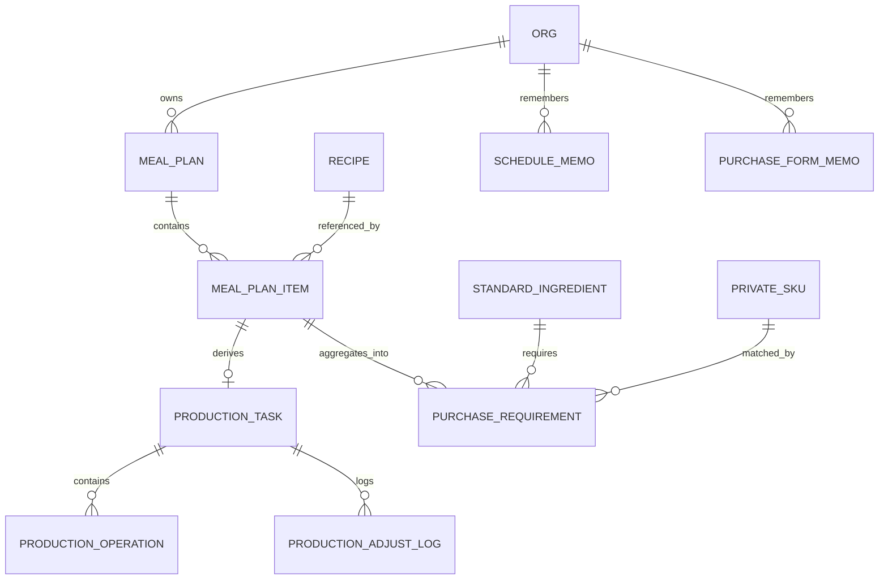

# 商户端计划管理 PRD

| 项目 | 内容 |
| --- | --- |
| 文档名称 | 商户端计划管理 PRD |
| 版本 | V1.1 |
| 日期 | 2026-09-23 |
| 适用范围 | 食联网数智餐饮平台 · 商户端「计划管理」（排餐计划 / 生产计划 / 采购计划） |
| 关联文档 | 《商户端菜谱管理 PRD》V1.0、《商户端商品中心 PRD》V1.0、《租户端菜谱管理与授权 PRD》V2.0、《数智餐饮运营管理平台—商品中心 PRD》V1.1 |
| 配套原型 | 商户端原型 `原型线上发布/merchant`（排餐计划、生产计划已实现；采购计划未开始） |
| 文档性质 | 第一期产品需求基线（页面 / 字段 / 计算规则 / 交互级） |

> **V1.1 变更摘要（2026-09-23）**
>
> 1. **用料换算从「占比分摊」改为「倍数放大」**：`倍数 k = 入锅投料总量 W ÷ 基准批次量 Q`，每行用量 `= 投料量 × k`。
>    两者在数学上等价，但倍数放大的**适用范围更大** —— 占比分摊在存在计数单位（个 / 只 / 条）行时算不出分母。
> 2. **基准批次量 Q 的定义**：纯人工菜按「一份」配置、含设备菜按「一批」配置；`Q` **不等于单锅产能**。
> 3. **排餐与设备彻底解耦**：排餐详情面板移除设备加工步骤、预计锅数；单锅产能改挂**设备型号主数据**。
> 4. **人均配量默认值分两路**：纯人工菜按菜谱派生，含设备菜靠记忆 / 首次手填。
> 5. **单位口径**：可折质量的行（克 / 千克 / 毫升 / 升）进合计，计数单位行进合计之外但仍按倍数放大。
> 6. 修正生产计划排程的**秒 / 分钟单位混用**缺陷（曾导致开工时间出现负值）。
> 7. **文案统一**：含设备菜的用料换算表头由「每批投料」改为「**菜谱投料**」（纯人工菜仍为「每份投料」），
>    说明行同步改为「菜谱投料 = 菜谱一次的投料量，与设备无关」。**计算口径不变**，仅文案调整。
> 8. **单位展示口径**：「菜谱投料」列按菜谱原单位展示、**不做进位**（设备菜用料单位统一为 `g`，故一律显示为 `g`）；
>    「本次用量」列仍按可读性进位。
> 9. **精度口径统一**：**出品量改为只读派生值**，取消「编辑出品量 → 反算人均配量」的反向路径；
>    人均配量精度由 6 位收紧为 **3 位（0.001 kg = 1 g）**，录入 / 存储 / 展示同一口径；
>    就餐人数限制为 1–9999；入锅投料总量展示改为 2 位。代价是倍数不再正好等于就餐人数（已确认接受）。
> 10. **公式行补全**：「入锅投料总量」行原先只回显 `91%`（漏了被除数），现回显完整算式 `12.72 ÷ 91%`；
>     详情面板内的出品量同步显示为 2 位，与公式里的操作数逐位一致。
> 11. **锅数产能来源修正（生产计划）**：锅数由「只取主加工步骤设备的容量」改为
>     **取该任务占用的所有设备 `⌈W ÷ C⌉` 的最大值**；换主加工设备 = 把原主设备上的步骤整体挪到新设备，
>     锅数随之按新设备集合重算。修掉两个实测复现的 bug：非主步骤在小设备上时锅数被低估、换设备后锅数留在旧产能上。
> 12. **新增每锅投料量（生产计划）**：任务表加一列、调整抽屉加总览格与「本任务用料」逐行值。
>     ~~`W ÷ 锅数`（均分）~~ → **第 17 条已改为「满锅 + 尾锅」口径**，本条仅保留列位。
> 13. **生产计划展示位数对齐**：出品量 / 入锅投料总量 / 每锅投料量统一 2 位小数。
> 14. **排产粒度定为设备型号**：不区分具体机台，同型号不并行（已知取舍，见 3.2）。
> 15. **状态归属明确**：`statuses` 归生产计划所有，排餐的未保存缓冲不再覆盖它（修掉锁定状态丢失）。
> 16. **切页拦截**：排餐有未保存修改时切到生产计划，补上「保存后切换 / 取消切换」确认抽屉；
>     顺带把「切换组织」也补上 `validate()`，两处口径一致（原先组织切换会跳过校验直接提交）。
> 17. **装载口径由「均分」改为「满锅 + 尾锅」**（推翻第 12 条）：
>     锅数 = 产能所需的最少锅数时，**前 (锅数−1) 锅装满设备额定容量，尾锅装余量**。
>     均分是错的 —— 菜谱 BOM 是「一批」的量，均分会让每锅都要按非整数倍折算整张 BOM
>     （宫保鸡丁 `10.91kg ÷ 一批 12kg = 0.909 倍`），后厨没法执行。
>     尾锅量 `= W −(锅数−1)× C_min`，由 `锅数 = max⌈W÷C⌉ = ⌈W÷C_min⌉` 可证其恒 `∈ (0, C_min]`。
>     人为主观多开锅（锅数 > 最少锅数）时「装满」会把后面几锅留空、尾锅变负 → **退回均分并标注**。
>     尾锅量**不预先取整**（否则「满锅量×满锅数＋尾锅量 = W」不精确成立）；展示 2 位。
> 18. **去掉「一键按推荐顺序重排」**（生产计划）：任务视图改为**按餐次分段**
>     （分隔行承载餐次 · 开餐时间 · 道数，故取消「餐次」列）。
>     ~~原方案：段内拖拽任务行即改序、保留派生的「加工顺序」列~~ —— **第 21 条已整体推翻，改为不拖拽**。
> 19. **排程方向修正**（生产计划）：`scheduleAll` 是倒推排程，「先处理的拿到开餐那个槽」。
>     据此确定处理顺序（与列表顺序相反）：**已填时间的先占位**，未填的按**总时长从短到长**处理，
>     从而「最短的压轴到开餐时间、最长的最先开工」。默认顺序配合该处理顺序，自然满足 5.5 的「工艺前置」与「出品时效」两条约束。
> 20. **去掉「出品静置缓冲」**（生产计划）：排程终点由 `开餐时间 − 15 分钟` 改为**直接取开餐时间**，
>     同步去掉筛选栏与时间轴图例里的缓冲文案，`BUFFER_MIN` 从两端导出链删除。
>     附带修掉时间轴图例与竖线不一致的问题（竖线画在开餐时间上，图例却写「已扣除出品缓冲」）。
>     **业务口径变更**：系统允许「开餐时间出锅」，即默认后厨能踩点出锅。
> 21. **去掉拖拽，改用「计划加工时间」表达加工顺序**（生产计划）：
>     ⚠️ **本条的实施细节已被第 23 条覆盖**（时间由「系统自动排定」改为「默认为空、人工填」），
>     仅「去掉拖拽」这一结论仍然有效。以下为当时的设计：
>     列表按**计划开始时间升序**排列即加工顺序，「加工顺序」列与 `sequence` 字段**一并取消**；
>     任务表「计划加工时间」列的**开始时间行内可直接改**（改了即钉住并标「已定时」，`×` 清除回自动倒推）；
>     抽屉里的「加工顺序」只读回显字段也删掉。
>     去掉拖拽同时消掉 4 个边界问题：筛选状态下会插错位置、已开工任务卡在中间跨不过去、
>     触屏不支持 HTML5 拖拽、`sequence` 字段需要单独维护。
>     ~~代价：每钉住一道菜，其余菜的自动时间会重排（「打地鼠」）~~ —— **第 23 条把自动排定整体去掉了**。
> 22. **排程摆放修正（两处）**（生产计划）：
>     (a) **已指定时间的任务必须先处理** —— 它是硬约束，若后处理会被自动排好的菜占掉设备时段而产生**假冲突**
>     （实测：土豆烧牛肉定在 17:10、紫菜蛋花汤自动排到 17:09—17:30 → 不先占位就误报冲突 2 处）；
>     (b) **任务内部必须连续** —— 先求「任务结束时刻」（对每一步都满足「该步结束 ≤ 该设备空闲时刻」）再正着铺满。
>     修前逐步做 `min(结束, 设备空闲)` 会把任务从内部撕开，出现「焯水 12:52 结束、烧制 16:30 才开始」，
>     展示为 `12:52 — 17:30`（跨度 4h38m）而「预计总时长」只有 1h8m。
> 23. **计划加工时间默认为空 + 开工前硬校验**（生产计划）：
>     **排餐结束后系统不预填任何时间**，每道菜的「计划加工时间」都是空的，标「待排」；
>     空的**不许开工** —— 点「开始生产」时校验，为空则提示「请先填写计划加工时间，再开始生产」并聚焦到输入框；
>     系统仍按开餐时间倒推算出**建议值**，但只作为灰字（点一下即采用该道），
>     另给工具栏入口「按开餐时间自动排程」一次铺满（**只填空的，已填的一律不动**）。
>     这么设计是要「谁定时间谁负责」+「没想清楚不许开火」。代价是多一步填写动作；
>     「一键铺满」填出来的是系统建议值、等同于人工填写，所以约束的实质是「不能留空开工」，而非「必须逐道人工思考」。
>     连带变化：列表排序改为「已填的按时间升序在前、未填的按时长倒序聚在后」；
>     顶部统计卡加「待排 N 道」，「排期冲突」在无已排任务时显示 `—`；
>     设备时间轴只画已排的，未排时给「待排 N 道」提示条 + 空态（不画虚线块）。
> 24. **`<input type="time">` 不支持 placeholder**（生产计划）：浏览器只画自己的 `--:--`，
>     灰字建议值挂在 placeholder 上**不会渲染**（原型实测：HTML 里有属性，页面上看不到）。
>     改用独立的灰字元素 `.pp-suggest` 承载，并做成可点击采用。抽屉里的建议值同理，写进提示文字。
> 25. **示例排餐加厚到「每餐多道菜」，暴露并修掉 3 个问题**：
>     种子从「一餐一道」改为**每餐 1–4 道**，刻意压四种形态：多道设备菜同餐次、两道菜抢同一台设备
>     （周三午餐的土豆烧牛肉焯水与紫菜蛋花汤都在智谷 ZG-T30）、设备菜与纯人工菜混排、
>     以及**周五晚餐全是人工菜**（生产计划应为 0 道）。加厚之后立刻暴露：
>     ① 种子里「生产中 / 生产完成」只写在排餐侧，生产计划读不到 → 排餐说「生产中」、生产计划说「未开始」；
>     ② 时间轴一个步骤一个块，宫保鸡丁在智谷 A8 上的 3 个步骤画成 3 个几十像素的小块、各印一遍菜名；
>     ③ `.pp-block` 缺 `box-sizing:border-box`，padding + 左边框加在百分比宽度之外，靠右边缘的块必然被切断。
>     三者均已修（详见 5.5）。**教训：示例数据只放一餐一道，等于把「多道 / 抢设备 / 混排」这几种真实形态全藏起来了。**
> 26. **已开工的任务必须带着它的计划加工时间**（生产计划）：第 23 条「没填时间不许开工」意味着
>     「生产中 / 生产完成」+「计划加工时间为空」是产品上不可能出现的状态。
>     原型示例数据里那两道历史任务因此连同计划时间（取当时的建议值）一起预置 ——
>     只补状态会造出「已开工却还显示『待排』、时间输入框还是灰的」这种自相矛盾的画面。
>     顺带把任务状态改为**回落到排餐侧镜像的 `plan.statuses`**，两端不会再各说各话；
>     「待排」的判定收紧为「未填时间 **且** 未开工」。
> 27. **「计划加工时间」这一列上的两个点击串门**（生产计划，示例加厚后逐格点出来的）：
>     ① 时间输入框和「开始生产」按钮**同名 `data-start`**，绑定 `$$('[data-start]')` 时把两者都挂上了。
>     后果是**点时间框会走开工逻辑**：已填时（想改时间）弹出「开始生产」确认抽屉，未填时（想填时间）
>     先挨一句「请先填写计划加工时间，再开始生产」并闪红 —— 正是要填它的那一下被拦。修法：输入框改名 `data-time`，
>     选择器收紧为 `button[data-start]`。
>     ② 已开工的行，时间输入框 `disabled` 了，但旁边的 `×` 清除钮没有 —— 能把「生产中」任务的计划时间清成空，
>     直接推翻第 26 条的结论。修法：`locked` 时不渲染 `×`。
>     **教训：同一列上放两个可点元素，attribute 命名必须能让选择器区分开；「输入框禁用」不等于「这一格只读」。**
> 28. **设备时间轴的可读性与口径（示例加厚后逐格点出来的）**：
>     ① **横轴恒定从 05:00 起**，筛到晚餐时 750 分钟的轴里 97% 是空白、任务块被压成 30—50 像素，
>     「紫菜蛋花汤」只能显示成「紫…」。改为**轴范围跟着已排任务自适应**（下界 = 最早开工向下取整半小时，
>     上界 = max(最晚开餐, 最晚结束) 向上取整半小时）。筛晚餐后 34px / 46px → **432px / 864px**。
>     ② **块用 `min-width:34px` 撑宽**，靠右的块因此越过轨道被裁（葱油拌面 11 分钟、左边缘 98.5%，撑完右边缘 100.6%）。
>     改为**块宽严格按比例**（下限 3px），**窄块的菜名挂到块外侧**的白底小标签上。
>     ③ **首尾刻度居中会被裁掉一半**（轴自适应后刻度常正好落在 0% / 100%）→ 首个左对齐、末个右对齐。
>     ④ **「排期冲突」按筛选前算、横轴按筛选后算** → 筛晚餐时报「冲突 3 处」却一处都看不到。
>     改为同口径，并给「`+N` 被筛选隐藏」提示。
>     **教训：筛选是「缩小观察范围」，不是「只隐藏一部分」——凡是有数字的地方都要问一句「这个数字算的是筛选前还是筛选后」。**
> 29. **一锅任务不该叫「尾锅」，顺带揪出两个更隐蔽的毛病**（由 1 锅的实拍截图触发）：
>     ① **`B = 1` 时写「尾锅 25kg」**：满锅数 = `B − 1 = 0`，尾锅把整批都吞了，读起来像前面还有几锅。
>     → 一锅直接给投料量；抽屉里投料量字段 / 尾锅字段 / 用料表表头三处同口径联动。
>     ② **抽屉的派生投料量按「上一道菜」的设备算**：`L0` 在抽屉 DOM 写进去**之前**就调用了读 DOM 的 `curDev()`，
>     拿到的是上一道菜留下的旧 `<select>`。实测「先开小米南瓜粥（ZG-T30，30kg/锅）再开宫保鸡丁（智谷 A8，12kg/锅）」，
>     宫保鸡丁被按 30kg/锅 算成「均分 11.82kg」，而同一行的设备提示明明写着「智谷 A8 12kg/锅」。
>     → 设备一律**显式传参**，只有 `syncPots`（抽屉已在、用户刚改）才读 DOM。
>     ③ **浮点尘埃导致 `hm()` 打出 `16:60`**：已填时间的任务用 `end − total` 反推起点，
>     `17:00` 存成 `1019.9999999999999` → `Math.floor` 退一格成 `16`、`% 60` 进位成 `60`。
>     后果是 `<input type="time">` 的 value 非法（浏览器判无效）、时间轴 `from` 退一格到 `16:30`。
>     → 已填时间**直接从 `plannedStart` 起铺**，不再反推；`hm()` 先 `Math.round` 兜底。
>     **教训：只要用「结束 − 时长」反推起点，就一定会带上浮点尘埃；凡是要 `Math.floor` 或写进 `type="time"` 的值，
>     必须在源头或格式化处取整。二是「读 DOM 拿当前上下文」在「先建后写」的渲染顺序里必然读到上一轮的值 —— 显式传参。**
> 30. **「计划加工时间」手填完全不生效**（调查排餐↔生产联动时顺出来的，性质是缺陷不是设计）：
>     `$$('.pp-time-in')` 的 `onchange` 里写的是 `findTask(x.dataset.start)`，可这个输入框挂的属性是
>     **`data-time`**（`data-start` 是同行「开始生产」按钮的属性）→ `findTask(undefined)` → 静默 `return`。
>     后果：手填时间不落记录、不清「待排」、`开始生产` 永远被「请先填写计划加工时间」挡住
>     —— **临时加菜根本排不上去**，而「生产中锁定」这条链也就永远到不了。
>     点「建议 xx:xx」灰字那条路径取值是对的，所以链路还能走通，问题被掩盖了。
>     **教训：191 项断言全部直接改 `overrides()`，绕过了 DOM 处理器 —— 逻辑测得再密，
>     也覆盖不到「标记名和取值名对不上」这类接线错误。凡是「处理器读 `dataset.X`」的写法，
>     都要有一条断言盯着标记本身（见 8b「标记 / 处理器契约」）。**
> 31. **排餐 ↔ 生产联动补齐（讨论后定案，4 项）**：确认「联动」本身**大部分早已实现** ——
>     排餐是唯一录入口、生产计划实时派生（`tasksOf()` 每次渲染直接读排餐）、
>     `setStatus()` 把状态同时写回生产侧 override 和排餐侧 `plan.statuses` 并 `MP.refresh()`、
>     `removeDish` 对「生产中/已完成」硬拦截并对未开工的设备菜二次确认、排餐详情抽屉对锁定菜隐藏
>     删除/替换/保存入口。补齐的是 4 个口子：
>     ① **开工定格**（见 5.7 规则 7）：改就餐人数曾能把**已经在做**的菜的量改掉
>     —— 实测午餐有菜在生产中时把人数 300→150 保存，那道菜的投料 58.5kg → 29.3kg 而状态仍是「生产中」。
>     现在开工时把用量冻成快照，排餐里**只有未开工的菜**跟随人数变。
>     ② **删菜清生产调整**（见 5.7 规则 8）：两侧键格式不同（排餐按周内序号 `3|午餐|CP001`，
>     生产按完整日期 `2026-09-24|午餐|CP001`），漏清导致重新加回来会复活旧时间 / 旧锅数。
>     ③ **撤销开工**：原来点了「开始生产」就永久锁死，误操作无法挽回。现在当天可撤销
>     （同步解锁排餐 + 清快照）；「生产完成」仍不可回退。
>     ④ **角标气泡**补「待排产 / 已排产 HH:MM · 主加工设备 · 锅数」：排餐原本分不清
>     「未开始」里哪些已占住设备，临时改菜看不出会不会打乱已有排程。角标**仍保持三档**，信息只进气泡。
>     **教训：跨模块的键格式不一致是隐形地雷 —— 同一个「日期|餐次|菜」在两边一个是周内序号、一个是完整日期，
>     两处都写对了才叫联动；删一处忘一处，症状是「删掉的东西又回来了」。**
> 32. **纯人工菜的角标气泡不该带状态词**（由「为什么会有两个不同的提示文案」的实拍截图触发）：
>     含设备加工的菜气泡是「未开始 · 可修改 · 待排产 · 智谷 ZG-T30 · 2 锅」，
>     纯人工菜却只有「未开始 · 可修改」—— 差异本身是对的（纯人工菜不进生产计划，没有排产状态、
>     没有设备和锅数，硬造就是假数据），但**「未开始」是个空指**：那是设备任务的执行状态，
>     纯人工菜没有这个状态机，读起来会让人以为它以后会变成「生产中」。
>     排餐详情抽屉里早就有「含设备加工 / 纯人工」这个区分，气泡反而没跟上 —— 现在对齐：**纯人工菜只写「可修改」**。
>     **教训：文案复用了某个状态机的词，就要先问一句「这个词对这类对象成立吗」。**
> 33. **车间要用手机，先得有一份「服务端」**（由「生产车间没有电脑」这条真实约束引出）：
>     需求本身很直接 —— 排餐在电脑上提前排好，生产时车间里没有电脑，所以排餐调整与生产确认得在手机上做。
>     但查下来发现**卡点不在页面而在数据**：排餐计划存在模块级内存 `stores`，生产现场调整存在内存
>     `taskOverrides`，**两处都不落盘** —— 刷新页面回到种子、换浏览器什么都没有，手机根本看不到电脑排的餐。
>     所以先补 `localStorage` 落盘层（按周分键、按组织分键、`STORE_V` 失效旧数据、读写全 `try/catch` 降级），
>     并把它叫成「原型的服务端」：将来接真实后端只换这一层。
>     实测：电脑侧填计划加工时间 + 开工 → **重新加载页面（390px 手机宽度）** → 状态、定格快照
>     （48kg / 58.54kg / 4 锅 / 优特 UT-C16）、计划结束时间全部原样读回，排餐侧仍是锁定的。
>     同时把 `save` / `setStatus` / `setOverride` 开成对外动作 —— 手机页要复用**同一套**规则，
>     而不是另写一份（本项目每一个缺陷都来自规则被写了两遍）。
>     **教训：跨设备的需求，先问「数据存在哪」，再问「页面长什么样」；两端各存各的内存，页面做得再好也传不过去。**
> 34. **车间端手机页落地，顺带揪出一个「函数写了两份」的坑**：
>     手机页 `merchant-mobile.html` 定为**独立页面**而不是把桌面周表压扁 —— 交互范式不同（卡片 vs 表格）。
>     关键是**一条规则都没有重写**：页面加载两个桌面模块，只用它们的计算与动作（锅数、投料、定格、锁定、
>     开工准入、原因必填、落盘全在 `MerchantPlan.mobile` / `MerchantProduction` 里），桌面表格整体 CSS 隐藏。
>     为此补了三处共享入口：`startBlock()`（没填计划加工时间不许开工）、`removeBlock()` / `applyRemove()`
>     （删除准入与落地）、`applyAdd()`（加菜 / 换菜落地），以及 `mobile` 门面（只改今天、原因必填、编辑缓冲）。
>     过程中发现**一个真问题**：重构时把 `removeDish` 写成了两份 —— 新的插在前面、旧的留在后面，
>     JS 函数声明提升导致**跑的是旧那份**，抽出来的 `applyRemove` 成了死代码。变异测试先报了
>     「这条规则没有测试抓到」，顺着查才发现；根因是给规则做源码契约断言时，锚点必须落在
>     **真正执行的那一份**上。已删除重复定义，并把契约断言收窄到 `applyRemove` 函数体内。
>     另外修掉两个只有真机才会暴露的样式坑：`.mb-sheet-mask{display:flex}` 盖掉了 `[hidden]` 的
>     `display:none`（「隐藏」的抽屉照样铺满页面）；人均配量标签写成 g/人 而口径是 kg/人。
>     **教训一：同名函数重复定义会静默覆盖，测试必须盯真正执行的那一份。**
>     **教训二：`hidden` 属性会被作者样式里的 `display` 盖掉，抽屉类组件要显式写 `[hidden]{display:none}`。**

## 1. 文档目的与范围

本文档定义商户端「计划管理」三个计划的完整产品规格：**排餐计划**（需求侧）、**生产计划**（执行侧）、**采购计划**（补给侧），覆盖三者的职责边界、端到端计算链、计划间耦合规则、页面结构、字段、校验与状态流转。

本文档的定位：

- 三计划构成「**需求 → 执行 / 补给**」单向链：排餐计划是**唯一人工录入口**，生产计划与采购计划均**自动派生**，只回传状态、不回写内容。
- 生产计划**只覆盖含设备加工的菜**；采购计划**覆盖全量菜**（含纯人工菜）。两条派生路径的数据源都是排餐计划，互不依赖。
- 菜谱层与商品层为主数据来源，本期主数据只做**一处**增强：设备型号新增「单锅产能 / 额定容量」。菜谱侧不再新增产能字段。

### 1.1 事实来源标注约定

本文档对关键条目标注来源等级，避免把决策、上游规则与原型实现事实混为一谈：

| 标记 | 含义 |
| --- | --- |
| **【已确认】** | 本轮业务方已明确拍板的决策，可直接实现与验收 |
| **【PRD】** | 来自上游 PRD 的已确认业务规则 |
| **【原型】** | 来自当前原型代码的实现事实，证明「现在是怎么做的」，不自动等于业务要求 |
| **【待确认】** | 无已确认来源，需业务方补充；不得按惯例推断 |

### 1.2 术语

| 术语 | 定义 |
| --- | --- |
| 排餐计划 | 按自然周安排每天各餐次菜谱的计划，并决定每道菜的出品量。三计划中的需求来源 |
| 生产计划 | 按天关联排餐计划形成的设备加工执行计划，决定设备、锅数与计划加工时间 |
| 采购计划 | 按排餐计划出品量反算食材需求量，决定采购形态与采购量的计划 |
| 就餐人数 | 某组织某日某餐次的用餐人数，在排餐计划中录入 |
| 人均配量 | 该组织做某道菜时每人平均消耗的**成品量**（kg/人），在排餐计划中录入 |
| 出品量 | 某道菜需要产出的成品量（kg）。`出品量 = 就餐人数 × 人均配量` |
| 出餐成品系数 | 成品量 ÷ 入锅投料量（百分比）。菜谱基础信息已有字段，业务口语亦称「出品率」**【已确认】** 统一沿用「出餐成品系数」这一名称 |
| 入锅投料总量 | 达到某出品量所需投入的原料总量（kg）。`入锅投料总量 = 出品量 ÷ 出餐成品系数` |
| 基准批次量 Q | 菜谱用料明细中**能折成质量的行**之和（kg）。纯人工菜按「一份」配置，含设备菜按「一次投料」配置。界面文案：含设备菜的表头显示为「**菜谱投料**」，纯人工菜显示为「**每份投料**」 **【已确认】** |
| 倍数 k | `入锅投料总量 W ÷ 基准批次量 Q`，业务含义是「本次要做几份菜谱配方」，无量纲、不取整 **【已确认】** |
| 食材用量 | 某食材本次实际需要投入的量 = `该行投料量 × 倍数 k`，单位保持菜谱的原单位 **【已确认】** |
| 食材占比 | 某食材投料量占基准批次量的比例 `投料量_i ÷ Q`，**仅用于展示，不参与计算** **【已确认】** |
| 单锅标准产能（设备额定容量） | 单台设备单锅可容纳的**入锅投料量**（kg/锅），维护在**设备型号主数据**上，菜谱步骤只引用设备型号、不承载产能 **【已确认】** |
| 锅数 | 生产批次数量。一道菜一个锅数，作用于该菜全部设备加工步骤 |
| 毛净率 | 净料 ÷ 毛料，衡量粗加工损耗，由平台标准食材库统一维护 |
| 形态系数 | 投料需求量换算为采购需求量的系数，随采购形态取值 |
| 计划态 / 执行态 | 排餐计划为计划态（可改）；生产计划为执行态（可临时调整，不回写排餐） |
| 生产状态 | 生产任务的 2 个状态：`生产中`（开火前点确认）、`生产完成`（结束后点完成）；未开始为默认无状态 **【已确认】** |

### 1.3 本期不包含

- 采购计划与供应商、询价、比价、订单、到货验收、库存台账的对接；
- 采购计划的审批流；
- 生产计划的人员排班、班组分配、绩效统计；
- 生产设备的真实下发与状态回传（现场设备联机）；
- 排餐计划的营养分析、成本核算、菜单发布；
- 就餐人数的默认值维护与工作日 / 周末 / 节假日的差异化规则 **【已确认】**；
- 采购计划的手工新增、删除与跨周期合并（V1 只做自动派生 + 形态确认）。

## 2. 三计划总体设计

### 2.1 主线：需求 → 执行 / 补给

```
菜谱库（主数据）
├─ 用料明细：投料量 w_i + 单位 + 用料角色 ─→ 提供基准批次量 Q = Σ可折质量的行
├─ 出餐成品系数 r0 ───────────────────→ 作为排餐时的默认值
├─ 设备加工步骤：设备型号 / 单锅时长
└─ 加工方式：纯人工 / 含设备加工 ──────→ 生产计划的准入条件

                ↓ 引用

        排餐计划（唯一人工录入口）
        ├─ 吃什么：菜谱
        ├─ 就餐人数 n          （记忆代入）
        ├─ 人均配量 p          （纯人工=菜谱派生 / 含设备=记忆代入或手填）
        ├─ 出餐成品系数 r1      （默认 r0，可覆盖）
        └─ 派生：出品量 Y1 = n × p
                  入锅投料总量 W = Y1 ÷ r1
                  倍数 k = W ÷ Q
                  食材用量_i = w_i × k        ← 与设备无关

        ├── 派生（仅「含设备加工」的菜）──→ 生产计划
        │                                  设备（额定容量）/ 锅数 / 顺序 / 状态
        └── 派生（全量菜，含纯人工）──────→ 采购计划
                                           形态换算 / SKU 匹配 / 采购量

        ↑ 生产计划仅向排餐计划回传状态，不回写内容
```

> **排餐与设备解耦** **【已确认】**：排餐计划只回答「吃什么、吃多少、出品率」，不感知设备与锅数。
> 同一份用料换算结果，换任何设备都不变；分几锅是生产计划按所选设备额定容量算出来的。

### 2.2 三计划边界矩阵

| 维度 | 排餐计划 | 生产计划 | 采购计划 |
| --- | --- | --- | --- |
| 回答的问题 | 吃什么 / 吃多少 / 出餐成品系数 | 哪台设备 / 几锅 / 什么顺序 | 买哪个SKU / 什么形态 / 买多少 |
| 粒度 | 组织 × 周 × 日期 × 餐次 × 菜谱 | 组织 × 日期 × 餐次 × 菜谱（+ 设备） | 组织 × 采购周期 × 标准食材 × SKU |
| 数据来源 | 菜谱库（引用） | 排餐计划派生（仅设备菜） | 排餐计划派生（全量菜） |
| 是否人工录入 | **是，唯一录入口** | 否，仅现场调整 | 否，仅形态确认 |
| 可变更性 | 计划态，可改（有约束） | 执行态，可临时改 | 派生态，随排餐重算 |
| 状态写入方 | 只读展示 | **唯一写入方** | — |
| 责任角色 | 食堂 / 档口管理员（排餐员） | 后厨 / 生产人员 | 采购员 |

### 2.3 端到端计算链（核心公式）

本节公式为三计划唯一口径，研发不得自行拆分或叠加系数。

**第 0 层：菜谱主数据**

```
可折质量的行      = 单位为 克 / 千克 / 毫升 / 升 的用料行（毫升、升按 1 g/ml 折算）**【已确认】**
基准批次量 Q      = Σ 可折质量的行 的投料量 (kg)
食材占比 q_i      = 可折质量的行：w_i ÷ Q；计数单位行（个 / 只 / 条 / 份 / 适量）：无占比
菜谱标准出品量 Y0 = r0 × Q        （推算值，不单独维护字段）
```

> **纯人工菜按「一份」配置用料，含设备菜按「一批」配置用料** **【已确认】**。
> `Q` 是「配方的基准规模」，**不等于单锅产能**：排餐人员并不知道生产人员会用哪台设备
> （同一道菜 1 号机 12 kg/锅、2 号机 16 kg/锅都可能），所以排餐侧不能拿锅容量当分母 **【已确认】**。

**第 1 层：排餐计划（需求 → 投料）**

```
出品量 Y1        = 就餐人数 n × 人均配量 p
入锅投料总量 W   = Y1 ÷ 出餐成品系数 r1
倍数 k           = W ÷ Q
食材用量_i       = w_i × k                 （单位保持菜谱原单位，不强制换算）
校验：Σ（可折质量行的用量_i）= k × Q = W   （行加得平）
```

> **重要口径（避免重复计算）**：菜谱的 `出餐成品系数 r0` **只作为排餐时的默认值**，不作为乘数参与计算。
> 因 `Y0 = r0 × Q`，若同时使用 `Y1 ÷ r0 ÷ r1` 会把烹制损耗计算两遍，导致采购量虚高。
> 排餐计划落库的三个输入是 `n`、`p`、`r1`；`Y1` 与 `W` 均为派生值。

**第 2 层：生产计划（投料 → 锅数）**

```
单锅标准产能 C    = 该任务**所占用的每台**设备型号的额定容量 (kg/锅)   ← 来自设备主数据
锅数 B            = max over 该任务占用的所有设备 of ⌈ W ÷ C ⌉
                    （一道菜可能跨多台设备，每台都要装得下，所以取最大值，见 5.4）
满锅投料量 F      = min over 该任务占用的所有设备 of C      ← 装满取最小容量，同一份料要走完所有步骤
满锅数            = B − 1
尾锅投料量 T      = W − (B − 1) × F        （恒 ∈ (0, F]，见 5.4）
（B 允许人工覆盖，覆盖后标记「已调整」；换设备只提示「按新设备建议锅数为 N」，不自动覆盖 **【已确认】**）
（人工把 B 改到 > 产能所需的最少锅数时，F/T 口径失效 → 退回均分「每锅 = W ÷ B」并标注，见 5.4 第 7 条）
设备步骤占用时长  = 锅数 B × 该步骤单锅时长
```

**第 3 层：采购计划（投料 → 采购）**

```
形态系数 φ       = 买净菜（形态 == 投料状态）  → 1
                   买毛菜（需自行粗加工）      → 1 ÷ 毛净率 m
                   买半成品                    → 按半成品折算率
净料需求量_i     = 用料换算输出的「本次用量」折成质量（kg）
采购量_i         = 净料需求量_i × 形态系数 φ      ← 只用「可折质量」的行，计数单位行跳过
SKU 下单量       = ⌈ 采购量_i ÷ 该 SKU 的换算基数 ⌉
```

> **符号约定**：第 1 层的倍数记作 `k`，本层的形态系数记作 `φ`，两者不是同一个东西，不得混用。
> **采购计划的输入是排餐计划全量菜（含纯人工菜）的用料换算结果**，与生产计划无关，**不得用「是否含设备加工」过滤** **【已确认】**。
> 自采用料（如饮用水，行上标记「自采」）不产生采购需求。

> 出餐成品系数管的是**烹制损耗**，毛净率管的是**粗加工损耗**，是两个阶段，必须分两步换算 **【已确认】**。

**计算示例（贯穿全文）**

| 项 | 值 | 来源 |
| --- | --- | --- |
| 就餐人数 n | 300 人 | 排餐计划录入 |
| 人均配量 p | 0.5 kg/人 | 排餐计划录入 |
| 出品量 Y1 | 150 kg | 300 × 0.5 |
| 出餐成品系数 r1 | 88% | 默认取菜谱 r0 |
| 入锅投料总量 W | 170.45 kg | 150 ÷ 0.88 |
| 菜谱一批投料（含设备菜，Q = 12 kg） | 鸡胸肉 7.2 / 花生米 1.8 / 黄瓜 2.4 / 生抽 0.4 / 香油 200 ml | 菜谱用料明细 |
| 倍数 k | 14.2 | 170.45 ÷ 12 |
| 鸡胸肉占比 q | 60% | 7.2 ÷ 12（仅展示） |
| 鸡胸肉用量 | 102.27 kg | 7.2 × 14.2 |
| 香油用量 | 2.84 kg（原单位 2841 ml） | 0.2 × 14.2 |
| 各行用量之和 | 170.45 kg | = W，行加得平 |
| 设备额定容量 C | 12 kg/锅（智谷 A8） | 设备型号主数据 |
| 锅数 B | 15 锅 | ⌈170.45 ÷ 12⌉ |
| 满锅投料量 F | 12 kg | 装满取占用设备的最小额定容量 |
| 尾锅投料量 T | 2.45 kg | 170.45 − 14 × 12；装满 14 锅，第 15 锅是尾锅 |
| 鸡胸肉毛净率 m | 80% | 平台标准食材库 |
| 买毛菜时采购量 | 127.84 kg | 102.27 ÷ 0.8 |
| 买净菜时采购量 | 102.27 kg | 102.27 × 1 |

> 同一道菜，买毛菜比买净菜多采购 25%。这就是「买毛菜还是净菜」在数量上的真实含义。
> **换设备不改用料**：上例若改用 16 kg/锅 的设备，锅数变为 11 锅、满锅 16 kg × 10 ＋ 尾锅 10.45 kg，
> 但 14.2 的倍数与各行用量**完全不变** **【已确认】**。
> **装载口径看 5.4**：满锅量取的是**最小**容量（同一份料要走完所有步骤），锅数取的是各设备 `⌈W ÷ C⌉` 的**最大**值。

### 2.4 计划间耦合规则

三计划**只保留 3 个耦合点**，不做页面互跳、不做双向内容同步 **【已确认】**。

| 耦合点 | 排餐计划侧 | 生产计划侧 |
| --- | --- | --- |
| 内容下发 | 保存即生效，无「生成生产计划」按钮 | 自动出现待生产任务（仅设备菜） |
| 变更 | 修改已下发的菜 → 强提示「已进入生产计划」并记录原因 | 派生值（出品量 / 投料量）自动刷新；**人工调整过的设备 / 锅数 / 顺序保留**，仅标记「来源已变更」 |
| 状态 | **只读徽标**（2 态） | **唯一写入方** |

规则明细：

1. **单向派生**：排餐计划保存后，生产计划按 `日期 × 餐次` 自动聚合出差量任务，不设「生成」按钮 **【已确认】**；
2. **现场调整只写自己**：生产计划的换设备、改锅数、调顺序**只写生产计划**，不回写排餐计划 **【已确认】**；
3. **只回传状态**：生产计划向排餐计划回传 **2 个状态**（生产中 / 生产完成）用于徽标展示，不回传设备、锅数、顺序等内容；
4. **`statuses` 归生产计划所有** **【已确认】**：排餐计划从不修改菜品状态，所以排餐的**未保存缓冲不得把它覆盖回去** ——
   `load()` 一律以 store 中的状态为准，`commit()` 保存时把 store 里的状态原样带回。
   否则会出现「排餐有未保存编辑 → 去生产计划点开始生产 → 回排餐页」把刚设的锁定状态**无声抹掉**；
5. **切页拦截** **【已确认】**：排餐有未保存修改时切到生产计划，弹出与「切换组织」**同款**的确认抽屉 ——
   - 原因：生产计划按**已保存**的排餐数据派生，未保存的修改**不会**体现在生产计划里，
     不提醒的话用户会以为刚才的编辑已经生效；
   - 「保存后切换」先跑一次 `validate()`，**校验不通过则提示并留在排餐**（不提交坏数据、也不切）；
   - 「取消切换」保持当前编辑与缓冲不动，留在排餐；
   - 无未保存修改时**直接放行**，不打扰。
4. **不自动覆盖**：排餐变更后，生产计划**不自动覆盖**已生产人员调整过的内容，只打标记 **【已确认】**；
5. **生产计划不参与采购**：采购计划的数据源是排餐计划全量菜，与生产计划无关。纯人工菜不进生产计划，但必须进采购计划。

## 3. 主数据前置：菜谱层增强

### 3.1 本期改动

| 位置 | 变更 | 来源 |
| --- | --- | --- |
| 设备型号主数据 | **新增「单锅产能 / 额定容量」**（数值，kg/锅，必填） | **【已确认】** |
| 菜谱 → 加工步骤 → **设备加工步骤** | **不改动**，只引用设备型号；产能**不**维护在菜谱上 | **【已确认】** |
| 菜谱 → 基础信息 → 出餐成品系数 | **不改动**，字段名与语义保持原样（《商户端菜谱管理 PRD》7.5） | **【已确认】** |
| 菜谱 → 用料明细 | 沿用投料量 / 单位 / 投料状态 / 切配方式 / 切配规格，但**基准口径待补**（见 3.4） | **【待确认】** |
| 菜谱 → 加工方式判定 | **不改动**，直接复用为生产计划准入条件 | **【PRD】** |

> 原讨论曾把「单锅标准产能」放在菜谱的设备加工步骤上，**已撤回** **【已确认】**：同一道菜在不同车间用不同设备
> （1 号机 12 kg/锅、2 号机 16 kg/锅），产能属于**设备**而不是**菜**。挂在菜谱上会逼排餐人员预判生产用哪台设备，
> 与「排餐不感知设备」直接冲突。
> 原讨论中曾考虑在菜谱新增「每份参考量」「人均配量」，因人均配量确定放在排餐计划（见 4.3），菜谱层**无需新增该字段** **【已确认】**。

### 3.2 单锅产能（设备额定容量）规则

1. **单位是入锅投料量（kg/锅）**，不是成品量 —— 锅装的是生料 **【已确认】**；
2. 维护在**设备型号主数据**上（一个型号一个值），**不**维护在菜谱上 **【已确认】**；
3. **计算锅数时遍历该菜占用的全部设备型号**，取各自 `⌈W ÷ C⌉` 的**最大值** **【已确认】**：
   - 一道菜可能跨多台设备（如焯水在大锅、烧制在小锅）。**只要有一台装不下，锅数就是不够的**，
     所以不能只看承载主加工时长的那一台；
   - V1 曾按「主加工步骤」单台设备取值，会让「非主步骤落在小设备上」的菜少算锅数 —— 已修正，见 5.4 的反例；
4. 取值范围 > 0；未维护时锅数默认 1，并标记「缺少设备额定容量，锅数待人工确认」；
5. 菜谱版本变更时，按版本快照管理：已进入生产计划的锅数为**执行时快照**，不随菜谱改版自动变化；
6. **设备型号额定容量被改**：未人工覆盖的锅数按新容量刷新建议值；已人工覆盖的保留，仅标记「来源已变更」 **【已确认】**。
7. **排产粒度是「设备型号」，不是「具体机台」** **【已确认】**：
   - 设备主数据的唯一标识是 `厂家 + 型号`（如 `智谷 A8`）；排餐 / 生产计划的设备引用、时间轴泳道、设备占用均以**型号**为单位；
   - **已知取舍（V1 接受）**：同一食堂若有两台同型号设备，系统把它们视为**同一条可用资源**（同一条泳道、被迫串行排序），
     不区分 1 号机 / 2 号机，**不支持同型号并行**。因此时间轴是「产能口径」而非「实物口径」；
   - 若将来要支持，做法是在设备主数据上挂「机台」子实体：**型号定产能、机台定排产键**，
     排产键由型号改为机台，其余计算口径不变。

### 3.3 加工方式作为生产计划准入条件

| 加工方式 | 判定条件 | 是否进生产计划 |
| --- | --- | --- |
| 纯人工 | 加工步骤全部为人工处理步骤 | **否** |
| 含设备加工 | 加工步骤中包含至少一个设备加工步骤 | **是** |

判定规则直接复用《商户端菜谱管理 PRD》7.4，**不新增字段** **【PRD】**。

> 实现提示 **【待确认】**：判定必须看**步骤类型**（该步骤是设备加工还是人工处理），不能简化为「步骤列表是否为空」。
> 一个全部是人工步骤的菜谱同样有步骤列表，按「步骤非空」判定会把它误判为设备菜。

### 3.4 用料明细的基准口径（菜谱管理侧待补）

《商户端菜谱管理 PRD》7.6 的用料明细**没有定义「投料量是按每份还是每锅配置」**，也没有单位换算规则。
三计划要算用料，必须先补齐这两件事 **【待确认】**：

| 待补项 | 建议口径 | 依据 |
| --- | --- | --- |
| 用料明细的**基准** | 纯人工菜按「一份」配置；含设备菜按「一批」配置 | 与 2.3 的 `Q` 一致 **【已确认】** |
| **单位换算规则** | 克 / 千克 / 毫升 / 升 可折成质量（毫升、升按 `1 g/ml`）；个 / 只 / 条 / 份 / 适量不进合计，但仍按倍数放大 | **【已确认】** |
| **单锅产能** | 从菜谱设备加工步骤**移除**，改挂设备型号主数据 | 见 3.1 / 3.2 **【已确认】** |
| 主料使用计数单位 | 行级提示「主料建议使用质量单位」，**不硬拦** | 单份配量很小的菜（如「鸡蛋 1 个」）确实不适合强制改克 |
| **自采用料** | 饮用水等自采用料需要可识别（如标记「自采」），采购计划应跳过 | 汤粥类的用水占 `Q` 的大头，不纳入基准会明显失真 |

## 4. 排餐计划

### 4.1 页面结构（沿用现有周视图）

在现有 `merchant-meal-plan-v1.js` 已实现的周排餐表基础上扩展，**不改变整体交互形态** **【原型】**：

- 顶部：周切换 / 周选择器 / 回到本周 / 复制排餐 / 编辑-保存；
- 周排餐表：行 = 餐次，列 = 日期，单元格 = 菜谱卡片列表；
- 新增：单元格内每道菜展示 `出品量` 与状态徽标；餐次行头新增 `就餐人数` 录入。

### 4.2 三个输入与派生值

| 层级 | 字段 | 类型 | 必填 | 说明 |
| --- | --- | --- | --- | --- |
| 餐次级 | 就餐人数 | 数值（人） | 是 | 按 `日期 × 餐次` 录入，**1–9999** 的整数 |
| 菜品级 | 菜谱 | 引用 | 是 | 从菜谱库选择 |
| 菜品级 | 人均配量 p | 数值（kg/人） | 是 | 默认值来源按加工方式分两路，见 4.3；**精度 0.001 kg（1 g），录入 / 存储 / 展示同一口径** |
| 菜品级 | 出餐成品系数 r1 | 百分比 | 是 | 默认取菜谱 `r0`，可覆盖；覆盖值按 `组织 × 菜谱` 记忆；1–100 的整数 |
| 菜品级 | **出品量 Y1** | 数值（kg） | **派生，只读** | `n × p`，**不提供编辑入口** |
| 菜品级 | **入锅投料总量 W** | 数值（kg） | 派生，只读 | `Y1 ÷ r1`，展示 2 位小数 |
| 菜品级 | **用料换算** | 表格（派生，只读） | — | 每行 `投料量 × k`，`k = W ÷ Q`；单位保持菜谱原单位 |

展示规则：

- 菜品卡片默认展示「菜名 + 出品量」，如 `宫保鸡丁 45kg`；
- 点开菜品卡片展开详情面板：人数 / 人均配量 / 出餐成品系数 / 出品量 / 入锅投料总量 / **用料换算**；
- 派生字段只读，鼠标悬停显示计算式；
- 详情面板**不展示设备、锅数、单锅时长** —— 那些属于生产计划 **【已确认】**；
- 用料换算表头随加工方式切换：纯人工菜为「**每份投料**」，含设备菜为「**菜谱投料**」 **【已确认】**；
  - 含设备菜的用量基准是「菜谱一次的投料量」，**与设备无关**；不叫「每锅」是因为一锅装多少取决于生产人员选哪台设备，排餐侧无从知道 **【已确认】**；
- 用料换算表附一行合计与口径说明：`菜谱投料合计 14 kg，每行本次用量 = 该行投料 × 倍数，单位保持菜谱原单位`。
- **两列的单位口径不同** **【已确认】**：
  - 「**菜谱投料**」列是**菜谱原值**，按菜谱配置的单位**原样展示、不做进位** —— 设备菜的用料单位统一为 `g`，
    因此这一列在设备菜上**必须是 g**（如 `7200 g`，不得显示成 `7.2 kg`）；
  - 「**本次用量**」列是**计算结果**，允许为可读性进位（≥1000 g → kg，≥1000 ml → L）。

### 4.3 记忆代入机制

社会餐饮场景下，就餐人数与人均配量都很不确定，采用「**第一次填写，下次自动代入**」机制降低重复录入 **【已确认】**。

**人均配量的默认值来源（按加工方式分两路）** **【已确认】**

| 加工方式 | 默认值 | 记忆的作用 |
| --- | --- | --- |
| 纯人工 | **菜谱派生**：`p = Q × r1 ÷ 1000`（一份的料 × 出餐成品系数） | 只记录**人工覆盖值** |
| 含设备 | 首次**留空必填** —— 一批的料无法折算成一个人的量 | 记忆是唯一来源 |

派生规则说明：

1. **为什么纯人工能派生而含设备不能**：纯人工菜的用料基准就是「一份」，`一份的料 × 出餐成品系数 = 每人吃到的成品量`；
   含设备菜的用料基准是「一批」，与就餐人数没有直接关系，只能靠历史经验 **【已确认】**；
2. 详情面板必须标注来源，让用户知道这个数从哪来：
   - 派生：`└ 按菜谱每份投料 116 g × 出餐成品系数 91% = 0.10556 kg/人，可直接修改`
   - 记忆：`└ 人均配量沿用 09-18 午餐 的记录值，可直接修改覆盖`
   - 首次：`└ 该菜含设备加工，无法从菜谱推算人均配量，请填写`
3. 内部以 `perPersonFrom = recipe / memory / manual` 标记来源；
4. **派生来源的人均配量随菜谱用料或出餐成品系数自动刷新；人工改过的一律不再自动覆盖** **【已确认】**（与 5.8 的
   「派生值自动刷新，人工调整值永不自动覆盖」同一原则）；
5. 用户编辑人均配量或出品量后，来源立即转为 `manual`，不再参与自动刷新；
6. **记忆只写人工值**：来源为 `recipe` 的人均配量不写记忆（下次仍按菜谱派生） **【已确认】**；
7. 纯人工菜派生值若落在 `(0.01, 1.5)` kg/人 之外，提示「菜谱投料疑似不是按单人份配置」，**仍填入**，不阻断排餐。

**记忆粒度**

| 记忆对象 | 记忆粒度 | 理由 |
| --- | --- | --- |
| 就餐人数 | `组织 × 餐次` | 早餐 80 人、午餐 300 人，必须分餐次 |
| 人均配量 | `组织 × 菜谱` | 同一道菜跨餐次配量差别不大，不分餐次更省 **【已确认】** |
| 出餐成品系数 | `组织 × 菜谱`（仅当覆盖过菜谱默认值） | 未覆盖则走菜谱默认，不占记忆 |

**取数与代入规则**

1. **取数来源**：只从**已保存**的历史排餐取值，**不取未保存的编辑态** —— 避免把草稿带入；
2. **取值规则**：取该组织下**最近一次有值**的记录，**不绑定星期几**。社会餐饮不规律，绑「上周同一天」反而取不到值 **【已确认】**；
3. **代入时机**：新增菜品时带出该菜的人均配量与出餐成品系数；进入空白餐次时带出该餐次人数；
4. **视觉标记**：代入值旁展示来源小字，如 `沿用 09-18 午餐`，让用户知道这是记忆值而非本次确认；
5. **可清除**：支持一键清除代入值，清除后为空白必填；
6. **组织隔离**：记忆按 `merchant_id + org_id` 隔离，A 食堂的记忆不得流入 B 档口 **【PRD】**（沿用组织隔离原则）；
7. **跟随菜谱身份，不随版本失效**：菜谱升版导致用料变化后，人均配量记忆**保留** —— 它是该组织的经营经验，与菜谱内容版本无关 **【已确认】**；
8. **写入时机**：排餐计划**保存时**写入记忆，取消编辑不写入。

**首次无记忆值时的处理**

- **含设备菜**：留空、**必填**、占位提示「该菜含设备加工，无法从菜谱推算人均配量，请填写」 **【已确认】**；
- **纯人工菜**：按菜谱每份投料自动派生并填入，用户**不需要**先填一次 **【已确认】**；
- **不引入**分类级默认值或组织级默认值配置页 —— 填一次即被记住，第二次起零操作 **【已确认】**。

### 4.4 出品量（只读派生）与精度口径

1. **出品量不提供编辑入口，是纯派生只读值** **【已确认】** —— 详情面板里只有一个「出品量 = 人数 × 人均配量」的展示行，没有输入框；
2. **落库唯一真相为 `就餐人数`、`人均配量`、`出餐成品系数` 三个输入**；`出品量` 与 `入锅投料总量` 均为派生值，不单独落库；
3. **人均配量精度 = 0.001 kg（1 g）** **【已确认】**，录入、存储、展示同一口径：
   - 输入框 `step = 0.001`，**失焦时把值收敛到 3 位小数**，界面上看到的数就是实际参与计算的数；
   - 纯人工菜的菜谱派生值同样截到 3 位（`Q × r1` 截 3 位）；
   - 理由：**1 克/人是人能做出的最细配量决策**，再细属于虚假精度。因为不存在「编辑出品量反算人均配量」这条反向路径，人均配量不需要保留更高精度；
4. **已知代价（已确认接受）**：派生值截 3 位后，`倍数 k` 不再正好等于就餐人数。
   例：鸡蛋饼一份投料 116 g、系数 91% → 人均配量 105.56 g 截为 **0.106 kg**（非 0.10556），
   120 人时 `k = 120.5` 而非 120，用料比理论值多约 0.42%，在用餐人数本身的波动面前可忽略；
5. **出品量的可达精度 = 就餐人数 × 1 g**（人数 120 → 0.12 kg，1000 → 1 kg，9999 → 约 10 kg）。
   这是「按克定人均」的算术必然，不是精度缺陷；要更细只能降低决策单位（人均配量取 4 位），当前不采纳；
6. 就餐人数为空或为 0 时，出品量展示为 `—` 并提示「请先填写就餐人数」；
7. **展示精度统一约定**：

| 值 | 展示位数 | 说明 |
| --- | --- | --- |
| 出品量 Y1（菜品卡片） | 1 位（`45kg`） | 卡片是摘要，100 g 足够 |
| 出品量 Y1（详情面板） | **2 位**（`12.72kg`） | 面板内它是下一行公式的被除数，必须与公式里的操作数逐位一致 |
| 入锅投料总量 W | **2 位**（`13.98kg`） | 与用料行的 2 位对齐 |
| 各行本次用量 | 2 位（`40.91 kg`） | — |
| 菜谱投料 | 菜谱原单位，**不进位** | 设备菜统一为 `g` |

> **两个派生行都要回显完整算式，不能只回显部分操作数** **【已确认】**：
> `出品量 = 人数 × 人均配量` 回显 `120 × 0.106`；`入锅投料总量 = 出品量 ÷ 出餐成品系数` 回显 `12.72 ÷ 91%`。
> 只回显系数（`91%`）会让用户看不出被除数是多少，且无法自行验算。

> 各行分别四舍五入后求和，可能与总计差一个末位（如各行显示 68.19、总计显示 68.18）。
> 这是「先舍入再展示」的必然结果，不是计算错误，**不为此调整计算或强行凑数**。

### 4.5 出餐成品系数覆盖

1. 默认取菜谱「出餐成品系数」`r0`，**正常不显示输入框**；
2. 仅在异常场景点开覆盖（如该组织实际出品损耗更大）；
3. 覆盖后打标「已人工调整」，并按 `组织 × 菜谱` 记忆，下次自动代入；
4. 菜谱升版后，若用户从未覆盖过，则自动跟随新版本 `r0`；若覆盖过，则保留用户覆盖值（与 4.3 第 7 条一致）。

### 4.6 状态徽标（只读）

排餐侧只读、不可编辑。**状态只保留 2 个** **【已确认】**：

| 状态 | 含义 | 排餐侧可做的操作 |
| --- | --- | --- |
| （不展示徽标） | 未开始，或未关联生产计划（纯人工菜） | **可自由修改 / 替换 / 删除** |
| 生产中 | 生产人员已点「开始生产」 | **禁止修改 / 替换 / 删除** |
| 生产完成 | 生产人员已点「完成」 | **禁止修改 / 替换 / 删除** |

规则：

1. **状态由生产人员手动触发，不做自动流转判断** **【已确认】**；
2. **「未开始」在排餐计划上不展示状态徽标**，避免视觉噪音；如需感知「该菜已在生产计划中」，见第 11 章 Q11；
3. 生产计划点「开始生产」即视为生产人员已确认设备与锅数，**不设单独的「确认」步骤** **【已确认】**；
4. 卡点分界在「开始生产」这一刻：**未开始 → 随便改；一旦开工 → 完全锁死** **【已确认】**；
5. 徽标只展示状态，不展示设备、锅数、顺序等生产内部细节。

### 4.7 变更与原因记录

1. 修改**已下发生产且未开始**的菜（换菜 / 改量 / 改系数），保存前给出强提示：「该菜已进入生产计划，修改后生产准备需重新安排」**【已确认】**；
2. 修改**当日**排餐需填写调整原因（原型已实现）**【原型】**；本次扩展为**全周生效**：修改已保存且日期 ≤ 今天的排餐均需填原因；
3. 调整记录保留：时间、餐次、类型（新增 / 替换 / 删除 / 改量）、明细、原因、操作人；
4. 原因记录不随「复制排餐」复制。

### 4.8 复制排餐

沿用原型实现 **【原型】**，补充规则：

1. 复制**带入**就餐人数、人均配量、出餐成品系数；
2. 复制**不带入**调整记录与生产状态；
3. 复制**不写入**记忆（记忆只由保存动作写入，避免复制污染记忆）。

### 4.9 校验规则

| # | 校验 | 提示 |
| --- | --- | --- |
| 1 | 就餐人数必填且 ≥ 1 | 请填写就餐人数 |
| 2 | 菜品的人均配量必填且 > 0 | 请输入人均配量 |
| 3 | 出餐成品系数 > 0 且 ≤ 100% | 出餐成品系数取值应大于 0 且不超过 100% |
| 4 | 出品量 > 0 | 出品量必须大于 0 |
| 5 | 同一餐次同一菜谱不建议重复添加 | 该餐次已安排此菜谱，是否继续添加？ |
| 6 | 未关联菜谱库的菜谱不可添加 | 菜谱已删除或停用，请重新选择 |
| 7 | 历史周不可编辑 | 历史周仅支持查看 |
| 8 | 生产中 / 生产完成的菜不可修改或删除 | 该菜正在生产 / 已生产完成，不能修改或删除 |

## 5. 生产计划

### 5.1 入口与页面结构

侧边导航「计划管理 → 生产计划」（原型已预留栏目与入口）**【原型】**。

页面自上而下：

| 区域 | 内容 |
| --- | --- |
| 头部 | 标题「生产计划」、日期切换（默认今天）、组织提示条 |
| 视图切换 | **任务视图**（按菜） / **设备时间轴**（按设备）**【已确认】** 双视图 |
| 筛选 | 餐次、设备型号、状态（未开始 / 生产中 / 生产完成）、是否仅看冲突 |
| 任务列表 | 行 = 菜品任务，见 5.3 |
| 设备时间轴 | 泳道 = 设备型号，块 = 任务在**该设备上**的占用（同一任务在该设备上的多个步骤**合并成一个块**），见 5.5 |
| 右侧抽屉 | 任务详情 / 临时调整 |

### 5.2 派生规则

1. 数据源：排餐计划中**加工方式 = 含设备加工**的菜 **【已确认】**；
2. 触发：排餐计划保存后自动同步差量，**无「生成生产计划」按钮** **【已确认】**；
3. 聚合键：`日期 × 餐次 × 菜谱`；同一菜谱在同一餐次只产生**一条任务**；
4. 删除：排餐计划删除某菜后，若该任务**未开始**则自动移除；已进入生产中或已完成则保留并标记「来源已删除」；
5. 快照：任务落库时快照 `入锅投料总量 W`、`设备额定容量 C`、`菜品名称`、`加工步骤`，避免菜谱改版影响已下发任务。

### 5.3 任务行字段

| 列 | 字段 | 说明 |
| --- | --- | --- |
| 1 | 餐次（**分隔行**） | 列表**按餐次分段**，餐次由分隔行承载（显示 餐次 · 开餐时间 · 道数），**不再单列「餐次」列** |
| 2 | 菜品 | 图片 + 菜谱名称 + 版本号 |
| 3 | 出品量 | 来自排餐计划（kg），**展示 2 位小数** |
| 4 | 入锅投料总量 | 来自排餐计划（kg），**展示 2 位小数** |
| 5 | 主加工设备 | 承载主加工时长的设备型号 |
| 6 | 锅数 | 一道菜一个值，见 5.4；人工覆盖标「已调整」，容量变更标「来源已变更」 |
| 7 | **每锅投料** | 两段式 `满锅量 × 满锅数 ＋ 尾锅量`（如 `14kg × 3 ＋ 尾锅 7.52kg`），见 5.4；这是给生产人员的装载指令。**一锅时直接给投料量**（如 `21.88kg`，不写「尾锅」）；多开锅时显示 `每锅 x` 并标「均分」 |
| 8 | 单锅时长 | 主加工设备步骤的单锅时长 |
| 9 | 预计总时长 | `锅数 × Σ各设备步骤单锅时长` |
| 10 | 计划加工时间 | **默认为空**，开始时间行内可填（唯一的调序手段）；结束时间派生。空 = 「待排」，此时显示灰字建议值（可点击采用）+「待排」标；有值时出现 `×` 清除钮（见 5.5）。**已开工时整格只读**：输入框禁用、`×` 不渲染 |
| 11 | ~~加工顺序~~ | **已取消** —— 顺序不再单独维护，列表按「计划加工时间」升序排列即加工顺序（见 5.5） |
| 12 | 状态 | 未开始（默认，不展示标签）/ 生产中 / 生产完成 |
| 13 | 标记 | 「待排」/「已调整」/「来源已变更」/「来源已删除」/「冲突」/「超时」 |
| 14 | 操作 | 调整 / **开始生产** / **完成**（**无「确认」按钮**） |

> 表内实际列顺序为：菜品 / 出品量 / 入锅投料总量 / 主加工设备 / 锅数 / 每锅投料 / 单锅时长 / 预计总时长 / 计划加工时间 / 状态 / 操作（共 11 列）。上表第 12 / 13 项的状态与标记合并展示在「状态」列。

> **展示位数沿用排餐口径** **【已确认】**：出品量、入锅投料总量、满锅投料量、尾锅投料量均为 **2 位小数**
> （尾锅量内部不取整，只在展示层收 2 位，见 5.4 第 7 条）。
> 锅数是由 `W` 算出来的，1 位小数会掩盖临界情况（`W = 60.04` 显示成 `60kg`，看着像 4 锅装得下，实际要 5 锅）。

**调整抽屉**除上述可调项外，还要给出两张只读表：
- **本任务用料**：食材 / 本任务总量 / **满锅投料** / **尾锅投料**（随锅数、随换设备联动重算；
  多开锅退化为均分时，表头改为「每锅投料」且尾锅列全为 `—`）；
- **设备加工步骤**：步骤 / 设备 / 单锅时长 / 本任务占用（随锅数联动重算，换设备后设备列同步挪动）。

### 5.4 锅数规则

1. **锅数的配置维度是「菜」，不是「设备」** **【已确认】**；
2. **一道菜有且只有一个锅数字段**，作用于该菜**全部**设备加工步骤 **【已确认】**；
3. 默认值 **【已确认】**：`锅数 = max over 该任务占用的所有设备 of ⌈W ÷ 该设备型号的额定容量⌉`
   - **不是只看主加工步骤那一台**。一道菜跨多台设备时每台都要装得下，所以取最大值；
   - **反例（已修正）**：主加工用 30kg/锅、焯水用 14kg/锅，`W = 123.81kg`。
     只看主加工得 5 锅，但焯水实际需要 9 锅 —— **焯水那一锅装不下**。正确锅数是 9；
4. 允许人工覆盖，覆盖后标记「已调整」；
5. 跨设备的时间轴占用：某设备步骤占用时长 = `锅数 × 该步骤单锅时长`，因此一个锅数即可排开全部设备的时间轴，**不产生第二个锅数配置**；
6. 锅数取值：≥ 1 的整数；不允许为 0；
7. **装载口径 = 「满锅 + 尾锅」，不是均分** **【已确认】**：
   - **满锅投料量 `F = min over 占用设备 of C`**（装满取最小容量：同一份料要走完所有步骤，每台都得装得下）；
   - **前 `B − 1` 锅装满 `F`，尾锅投料量 `T = W − (B−1) × F`**；
   - 由 `B = max⌈W÷C⌉ = ⌈W÷C_min⌉`（`⌈W÷C⌉` 随 `C` 单调递减，故最大值必由最小容量取得）可证
     `(B−1) × F < W ≤ B × F`，即 **`T` 恒 `∈ (0, F]`** —— 不会为负，也不会超上限；
   - **为什么推翻均分**：菜谱 BOM 是「一批」的投料量，均分会让每锅都要按**非整数倍**折算整张 BOM
     （宫保鸡丁均分 `10.91kg`，一批 `12kg` → 每锅乘 `0.909`），后厨没法执行；
     满锅口径下前几锅正好是整批，尾锅才需要折算；
   - 逐行每锅投料 `= 该行本次用量 × 该锅的量 ÷ W`（满锅行用 `F`，尾锅行用 `T`）；
   - **多开锅退化**：人工把锅数改到 **> 产能所需的最少锅数** 时，「装满」会把后面几锅留空、`T` 变负数
     → **退回均分「每锅 = `W ÷ B`」并在界面标注「均分」**。真实触发路径：改了主加工设备但人工锅数没跟着改
     （换设备不自动覆盖人工锅数）；
   - **`B = 1` 退化：不写「满锅 / 尾锅」，直接给投料量** **【已确认】**。只有一锅时 `满锅数 = B − 1 = 0`，
     `T` 会把整批都吞掉 —— 文案成了「尾锅 25kg」，而锅数明明只有 1 锅，读起来像前面还有几锅。
     真实触发路径：把就餐人数调小，出品量落进一锅产能内（早餐 70 人 → 小米南瓜粥 1 锅 `21.88kg`）。
     任务表该列直接写 `<b>投料量</b>`；抽屉里三处同口径联动：投料量字段标签变「投料量」、
     尾锅字段整块隐藏、用料表表头变「投料量」且尾锅列全为 `—`；
   - **锅数改小到装不下**（`B` < 最少锅数）：如实呈现，`T > F` 并标「超上限」，由计划员判断；
   - `T` **不预先取整**，否则「`F × 满锅数 + T = W`」不再精确成立；展示按 2 位收；
   - 锅数向上取整带来的富余是「未装满」，**不是额外投料** —— 投料总量始终是 `W`，不因锅数变化；
8. **换主加工设备 = 把原本挂在原主设备上的步骤整体挪到新设备** **【已确认】**：
   - 选新设备后，该任务占用的设备集合随之变化，锅数按新集合重新计算；
   - 「按新设备建议锅数为 N」立刻按新口径给值，但**锅数不自动覆盖人工值**，由生产人员决定是否采纳 **【已确认】**；
   - 调整抽屉里的「设备加工步骤」表要同步显示挪动后的设备；
9. **设备型号额定容量被改**：未人工覆盖的锅数按新容量自动刷新；已人工覆盖的保留原值，
   仅标记「来源已变更」（实现为保存时快照当时的容量，与当前容量比对）。

**示例（承接 2.3）**：宫保鸡丁 `W = 170.45kg`，主加工设备「智谷 A8」额定容量 `12kg/锅` → 锅数 `⌈170.45 ÷ 12⌉ = 15` 锅，
**满锅投料 `12kg × 14 锅 ＋ 尾锅 2.45kg`**（`170.45 − 14 × 12 = 2.45`，与 2.3 的尾锅量一致）。
该菜另有「预热炒锅」步骤（同一设备，单锅 60 秒）与「酱汁投放」步骤（单锅 20 秒），则：
- 主料炒制占用 = 15 × 180 秒 = 45 分钟
- 预热占用 = 15 × 60 秒 = 15 分钟
- 酱汁投放占用 = 15 × 20 秒 = 5 分钟

> **待确认（多设备步骤的产能不匹配）**：若一道菜的主加工步骤在 14 kg/锅 的炒锅、而某个前置步骤在 30 kg/锅 的汤锅上，
> 「一个锅数作用于全部步骤」仍成立（前置锅更大，不构成瓶颈）；但若**前置步骤的设备更小**（如焯水锅只有 8 kg/锅），
> 用主加工设备的容量算出的锅数会不够前置步骤用。V1 建议：锅数取「各设备步骤所需锅数的最大值」，即
> `锅数 = max_i ⌈W ÷ C_i⌉`，等价于按**最紧的那台设备**定锅数；未确认前原型的实现仍按主加工设备取值。

### 5.5 计划加工时间与设备时间轴

**加工顺序的作用域是「餐次内」**：一道菜排在第几个做，只在一个餐次里成立 —— 早餐的加工顺序和午餐的加工顺序互不相干，跨餐次不比较先后。

#### 5.5.1 计划加工时间默认为空

**排餐结束后，生产计划里每道菜的「计划加工时间」都是空的** **【已确认】** —— 系统不预填，由生产人员自己填。**没填就不许开工**（见 5.5.4）。

这么设计的原因：系统的倒推时间不可能知道现场情况（当天设备另有用途、师傅几点到岗），让人**先确认一遍再开火**比直接点「开始生产」可靠；时间是谁定的，出了问题就找谁。

| 状态 | 计划加工时间 | 任务表显示 | 能否开工 |
| --- | --- | --- | --- |
| **待排**（排餐刚下发） | 空 | 空输入框 + 灰字「建议 16:22」+ 「待排」标 | ❌ 硬阻断 |
| **已排**（填了时间） | 有值 | 时间 + `— 结束时间` + `×` 清除钮 | ✅ 可开工 |

**系统仍然会算「建议值」，但只是建议**：按开餐时间倒推算出一条完整的时间线（已填的先占位、未填的围绕它排），取值展示为灰字，**不写进计划**。灰字点一下即采用（单道），或点工具栏「按开餐时间自动排程」一次铺满（只填空的，已填的一律不动）。

> **`<input type="time">` 不支持 placeholder**：浏览器只画自己的 `--:--`，所以建议值必须用独立的灰字元素承载，不能挂在输入框的 placeholder 上（原型上踩过这个坑）。

#### 5.5.2 列表排序：已排在前，待排聚后

**已填时间的按时间升序排在前面，未填的按总时长从长到短聚在后面并标「待排」**。

未填的本来就没有加工顺序可言，所以不能让它们插在已填的中间 —— 否则「列表顺序 = 加工顺序」不成立，而且排到一半时看不出还剩几道没排。分隔行右侧显示「待排 N 道」。

#### 5.5.3 建议值的算法

按「开餐时间倒推 + 工艺时长」算：

```
计划结束时间 = 该餐次开餐时间
计划开始时间 = 计划结束时间 − 预计总时长
同一设备上按开始时间先后排布
```

> **V1.0 变更**：原公式为 `计划结束时间 = 开餐时间 − 出品静置缓冲`。**「出品缓冲」概念已整体去掉**，排程终点直接取开餐时间。附带效果：设备时间轴上那条「最晚开餐时间」竖线原本就画在开餐时间上、图例却写「已扣除出品缓冲」，去掉缓冲后图例与竖线自然对齐。
>
> **去掉出品缓冲的业务含义**：系统允许「开餐时间出锅」。原缓冲的用途是给装盘 / 静置留时间，去掉等于默认后厨能踩点出锅 —— 这是业务口径变更，不是实现细节。

**排程方向（倒推）与处理顺序**：

排程是**倒推**的 —— 先处理的任务占据「开餐时间」那个槽（最后完工），后处理的被往前推。因此排程的处理顺序与列表顺序**相反**：

| 处理次序 | 谁先处理 | 结果 |
| --- | --- | --- |
| 1 | **已填时间的任务**（按时间先后） | 硬约束，原地不动，先占住设备 |
| 2 | 未填的任务，**总时长从短到长** | 最短的先处理 → 拿到开餐那个槽 → **压轴出锅** |

由此得到建议值的形状：**总时长最长的菜最先开工，最短的菜压轴到开餐时间**。

> **已填时间的任务必须先占位**（V1.0 变更）：它是硬约束，若放在后面处理，会先被算出来的建议值占掉设备时段，建议值就会和已填的撞车。实测场景：把「土豆烧牛肉」填在 17:10，而「紫菜蛋花汤」的建议值算到 17:09—17:30 —— 不先占位，点「一键铺满」就会自己撞上自己。
>
> **任务内部必须连续**（V1.0 变更）：排程先求出「任务结束时刻」（对每一步都满足「该步结束 ≤ 该设备空闲时刻」），再正着铺满各步骤。修前是逐步做 `min(结束, 设备空闲)`，会把任务从内部撕开 —— 出现过「焯水 12:52 就结束、烧制 16:30 才开始」，展示为 `12:52 — 17:30`（跨度 4h38m）而「预计总时长」只有 1h8m。
>
> **约束要按「相对任务结束的偏移」整体换算**：逐步把 `end` 压到设备空闲时刻，会让整道菜被与后续步骤无关的、更早的设备空闲时间推到底 —— 菜提前几小时做好，不新鲜。正确做法是 `end ≤ 该设备空闲时刻 + 该步之后的步骤总时长`。

**需兼顾的四类约束**：

| 约束 | 说明 | 系统处理 |
| --- | --- | --- |
| 设备占用冲突 | 同一设备同一时段只能做一道菜 | 已填的自动错开；错不开时标红提示 |
| 开餐时间倒推 | 菜品须在开餐前出锅 | 作为排程终点 |
| 工艺前置 | 腌制 / 解冻 / 炖煮耗时长的菜需提前 | 建议值顺序为「总时长从长到短」 |
| 出品时效 | 炒菜宜临开餐前制作 | 处理顺序把最短的放在末位，压轴到开餐时间 |

#### 5.5.4 交互规则

1. **列表顺序 = 加工顺序**（已排的按时间升序，待排的聚在餐次末尾）。**「加工顺序」不单独维护**，也不拖拽 —— 「第几个做」的最终含义就是「几点开始做」；
2. **计划加工时间列的开始时间行内可直接改**：填入即「已排」，旁边出现 `×` 清除钮；清空或点 `×` 回到「待排」；
3. 列表**按餐次分段**，分隔行显示「餐次 · 开餐时间 · 道数」+ 右侧「待排 N 道」；**不再单列「餐次」列**（分隔行已承载）；
4. 已开工（生产中 / 生产完成）的任务，开始时间输入框**禁用**、`×` 清除钮**不渲染**（整格只读），与设备 / 锅数的锁定口径一致；
5. **点「开始生产」时校验计划加工时间** **【已确认】**：为空则**硬阻断**，提示「请先填写计划加工时间，再开始生产」，**不打开确认抽屉**，并把焦点移到该任务的输入框（输入框闪红一次）；已填则正常走确认流程；
6. 冲突**只提示不阻断** **【已确认】**：冲突行标红并在顶部汇总「排期冲突 N 处」；
7. **「排期冲突」在没有任何任务已排时显示 `—`**，不显示 `0 处` —— 那个 0 会被误读成「已排好、没问题」。同理顶部统计卡有「待排 N 道」；
8. 设备时间轴视图内可拖拽调整时间块，时间块不可重叠 **【待实现】**。

**设备时间轴只画已排的任务**：时间轴画的是**已确定的计划**，没填时间的画不出来。一道都没排时显示「待排 N 道」提示条 + 空态「还没有已排的任务」，**不画虚线块**（虚线与实块混在同一轨道上难以分辨）。待排数量只在提示条上体现。

**时间块的粒度 = 「任务 × 设备」，不是「步骤」** **【已确认】**：一台设备上一个任务的若干步骤**合并成一个块**（各步骤本来就连续，见上文「任务内部必须连续」）。块宽 = 该任务在这台设备上的首末步骤跨度，步骤名落到 tooltip 里按 `步骤1 → 步骤2` 列出。
> 修前一个步骤一个块：宫保鸡丁在智谷 A8 上的 3 个步骤（预热 5min / 炒制 15min / 酱汁 1.7min）画成 3 个各自几十像素的小块，每块都重复印一遍菜名，读数等于没有。示例排餐每餐加到多道菜之后这个问题才暴露出来。
> 同时修掉 `.pp-block` 缺 `box-sizing:border-box` 导致「padding + 左边框」加在百分比宽度之外、靠右边缘的块必然溢出被切断的问题（轨道加 `overflow:hidden` 兜底）。

**「待排」只对未开工的任务成立** **【已确认】**：判定是 `未填计划加工时间 且 状态 = 未开始`。已开工 / 已完成的任务谈不上「待排」，「待排 N 道」「排期冲突」计数与「按开餐时间自动排程」按钮都按这个口径。

**横轴范围跟着「已排的任务」自适应** **【已确认】**：下界 = 最早开工时间**向下取整到半小时**，上界 = `max(最晚开餐, 最晚结束)` **向上取整到半小时**（上界必须盖住「最晚结束」，否则超时任务会被画出轴外）。
- 只保留「半小时对齐」这一层垫量。曾试过在此基础上再保证「开餐前 1 小时可见」，实测筛到晚餐时空白重新吃掉三分之二，而刻度本身（17:00 / 17:30）已经给了开餐参照 —— **不要额外垫**。
- 首尾刻度改为贴边对齐（首个左对齐、末个右对齐）：居中会在 0% / 100% 处被轨道裁掉一半，而自适应之后刻度常常正好落在这两端。
- 上界不再是固定 05:00 之后，**同一批任务在不同筛选下的横向比例会不同** —— 这是自适应甘特图的固有代价，换来的是「筛到哪一段就看哪一段」。实测：筛晚餐从 `05:00—17:30`（任务只占最后 21 分钟，97% 空白）收成 `17:00—17:30`，两块从 34px / 46px 变成 432px / 864px，菜名完整。

**窄块的菜名挂到块外侧** **【已确认】**：块宽**严格按时间比例**（下限 3px 只保底可见），**不再用 `min-width` 撑宽** —— 撑宽会让靠右的块越过轨道被裁（实测葱油拌面 11 分钟、左边缘 98.5%，撑宽后右边缘到 100.6%）。块宽不足轴长 6% 时，菜名改成块外侧的白底小标签：靠左的块挂右边、其余挂左边，免得顶出轨道；块内只留色带，`N锅 · 时长` 隐藏，完整信息仍在 tooltip。

**「排期冲突」的计数口径必须和横轴一致** —— 都按**筛选后**的集合算。修前横轴按筛选后、计数按筛选前，筛到晚餐时会报「冲突 3 处」而画面上（只画筛选后的块）一处都看不到。被筛选隐藏的处数另给「`+N` 被筛选隐藏」提示，不让它悄悄消失。

> **V1.0 变更（本条推翻上一版的拖拽方案）**：曾实现「列表顺序即加工顺序 + 拖拽任务行改序 + 抽屉只读回显」，
> 现**整体去掉拖拽**，改用「计划加工时间」表达顺序。去掉拖拽同时消掉了 4 个边界问题：
> 筛选状态下拖拽会插错位置、已开工任务卡在中间跨不过去、触屏不支持 HTML5 拖拽、`sequence` 字段需要单独维护。
>
> **V1.0 变更（再推翻上一版的「自动排定」）**：上一版里时间是系统自动算好并直接生效的，「已定时」是例外状态。
> 现在反过来：**时间是空的（默认态），系统的计算结果降级为「建议值」**。代价是要多一步填写动作，
> 换来的是「谁定的时间谁负责」和「没想清楚不许开火」。「一键铺满」保留了一条省事路径 ——
> 但它填出来的是**系统建议值，等同于人工填写**，所以约束的实质是「不能留空开工」，而不是「必须逐道人工思考」。

### 5.6 临时调整

1. 允许调整项：**主加工设备、锅数、计划加工时间**；**仅「未开始」状态可调整** **【已确认】**；
   计划加工时间既可在调整抽屉里填，也可**在任务表「计划加工时间」列行内直接填**（见 5.5）；加工顺序不单独维护；
2. 临时调整**只写生产计划，不影响排餐计划** **【已确认】**；
3. 调整后该任务标记「已调整」，并在任务详情保留调整记录（时间、字段、原值、新值、操作人）；
4. 调整不重算排餐计划的出品量与投料量；
5. 换设备后，抽屉里立即展示**新设备的额定容量**与「按新设备建议锅数为 N」，锅数**不自动重算**（保持人工值）。

### 5.7 状态机

**只保留 2 个状态**，生产人员全程只有 **2 个动作**：开火前点「开始生产」、结束后点「完成」**【已确认】**。

| 状态 | 含义 | 进入方式 | 可执行操作 |
| --- | --- | --- | --- |
| 未开始（默认无状态） | 排餐下发后的初始态 | 排餐保存自动生成 | 填 / 改计划加工时间（含任务表行内填）、调整设备 / 锅数、**开始生产** |
| 生产中 | 生产人员已开始烹饪 | 点「开始生产」 | **完成**、**撤销开工**（限当天） |
| 生产完成 | 烹饪结束 | 点「完成」 | 无（只读） |

状态迁移：

| 起点 | 操作 | 终点 |
| --- | --- | --- |
| 未开始 | 开始生产 | 生产中 |
| 生产中 | 完成 | 生产完成 |
| 生产中 | 撤销开工（**仅当天**） | 未开始 |

规则：

1. **不设「确认」步骤** —— 点「开始生产」即视为生产人员已确认设备与锅数 **【已确认】**；
2. **「开始生产」的前置校验** **【已确认】**：计划加工时间为空 → **硬阻断**，提示「请先填写计划加工时间，再开始生产」，不打开确认抽屉，并把焦点移到该任务的输入框；已填 → 正常进入确认流程；
3. 进入「生产中」后，**锁定**不可再调整设备 / 锅数 / 计划加工时间 —— 任务表里该行的开始时间输入框**禁用**，见 5.5；
4. 状态回退：**「生产中」当天可撤销开工**（回到未开始，排餐计划同步解锁）**【已确认】**；
   「生产完成」**不可回退**，误操作由线下处理。撤销入口只对**当天**的任务出现 —— 历史任务不开放回退，避免把已归档的账弄乱；
5. 生产计划是状态**唯一写入方**；排餐计划仅只读展示 **【已确认】**。
6. **校验只管「这一道」**：点第 N 道菜的「开始生产」只校验第 N 道的计划加工时间，不要求全天排完。
   代价是可能「先开了 A，后来发现 B 本该在 A 之前」—— 这是现场排产的正常风险，系统不做跨任务的开工顺序阻断。
7. **开工即定格用量** **【已确认】**：点「开始生产」时把这道菜此刻的**出品量 / 入锅投料总量 / 锅数 / 主加工设备**
   存成快照；之后排餐再改就餐人数或人均配量，**这道菜不跟着变** —— 真实后厨语义：已经下锅的量不会因为
   后来改了人数而变。任务行标「**按开工时定格**」角标说明原因，排餐角标气泡同步提示「用量按开工时定格」。
   撤销开工时**清除快照**，恢复成跟随排餐的实时口径。
8. **删菜要连带清生产侧的现场调整**：排餐删除一道菜时，该菜**当天**的生产调整记录
   （计划加工时间 / 锅数 / 设备 / 状态 / 定格快照）一并清除 —— 两侧的键格式不同
   （排餐按周内序号，生产按完整日期），曾经漏清导致「删掉再加回来，旧时间/旧锅数原样复活」。

### 5.8 来源变更处理

| 场景 | 生产计划处理 |
| --- | --- |
| 未开始 · 排餐改量 | 出品量 / 入锅投料总量**自动刷新**；锅数**未人工覆盖**时按新投料量重算，**已覆盖**时保留并标记「来源已变更」 |
| 未开始 · 排餐换菜 | 原任务标记「来源已删除」，新增一条「未开始」任务 |
| 未开始 · 排餐删除菜 | 任务**自动移除**（尚未开工，无损失） |
| 未开始 · 排餐改出餐成品系数 | 同「改量」，投料量刷新 |
| 生产中 / 生产完成 | **不做任何自动变更**。其中**用量按「开工定格」快照**计算（见 5.7 规则 7）：排餐改人数或人均配量，这道菜的出品量 / 投料量 / 锅数都**不跟着变** —— 已经在做的量不该被改动。仍标「来源已变更」，由生产人员线下处理 |

> 取消「待生产确认 / 已确认待生产」后，**未开始阶段不再有「生产侧已确认」这层保护**。因此把保护下沉为字段级规则：**派生值（出品量 / 投料量）自动刷新，人工调整值（设备 / 锅数 / 顺序）永不自动覆盖** **【已确认】**。

### 5.9 校验规则

| # | 校验 | 提示 |
| --- | --- | --- |
| 1 | 锅数 ≥ 1 整数 | 锅数必须为大于 0 的整数 |
| 2 | 主加工设备必选 | 请选择主加工设备 |
| 3 | 设备时间块不可重叠 | 该时段设备已被占用 |
| 4 | 计划结束时间不得晚于开餐时间 | 该菜品将在开餐后才完成 |
| 5 | 生产中不可修改设备与锅数 | 该任务已开工，不能调整设备或锅数 |
| 6 | 来源已删除的任务不可开工 | 排餐已删除该菜，请先处理 |

## 6. 采购计划

### 6.1 入口与页面结构

侧边导航「计划管理 → 采购计划」。

| 区域 | 内容 |
| --- | --- |
| 头部 | 标题「采购计划」、组织提示条 |
| 周期选择 | 采购周期（默认下一周 / 自定义日期区间） |
| 汇总条 | 待确认形态行数、已确认行数、涉及 SKU 数 |
| 明细表 | 行 = `标准食材 × 采购形态`，见 6.4 |
| 右侧抽屉 | 候选 SKU 选择 / 需求量来源追溯 |

### 6.2 需求量来源

1. 数据源：排餐计划**全量菜**（含纯人工菜）**【已确认】**；
2. **不依赖生产计划** —— 纯人工菜不进生产计划但必须采购 【已确认】；
3. 汇总规则：按 `标准食材 × 采购形态` 汇总所选周期内的全部食材投料需求量；
4. 已过期的历史排餐按已保存内容计算，不随时间变化。

### 6.3 换算公式

见 2.3 第 3 层。补充规则：

1. `毛净率 m` 取自**平台标准食材库**，商户端只读 **【已确认】**；
2. 形态系数 `k` 随采购形态取值，形态变更时采购量实时重算；
3. `SKU 下单量 = ⌈采购量 ÷ 该 SKU 的换算基数⌉`，换算基数取自 SKU 的「换算关系 / 库存基准单位」（《商户端商品中心 PRD》6.5）；
4. 向上取整后若低于该 SKU 的最小起订量，按最小起订量取值（无最小起订量主数据时不做此校验）。

### 6.4 明细表字段

| 列 | 字段 | 说明 |
| --- | --- | --- |
| 1 | 标准食材 | 名称 + 编码 |
| 2 | 入锅投料需求量 | 汇总后的投料量（kg） |
| 3 | 采购形态 | 毛菜 / 净菜 / 半成品，可改（见 6.5） |
| 4 | 形态来源 | 菜谱指定 / 系统推断 / 人工选定 |
| 5 | 形态系数 | 展示系数与依据（如「÷ 毛净率 80%」） |
| 6 | 采购量 | 换算后需求量（kg） |
| 7 | 匹配 SKU | 选定的私域 SKU |
| 8 | SKU 下单量 | 按换算基数向上取整 |
| 9 | 来源菜谱 | 贡献该食材的菜谱数量，可展开追溯 |
| 10 | 操作 | 选择 SKU / 修改形态 |

### 6.5 SKU 形态选择策略

**选择粒度是用料行（标准食材），不是菜品** —— 一道菜里肉买毛菜、调料买半成品是正常情况。

三层策略，优先级从高到低：

**① 菜谱指定（最高优先级）**

《商户端菜谱管理 PRD》7.6 用料明细新增「**期望采购形态**」字段 **【已确认】**：

| 取值 | 含义 |
| --- | --- |
| 毛菜 | 锁定按毛菜采购 |
| 净菜 | 锁定按净菜采购 |
| 半成品 | 锁定按半成品采购 |
| 不限（默认） | 进入第 ② 层推断 |

指定后采购侧不可随意更改；如需变更须回菜谱修改或走人工覆盖（人工覆盖按 ③ 处理并记录）。

**② 投料状态自动推断（默认）**

菜谱未指定时，按用料行的 `投料状态 + 切配方式` 推断，**不新增数据**：

| 菜谱投料状态 | 推荐采购形态 |
| --- | --- |
| 原始 / 未处理 | 毛菜 |
| 已清洗、已切配（切 / 丝 / 片 / 丁） | 净菜 |
| 已调味 / 已预制 / 可直接加热 | 半成品 |

推断结果标记为「系统推断」，采购员可覆盖。

**③ 人工选定并记忆（兜底）**

1. 无匹配或多候选时，采购计划列出生效的候选 SKU，按「形态匹配度 → 库存 → 价格」排序；
2. 采购员选定一次后，**记为该组织的默认选择**（粒度：`组织 × 标准食材`），后续自动复用；
3. 人工选定的形态标记为「人工选定」，优先级低于菜谱指定、高于系统推断；
4. 候选 SKU 必须满足：所属私域商品已发布、SKU 已发布且启用（《商户端商品中心 PRD》13.2）。

**选择结果落库**

| 字段 | 说明 |
| --- | --- |
| 标准食材 | 关联键 |
| 采购形态 | 最终采用的形态 |
| 形态来源 | 菜谱指定 / 系统推断 / 人工选定 / 记忆默认 |
| 匹配 SKU | 最终选定的 SKU |
| 状态 | 待确认 / 已确认 |

### 6.6 半成品挂接（目标态）

**依据**：毛菜（关联 1 个标准食材）与净菜（关联 1 个及以上）可通过商品的 `standard_ingredient_ids` 与菜谱用料行**精确挂接**；半成品「无需关联标准食材」，其标准食材由平台另一套逻辑写入（《商户端商品中心 PRD》8.3），因此**在关联落地前无法自动挂接**。

**目标态设计（按上游已提供该数据为前提）** **【已确认】**：

> 平台标准食材库统一维护毛净率与**形态折算关系**，毛菜、净菜、半成品三种形态均可通过标准食材挂接到菜谱用料行，三级换算全链路自动完成。

**过渡期处理**：上游能力未就绪时，半成品不参与自动换算，由采购员在采购计划中手工添加该行，并标记来源为「人工添加」。**该过渡策略不阻塞排餐计划与生产计划上线** **【已确认】**。

### 6.7 异常与边界

| 场景 | 处理 |
| --- | --- |
| 标准食材无任何可用 SKU | 该行标红提示「无可用 SKU」，不阻断其他行 |
| 毛净率缺失 | 该行按系数 1 计算并提示「缺少毛净率，按净菜口径计算」 |
| 菜谱指定形态无对应 SKU | 提示「菜谱指定形态无可用 SKU，是否改用其他形态？」并允许人工覆盖 |
| 排餐计划在采购周期内被修改 | 采购明细实时重算；已确认行标记「来源已变更，待重新确认」 |
| 同一标准食材在多道菜中以不同形态出现 | 拆分为多行分别计算，不合并 |
| 周期内无排餐数据 | 空态提示「所选周期暂无排餐数据」 |

## 7. 组织与数据范围

1. 三计划的数据范围均以顶部当前组织为准；
2. 排餐计划仅对**食堂与档口**类型组织开放（原型已实现）**【原型】**；
3. 生产计划与采购计划沿用相同组织范围校验；
4. 记忆数据（人数 / 人均配量 / 出餐成品系数）、形态默认选择均按 `merchant_id + org_id` 隔离；
5. 切换组织时，排餐计划若存在未保存修改需提示「保存后切换 / 取消切换」（原型已实现）**【原型】**；生产计划与采购计划的现场调整同样提示；
6. 上级组织的计划数据不向下级组织继承。

## 8. 权限

| 操作 | 归属页面 | 说明 |
| --- | --- | --- |
| 排餐计划查看 / 编辑 / 复制 | 排餐计划 | 按角色与按钮权限控制 |
| 排餐计划调整原因查看 | 排餐计划 | 按角色控制 |
| 生产计划查看 | 生产计划 | 后厨 / 生产人员 |
| 生产计划调整（设备 / 锅数 / 计划加工时间） | 生产计划 | 后厨 / 生产人员 |
| 生产计划状态流转（开始生产 / 完成） | 生产计划 | 后厨 / 生产人员 |
| 采购计划查看 | 采购计划 | 采购员 |
| 采购形态与 SKU 选择 | 采购计划 | 采购员 |
| 菜谱「期望采购形态」维护 | 菜谱管理 → 菜谱库 | 菜谱维护人 |

数据范围按当前组织校验，**不能只依赖前端筛选** **【PRD】**。

## 9. 异常与边界场景

| 场景 | 处理 |
| --- | --- |
| 排餐计划保存时菜谱已被删除 / 停用 | 该菜无法保存，提示重新选择；不影响其他菜 |
| 菜谱改版导致用料变化 | 已下发的生产任务使用快照，不自动变化；标记「菜谱已升版」，由生产人员决定是否重算 |
| 排餐改量后生产任务正在生产中 | 不做自动变更，仅提示「来源已变更」 |
| 同一菜谱在同一餐次被重复添加 | 提示确认后允许，但生产计划只生成一条任务（按合计出品量） |
| 就餐人数为 0 | 不允许保存（校验 4.9-1） |
| 出餐成品系数被填成 0 | 校验拦截，提示 4.9-3 |
| 设备额定容量缺失（含设备加工但该设备型号未维护容量） | 锅数默认 1，标记「缺少设备额定容量，锅数待人工确认」 |
| 设备时间轴冲突 | 标红提示，允许保存 |
| 排餐计划整周清空 | 生产计划中「未开始」的任务全部移除；「生产中 / 生产完成」的任务保留并标记 |
| 采购周期跨周 | 按日期区间汇总，不按自然周截断 |
| 记忆值与菜谱当前状态不符（如菜谱已停用） | 记忆保留但不代入，提示「菜谱已停用」 |
| 两个组织排同一道菜 | 各自独立的记忆与计划数据，互不影响 |

## 10. 验收标准

| 编号 | 验收场景 | 预期结果 |
| --- | --- | --- |
| AC01 | 打开排餐计划 | 周视图展示，行 = 餐次、列 = 日期，可切换周与编辑 |
| AC02 | 录入就餐人数 | 餐次级可按 `日期 × 餐次` 录入人数，必填且 ≥ 1 |
| AC03 | 首次添加**含设备加工**的菜 | 人均配量留空、必填，占位提示「该菜含设备加工，无法从菜谱推算人均配量，请填写」；出餐成品系数取菜谱默认 |
| AC03b | 首次添加**纯人工**的菜 | 人均配量按「菜谱每份投料 × 出餐成品系数」自动派生并显示来源小字，无需用户先填 |
| AC03c | 派生来源的人均配量遇菜谱/系数变化 | 自动刷新；一旦用户手工改过（`per_person_from = MANUAL`）则永不被覆盖 |
| AC04 | 保存后再次添加同一道菜 | 自动代入上次保存的**人工**人均配量，并显示「沿用 <日期> <餐次>」小字 |
| AC05 | 切换餐次填入人数后保存 | 下次进入该餐次自动代入上次人数 |
| AC06 | 记忆粒度校验 | 人均配量按 `组织 × 菜谱` 记忆，跨餐次共用；人数按 `组织 × 餐次` 记忆 |
| AC07 | 取消编辑 | 取消后不写入记忆，下次仍取上一次**已保存**的值 |
| AC08 | 出品量只读 | 详情面板中出品量没有输入框，只有「出品量 = 人数 × 人均配量」的展示行，不可编辑 |
| AC08a | 人均配量精度 | 录入 / 存储 / 展示均为 3 位小数（0.001 kg）；输入 `0.10556` 失焦后收敛为 `0.106` |
| AC08b | 派生值精度 | 纯人工菜菜谱派生的人均配量同样截 3 位（116 g × 91% → `0.106`），倍数因此为 120.5 而非 120 |
| AC08c | 就餐人数上限 | 就餐人数录入限制为 1–9999 的整数 |
| AC09 | 无反向路径 | 不存在「编辑出品量 → 反算人均配量」的交互；出品量恒等于 `人数 × 人均配量` |
| AC10 | 出餐成品系数默认值 | 默认取菜谱值且不展示输入框；覆盖后打标「已人工调整」并按 `组织 × 菜谱` 记忆 |
| AC11 | 入锅投料总量 | 展示为 `出品量 ÷ 出餐成品系数`，只读，**2 位小数** |
| AC12 | 重复计算校验 | 计算过程中菜谱标准系数不被二次相乘（按 2.3 示例数值核对） |
| AC12a | 用料换算口径 | 每行用量 = `菜谱投料 × k`，`k = W ÷ Q`；表头为「每份投料」（纯人工菜）或「菜谱投料」（含设备菜），**不出现「每锅投料」**；含设备菜说明行必须写明「与设备无关」 |
| AC12b | 行加得平 | 各行「本次用量」（折成质量后）之和 = 入锅投料总量 W，误差 0 |
| AC12c | 单位处理 | 克 / 千克 / 毫升 / 升 进合计（毫升、升按 1 g/ml）；个 / 只 / 条 / 份 / 适量**不进合计但仍按 k 放大**；**菜谱投料列按原单位展示不进位**（设备菜统一为 g），**本次用量列** ≥1000 g 进位为 kg、≥1000 ml 进位为 L |
| AC12d | 排餐页与设备解耦 | 排餐详情面板不出现设备型号、锅数、单锅时长；排餐保存不受设备主数据变化影响。**唯一例外**：菜谱角标的悬停气泡会带上「待排产 / 已排产 HH:MM · 主加工设备 · 锅数」—— 判断「临时改菜会不会打乱已有排程」必须看到这些信息，放气泡里不侵入版面 |
| AC12e | 角标气泡内容 | 含设备加工的菜：`状态 · 待排产` 或 `状态 · 已排产 HH:MM`，已开工再加「用量按开工时定格」，末尾附 `主加工设备 · N 锅`；**纯人工菜不进生产计划，气泡只写「可修改」** —— 不带任何状态词（「未开始」是设备任务的状态机概念，对纯人工菜是空指） |
| AC12f | 开工定格 | 点「开始生产」后，排餐改就餐人数或人均配量并保存，该菜的出品量 / 投料量 / 锅数**保持不变**；同餐次**未开工**的菜跟着新口径变。任务行显示「按开工时定格」角标 |
| AC12g | 撤销开工 | 「生产中」且**日期为当天**的任务显示「撤销开工」；确认后状态回到未开始、定格快照被清除、排餐角标恢复可删可改；「生产完成」不提供该入口 |
| AC12h | 删菜连带清理 | 排餐删除某道菜后，该菜当天的生产调整记录（计划加工时间 / 锅数 / 设备 / 状态 / 定格快照）全部清除；重新加回同一道菜时是干净的初始态 |
| AC13 | 排餐保存后打开生产计划 | 仅「含设备加工」的菜自动出现为生产任务（未开始），纯人工菜不出现 |
| AC14 | 生产计划无生成按钮 | 页面上不存在「生成生产计划」按钮，任务自动同步 |
| AC15 | 生产计划锅数 | 默认 `max over 该任务占用的所有设备 of ⌈入锅投料总量 ÷ 该设备型号额定容量⌉`；一道菜**只有一个**锅数字段 |
| AC15a | 装载口径 = 满锅 + 尾锅 | 任务表「每锅投料」显示 `满锅量 × 满锅数 ＋ 尾锅量`，满锅量 = 占用设备的**最小**额定容量，满锅数 = 锅数 − 1；**一锅（`B = 1`）时不写「满锅 / 尾锅」，直接显示投料量** |
| AC15e | 抽屉与任务表同口径 | 「调整」抽屉的投料量字段、尾锅字段、用料表表头与尾锅列必须与任务表同一口径（一锅 → 「投料量」+ 尾锅列 `—`）；且派生值一律按**本任务的**主加工设备计算，不得沿用上一道菜残留的设备下拉值 |
| AC15b | 尾锅量闭环 | `满锅量 × 满锅数 ＋ 尾锅量 = 入锅投料总量` 精确成立（尾锅量不预先取整）；未人工改锅数时 `尾锅量 ∈ (0, 满锅量]`，恒不为负、不超上限 |
| AC15c | 多开锅退化 | 人工把锅数改到 > 产能所需最少锅数时，不再用满锅/尾锅，退回均分 `每锅 = W ÷ 锅数` 并标注「均分」；任何人工锅数下**尾锅量都不为负** |
| AC15d | 逐行每锅投料 | 本任务用料表 = 食材 / 本任务总量 / 满锅投料 / 尾锅投料；每格 `= 该行本次用量 × 该锅的量 ÷ W`，满锅列合计 + 尾锅列 = 该行本任务总量 |
| AC16 | 锅数人工覆盖 | 覆盖后标记「已调整」，且作用于该菜全部设备步骤的时间轴占用 |
| AC17 | 跨设备时间轴 | 某设备步骤占用时长 = 锅数 × 该步骤单锅时长；无第二个锅数配置 |
| AC18 | 计划加工时间默认空 | 排餐下发后**所有未开工**任务的「计划加工时间」为空，标「待排」并显示灰字建议值；顶部统计卡「待排 N 道」、分隔行右侧「待排 N 道」；「排期冲突」显示 `—`；设备时间轴显示提示条 + 空态，不画块 |
| AC19 | 填计划加工时间 | 灰字建议值点一下即采用该道；工具栏「按开餐时间自动排程」一次铺满**所有未填的**（已填的一律不动）；填后出现结束时间与 `×` 清除钮，`×` 可回到待排 |
| AC20 | 开工前校验 | 计划加工时间为空时点「开始生产」→ 提示「请先填写计划加工时间，再开始生产」，**不打开确认抽屉**，输入框闪红并聚焦；填了则正常进入确认流程 |
| AC21 | 调整加工顺序 | 任务视图**按餐次分段**，已填的按**计划加工时间升序**在段内靠前、未填的按时长倒序聚在段尾；行内填时间即完成调序；已填的先占位（建议值不与已填的撞车，也不让设备空等）；**任务内部连续**（跨度 = 预计总时长）；已开工的任务该输入框禁用 |
| AC21a | 「待排」的判定 | 「待排」= **未填计划加工时间 且 状态 = 未开始**。已开工 / 已完成的任务不显示「待排」，也不计入「待排 N 道」与「按开餐时间自动排程」的待办数 |
| AC21b | 时间块粒度 | 泳道上的块 = **任务 × 设备**：同一任务在同一设备上的多个连续步骤**合并为一个块**，块宽 = 首末步骤跨度，步骤名在 tooltip 里按 `步骤1 → 步骤2` 列出；块不因 `padding` / 边框 / `min-width` 溢出所在泳道 |
| AC21g | 横轴范围 | 轴下界 = 最早开工向下取整到半小时，上界 = `max(最晚开餐, 最晚结束)` 向上取整到半小时；额外垫量**只保留半小时对齐这一层**；首尾刻度贴边对齐，不被轨道裁切 |
| AC21h | 窄块标签外置 | 块宽严格按时间比例（下限 3px）；不足轴长 6% 时菜名挂到块外侧（靠左挂右、其余挂左），块内只留色带，完整信息在 tooltip |
| AC21i | 冲突计数口径 | 「排期冲突」与横轴同口径，均按**筛选后**的集合计算；存在被筛选隐藏的冲突时给出「`+N` 被筛选隐藏」提示 |
| AC21c | 已开工的任务有计划时间 | 状态为「生产中 / 生产完成」的任务，其计划加工时间必不为空（第 23 条「没填时间不许开工」的直接推论；历史 / 导入数据同理） |
| AC21d | 同菜跨餐次 | 同一菜谱在同一天的两个餐次各产生**一条独立任务**（聚合键含餐次），时间 / 锅数 / 状态互不影响 |
| AC21e | 时间格上的点击分工 | 点**时间输入框**只编辑时间：已填时不弹「开始生产」确认抽屉，未填时不弹「请先填写计划加工时间」；**「开始生产」按钮**才是开工入口（时间空则拦下并提示 + 聚焦闪红，已填则打开确认抽屉） |
| AC21f | 已开工整格只读 | 状态为「生产中 / 生产完成」时，时间输入框禁用**且** `×` 清除钮不渲染，该格无法被清空 |
| AC19 | 设备冲突 | 冲突块标红并汇总提示，允许保存（不阻断） |
| AC20 | 生产计划状态流转 | 只有 2 个状态：未开始 → 生产中 → 生产完成，生产人员全程只有 2 个动作 |
| AC21 | 状态回传 | 排餐计划菜品卡片展示「生产中 / 生产完成」徽标，「未开始」不展示徽标，且徽标不可编辑 |
| AC22 | 状态锁定的分界 | 「未开始」的菜可自由修改 / 替换 / 删除；「生产中」与「生产完成」的菜不可修改、不可删除 |
| AC23 | 生产计划临时调整不回写 | 变更设备 / 锅数 / 计划加工时间后，排餐计划的出品量、投料量、菜谱均无变化 |
| AC24 | 排餐改量 | 未开始任务的出品量 / 投料量自动刷新；锅数已人工覆盖时保留并标记「来源已变更」 |
| AC24a | 换设备不改用料 | 在生产计划里换主加工设备后，排餐计划的倍数与各行用量**完全不变**，只有锅数建议值变化 |
| AC24b | 换设备显示额定容量 | 调整抽屉选中设备后，立即展示该设备型号的额定容量与「按新设备建议锅数为 N」，锅数保持人工值不动 |
| AC25 | 排餐换菜 | 原任务标记「来源已删除」，同时新增一条「未开始」任务 |
| AC26 | 生产计划只到设备 | 页面不出现班组、人员分配相关字段 |
| AC27 | 打开采购计划 | 展示所选周期内按 `标准食材 × 采购形态` 汇总的采购明细 |
| AC28 | 采购数据源 | 纯人工菜也进入采购明细；采购明细不依赖生产计划 |
| AC29 | 三级换算 | 采购量按 `出品量 ÷ 出餐成品系数 × 形态系数` 计算，并按 SKU 换算基数向上取整 |
| AC30 | 毛菜与净菜差异 | 买毛菜时采购量 = 投料量 ÷ 毛净率，明显大于买净菜时的采购量 |
| AC31 | 毛净率来源 | 毛净率取自平台标准食材库，商户端只读 |
| AC32 | 菜谱指定形态 | 菜谱用料行指定「期望采购形态」后，采购计划按指定形态计算且不可随意更改 |
| AC33 | 投料状态推断 | 未指定时按投料状态 / 切配方式推断形态，并标记「系统推断」 |
| AC34 | 人工选定记忆 | 采购员选定 SKU 后按 `组织 × 标准食材` 记忆，下次自动复用 |
| AC35 | SKU 候选范围 | 候选 SKU 仅包含已发布商品下的已发布且启用 SKU |
| AC36 | 半成品过渡策略 | 上游未就绪时半成品不参与自动换算，可手工添加行并标记「人工添加」 |
| AC37 | 组织隔离 | 切换组织后排餐、生产、采购数据与记忆全部随组织切换，且互不可见 |
| AC38 | 非食堂 / 档口组织 | 排餐计划提示选择食堂或档口后继续 |
| AC39 | 未保存修改切换组织 | 提示保存后切换 / 取消切换，确认后按选择执行 |
| AC40 | 历史周 | 历史周仅支持查看，不可编辑 |
| AC41 | 生产人员操作步数 | 生产计划任务行只出现「开始生产」与「完成」两个状态动作，**不存在「确认」按钮** |
| AC42 | 未开始可自由改删 | 「未开始」的菜在排餐计划中可自由修改 / 替换 / 删除，且不受额外二次确认拦截 |

## 11. 待确认清单

以下条目无已确认来源，需业务方补充后方可验收；括号内为本文档采用的默认口径：

| # | 事项 | 默认口径 | 影响 |
| --- | --- | --- | --- |
| Q1 | 开餐时间（用于倒推建议加工时间）在哪里维护 | 按 `组织 × 餐次` 维护开餐时间；V1 若无可先用「餐次固定时间」占位 | 生产计划排程 |
| Q2 | ~~出品静置缓冲时长是否需要配置~~ | **已作废**：出品缓冲概念已整体去掉，排程终点取开餐时间（见 5.5 V1.0 变更） | ~~生产计划排序~~ |
| Q3 | 采购周期的默认区间 | 默认「下一自然周」，支持自定义日期区间 | 采购计划 |
| Q4 | SKU 最小起订量是否存在主数据 | 若无则不校验最小起订量 | 采购量取整 |
| Q5 | 半成品折算率的定义口径 | 按「半成品数量 ÷ 对应标准食材净料量」折算；上游未就绪时手工添加 | 采购换算 |
| Q6 | 采购计划是否需要手工新增 / 删除明细行 | V1 仅允许手工**新增**半成品行；不允许删除自动派生行 | 采购交互 |
| Q7 | 设备额定容量是否作为单锅产能上限校验 | 设备型号主数据里维护额定容量，菜谱侧不再维护产能，也就无需上限校验 | 设备型号主数据 |
| Q8 | 生产计划是否需要导出 / 打印工单 | 本期不包含 | 批量能力 |
| Q9 | 排餐计划的调整原因是否强制（全周） | 全周统一强制填写 | 排餐交互 |
| Q10 | 生产计划任务是否需要与现场设备联机回传 | 本期不包含，状态由人工流转 | 生产计划 |
| Q11 | 「未开始」的菜在排餐计划上是否需要视觉标识 | 不展示徽标，仅保留 4.7 的修改强提示 | 排餐交互 |
| Q12 | 生产状态是否允许回退（误点「开始生产」/「完成」） | 不提供回退入口，由线下处理 | 生产计划 |

## 12. 数据模型附录

> 本附录表达业务实体与基数关系，不等同于最终数据库表结构。字段命名供研发参考。

### 12.1 主数据层新增

| 表 / 对象 | 字段 | 说明 |
| --- | --- | --- |
| **设备型号主数据（新增字段）** | `device_model`、**`pot_capacity_kg`**（单锅产能 / 额定容量，kg/锅） | 本次唯一新增的主数据字段，见 3.1 **【已确认】** |
| 菜谱设备加工步骤 | `step_no`、`device_model`、`duration_sec`、`is_main_process`（是否主加工步骤）、`step_type`（设备加工 / 人工处理） | **不含产能字段**；产能随 `device_model` 从设备主数据取 **【已确认】** |
| 菜谱用料明细（扩展） | `ingredient_role`、`standard_ingredient_id`、`quantity`、`unit`、`input_state`、`cut_method`、`cut_spec`、`self_supply`（是否自采）、**`expected_purchase_form`**（期望采购形态：RAW / CLEAN / SEMI_FINISHED / ANY） | `self_supply`、`expected_purchase_form` 为新增；`unit` 需可折质量或为计数单位 |

### 12.2 排餐计划

| 字段 | 说明 |
| --- | --- |
| `meal_plan_id` | 排餐计划ID（周） |
| `merchant_id` / `org_id` | 所属商户 / 组织 |
| `week_start` | 周一日期 |
| `plan_date` / `meal` | 日期 / 餐次 |
| `headcount` | 就餐人数 |
| `recipe_id` / `recipe_version_snapshot` | 菜谱 / 版本快照 |
| `per_person_amount_kg` | 人均配量（kg/人），**精度 0.001（1 g），录入 / 存储 / 展示同一口径** |
| `per_person_from` | 人均配量来源：`RECIPE`（菜谱派生）/ `MEMORY`（记忆代入）/ `MANUAL`（人工录入）；为 `RECIPE` 时不写记忆 |
| `yield_coefficient` | 本次采用的出餐成品系数 |
| `yield_coefficient_overridden` | 是否人工覆盖 |
| `production_state` | 生产状态（只读，由生产计划写入）：`PRODUCING` / `COMPLETE`；**未开始为 `NULL`** **【已确认】** |
| `status` | `ACTIVE` |
| `updated_at` / `updated_by` | 更新信息 |

> 派生值 `output_kg = headcount × per_person_amount_kg` 与 `input_total_kg = output_kg ÷ yield_coefficient` 不落库为主数据，读取时重算。

### 12.3 排餐记忆表

| 字段 | 说明 |
| --- | --- |
| `merchant_id` / `org_id` | 隔离键 |
| `memo_type` | `HEADCOUNT` / `PER_PERSON_AMOUNT` / `YIELD_COEFFICIENT` |
| `target_key` | `HEADCOUNT` → 餐次；`PER_PERSON_AMOUNT` / `YIELD_COEFFICIENT` → 菜谱ID |
| `value` | 记忆值 |
| `source_plan_date` / `source_meal` | 来源排餐日期与餐次（用于展示「沿用 xx」） |
| `last_saved_at` | 最近一次保存时间 |

### 12.4 生产计划

| 字段 | 说明 |
| --- | --- |
| `production_task_id` | 任务ID |
| `merchant_id` / `org_id` | 隔离键 |
| `plan_date` / `meal` | 日期 / 餐次 |
| `recipe_id` / `recipe_version_snapshot` | 菜谱 / 版本快照 |
| `output_kg_snapshot` | 出品量快照（kg） |
| `input_total_kg_snapshot` | 入锅投料总量快照（kg） |
| `main_device_model` | 主加工设备型号 |
| `pot_capacity_kg_snapshot` | 设备额定容量快照（取自主加工步骤的设备型号） |
| `pot_count` | 锅数（一道菜一个值） |
| `pot_count_overridden` | 是否人工覆盖 |
| `sequence` | **已取消**（V1.0）：加工顺序不再单独维护，改由「计划加工时间升序」表达（见 5.5） |
| `planned_start_at` | **计划加工时间（开始）**。排餐下发时为空，由生产人员填写；空 = 不可开工（见 5.5） |
| `suggest_start_at` | 系统按开餐时间倒推的**建议**开始时间。只用于灰字提示与「一键铺满」，不构成计划 |
| `planned_start_at` / `planned_end_at` | 计划开始 / 结束时间 |
| `status` | `NOT_STARTED`（未开始，默认）/ `PRODUCING` / `COMPLETE` |
| `adjust_flag` | 是否人工调整过 |
| `source_changed` | 来源是否已变更 |
| `source_deleted` | 来源是否已删除 |

| 生产任务操作明细 | 字段 |
| --- | --- |
| 字段 | `task_id`、`step_no`、`device_model`、`per_pot_duration_sec`、`total_duration_sec`（= 锅数 × 单锅时长）、`actual_start_at`、`actual_end_at` |

| 生产调整记录 | 字段 |
| --- | --- |
| 字段 | `task_id`、`field`、`before_value`、`after_value`、`reason`、`operated_by`、`operated_at` |

### 12.5 采购计划

| 字段 | 说明 |
| --- | --- |
| `purchase_plan_id` | 采购计划ID |
| `merchant_id` / `org_id` | 隔离键 |
| `period_start` / `period_end` | 采购周期 |
| `standard_ingredient_id` | 标准食材 |
| `required_input_kg` | 入锅投料需求量（kg，汇总值） |
| `purchase_form` | `RAW` 毛菜 / `CLEAN` 净菜 / `SEMI_FINISHED` 半成品 |
| `form_source` | `RECIPE_SPECIFIED` / `SYSTEM_INFERRED` / `MANUAL` / `MEMO_DEFAULT` |
| `net_rate_snapshot` | 毛净率快照（取自平台标准食材库） |
| `form_coefficient` | 形态系数 |
| `purchase_qty_kg` | 采购量（kg） |
| `matched_sku_id` | 匹配的私域SKU |
| `conversion_base` | SKU 换算基数快照 |
| `order_qty` | SKU 下单量 |
| `confirm_status` | `PENDING` / `CONFIRMED` |
| `source_changed` | 来源是否已变更 |

| 采购形态默认选择 | 字段 |
| --- | --- |
| 字段 | `merchant_id`、`org_id`、`standard_ingredient_id`、`purchase_form`、`matched_sku_id`、`selected_by`、`selected_at` |

### 12.6 实体关系



**关系说明**：

- 一个排餐计划项（`日期 × 餐次 × 菜谱`）**仅当菜谱含设备加工步骤时**派生出一条生产任务；纯人工菜不派生生产任务，但**始终**派生采购需求；
- 采购需求按 `标准食材 × 采购形态` 汇总，来源可以是多条排餐计划项；
- 记忆表与形态默认选择表均为「组织级经验数据」，不参与业务计算，仅用于录入提速。

## 13. 多端与移动端（车间端）

### 13.1 数据落盘（原型的「服务端」）**【已实现】**

真实场景是「**提前在电脑上排好餐，生产时车间里没有电脑**」——两端必须是同一份数据。但原型是纯静态页、
没有后端（不使用 `fetch` / `XMLHttpRequest` / ES module / CDN），所以用 `localStorage` 充当服务端：
同一浏览器同源即可共享，演示时开两个标签（一个桌面宽、一个手机宽）就能走通整条流程；接入真实后端时**只换这一层**。

在此之前，排餐计划与生产现场调整**都只在内存里**（`stores`、`taskOverrides`），刷新页面即回到种子、
换浏览器什么都没有 —— 手机根本看不到电脑排的餐。

| 存储键 | 粒度 | 内容 |
| --- | --- | --- |
| `mp:plan:{STORE_V}:{组织}:{周起始日}` | 组织 × 周 | 一份排餐计划：排期、就餐人数、人均配量、成品系数、`statuses`、变更记录 |
| `mp:ovr:{STORE_V}:{组织}` | 组织 | 生产现场调整：计划加工时间、主加工设备、锅数、状态、**开工定格快照** |
| `mp:mem:{组织}` | 组织 | 「沿用上次」记忆表（早于本次改动即有，不参与业务计算） |

规则：

1. **按周分键**：排餐可能提前几天甚至跨周排，若整份数组存一个键，跨周时改动会被整片丢弃；
2. **落盘时机**：排餐 `commit()`（保存）、生产 `setStatus` / `setOverride`、删菜连带清理、示例状态播种；
3. `STORE_V` 进键名：种子或结构一变，旧数据自动失效，避免上一版计划伪装成本轮的 bug；
4. 读写全部 `try/catch`：配额满、隐私模式下静默降级为「只在内存里」，不阻断主流程。

### 13.2 移动端车间页（**已实现**）

页面：`merchant-mobile.html` + `merchant-mobile.css` + `merchant-mobile.js`（独立手机页，非响应式压扁桌面页）。

车间里没有电脑，所以排餐调整与生产确认必须在手机上完成。设计要点：

| # | 决策 | 结论 |
| --- | --- | --- |
| 1 | 数据通道 | **localStorage 充当后端**，先把「刷新就丢」修好（13.1） |
| 2 | 组织范围 | **保留组织切换**，可看多个食堂 |
| 3 | 车间删菜 | **能删，但仅限未开工的菜**；已开工的沿用现有硬拦截 |
| 4 | 异常上报（设备故障 / 缺料） | 本轮**不做**，另开一轮 |

- **形态**：单独一个手机页（**不把桌面周表压扁**）。交互范式不同（卡片 vs 表格），但**计算与动作必须复用**
  `merchant-meal-plan-v1.js` / `merchant-production-plan-v1.js` 的实现，**绝不复制规则** ——
  本项目此前的每一个缺陷都来自「同一条规则被写了两遍」。
- **生产页**：按计划加工时间排序 + 顶部一条「现在该做的」；大按钮「开始生产 / 完成」；
  卡片详情给主加工设备、锅数、每锅投料、**用料清单（要称多少料）**、时长；按时间 / 按设备切换分组。
- **排餐调整页**：只做**今天**，不做周表；可改本餐次人数、加菜、改人均配量、删未开工的菜；
  **所有改动必填调整原因**（沿用 4.7 变更记录）；沿用过去的日期只读、已开工锁定、开工定格规则。
- **不做**：手机上的设备时间轴（太窄）、周表编辑、报表。
- **场景约束**：按钮 ≥ 56px、一屏一任务、不依赖精确点击、强光下高对比、大字。弱网/离线本轮不做（数据结构上留位置）。
- **前提重构**：生产模块现在把「改状态」与「渲染桌面页」绑在一起（`setStatus()` 内直接 `MP.refresh()` + `render()`）。
  手机页要用同一套动作，必须先抽出纯动作层，桌面与移动各自渲染。

**落地情况**：

| 项 | 实现 |
| --- | --- |
| 复用方式 | 手机页加载两个桌面模块，**只用它们的计算与动作**，桌面表格/时间轴整体 CSS 隐藏；手机页自己画卡片 |
| 生产确认 | 顶部「正在做 / 接下来做」+ 一键开工；任务卡按**计划加工时间升序**（未排时间的用系统建议值站位）—— 桌面是按餐次分段，那是排程视角，车间要的是操作视角；可按时间 / 按设备分组 |
| 开工准入 | 点「开始生产」时若未填计划加工时间 → 直接弹填时间去（建议值可一键采用）；判定来自 `MerchantProduction.startBlock()`，与桌面同一条 |
| 详情 | 主加工设备、锅数、装载（满锅 × N ＋ 尾锅）、加工步骤、**用料清单（本次要称多少料）**、计划加工时间 |
| 排餐调整 | 只做**今天**；改就餐人数（± 与直填）、加菜、改人均配量 / 出餐成品系数、删菜 |
| 原因必填 | 加菜 / 删菜都要填原因，进当日调整记录；「必填」由 `MerchantPlan.mobile` 判定一次，桌面与手机共用同一条记录机制 |
| 删菜限制 | 已开工的不能删（`removeBlock()` 同一条判定）；未开工的可删 |
| 组织切换 | 保留，切换后两个模块经 `#currentOrganization` 的 MutationObserver 自行重置 |
| 不出现 | 设备时间轴、周表、报表、班组人员分配（沿用 AC26） |

空餐次（如早点 / 午点 / 夜宵）在手机上压成一行「未安排 ＋ 加菜」，不占整块高度。

### 13.3 验收标准补充

| 编号 | 验收点 | 判定 |
| --- | --- | --- |
| AC43a | 保存后落盘 | 排餐保存、生产开工 / 现场调整后，对应 `localStorage` 键存在且内容与内存一致 |
| AC43b | 跨端可见 | 电脑侧排餐与开工后，**重新加载**页面（含手机宽度视口）仍能读到同一份状态、定格快照与设备 / 锅数 |
| AC43c | 按周按组织隔离 | 不同组织、不同周的计划互不串；`STORE_V` 变化后旧数据自动失效而不报错 |
| AC43d | 降级不阻断 | `localStorage` 不可用（配额满 / 隐私模式）时功能仍可用，只是不落盘 |
| AC43e | 手机端复用而非重写 | 手机端的锅数、投料、定格、锁定、开工准入、原因必填全部来自 `MerchantPlan.mobile` / `MerchantProduction` 导出方法；模块内不存在第二份实现（源码契约断言覆盖） |
| AC43f | 手机端只改今天 | 传入非当天日期时被拦；过去的日期不可编辑 |
| AC43g | 手机端删菜准入 | 已开工的菜返回拦截原因且不出现在可删集合里；未开工的可删 |
| AC43h | 手机端开工准入 | 未填计划加工时间时点「开始生产」进入填时间流程，不得直接开工 |
| AC43i | 手机端改动需原因 | 加菜 / 删菜未填原因即拒绝；填了原因后进当日调整记录 |
| AC43j | 桌面端不受影响 | 手机页引入的改动（动作导出、空值保护）后，桌面排餐周表、生产任务表与时间轴功能不变 |
