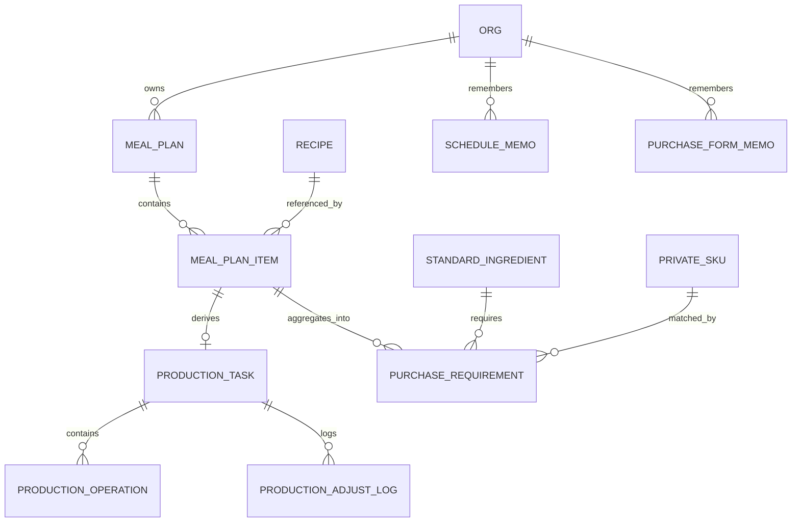

# 商户端计划管理 PRD

| 项目 | 内容 |
| --- | --- |
| 文档名称 | 商户端计划管理 PRD |
| 版本 | V1.1 |
| 日期 | 2026-09-23 |
| 适用范围 | 食联网数智餐饮平台 · 商户端「计划管理」（排餐计划 / 生产计划 / 采购计划） |
| 关联文档 | 《商户端菜谱管理 PRD》V1.0、《商户端商品中心 PRD》V1.0、《租户端菜谱管理与授权 PRD》V2.0、《数智餐饮运营管理平台—商品中心 PRD》V1.1 |
| 配套原型 | 商户端原型 `原型线上发布/merchant`（排餐计划、生产计划已实现；采购计划未开始） |
| 文档性质 | 第一期产品需求基线（页面 / 字段 / 计算规则 / 交互级） |

> **V1.1 变更摘要（2026-09-23）**
>
> 1. **用料换算从「占比分摊」改为「倍数放大」**：`倍数 k = 入锅投料总量 W ÷ 基准批次量 Q`，每行用量 `= 投料量 × k`。
>    两者在数学上等价，但倍数放大的**适用范围更大** —— 占比分摊在存在计数单位（个 / 只 / 条）行时算不出分母。
> 2. **基准批次量 Q 的定义**：纯人工菜按「一份」配置、含设备菜按「一批」配置；`Q` **不等于单锅产能**。
> 3. **排餐与设备彻底解耦**：排餐详情面板移除设备加工步骤、预计锅数；单锅产能改挂**设备型号主数据**。
> 4. **人均配量默认值分两路**：纯人工菜按菜谱派生，含设备菜靠记忆 / 首次手填。
> 5. **单位口径**：可折质量的行（克 / 千克 / 毫升 / 升）进合计，计数单位行进合计之外但仍按倍数放大。
> 6. 修正生产计划排程的**秒 / 分钟单位混用**缺陷（曾导致开工时间出现负值）。

## 1. 文档目的与范围

本文档定义商户端「计划管理」三个计划的完整产品规格：**排餐计划**（需求侧）、**生产计划**（执行侧）、**采购计划**（补给侧），覆盖三者的职责边界、端到端计算链、计划间耦合规则、页面结构、字段、校验与状态流转。

本文档的定位：

- 三计划构成「**需求 → 执行 / 补给**」单向链：排餐计划是**唯一人工录入口**，生产计划与采购计划均**自动派生**，只回传状态、不回写内容。
- 生产计划**只覆盖含设备加工的菜**；采购计划**覆盖全量菜**（含纯人工菜）。两条派生路径的数据源都是排餐计划，互不依赖。
- 菜谱层与商品层为主数据来源，本期主数据只做**一处**增强：设备型号新增「单锅产能 / 额定容量」。菜谱侧不再新增产能字段。

### 1.1 事实来源标注约定

本文档对关键条目标注来源等级，避免把决策、上游规则与原型实现事实混为一谈：

| 标记 | 含义 |
| --- | --- |
| **【已确认】** | 本轮业务方已明确拍板的决策，可直接实现与验收 |
| **【PRD】** | 来自上游 PRD 的已确认业务规则 |
| **【原型】** | 来自当前原型代码的实现事实，证明「现在是怎么做的」，不自动等于业务要求 |
| **【待确认】** | 无已确认来源，需业务方补充；不得按惯例推断 |

### 1.2 术语

| 术语 | 定义 |
| --- | --- |
| 排餐计划 | 按自然周安排每天各餐次菜谱的计划，并决定每道菜的出品量。三计划中的需求来源 |
| 生产计划 | 按天关联排餐计划形成的设备加工执行计划，决定设备、锅数与加工顺序 |
| 采购计划 | 按排餐计划出品量反算食材需求量，决定采购形态与采购量的计划 |
| 就餐人数 | 某组织某日某餐次的用餐人数，在排餐计划中录入 |
| 人均配量 | 该组织做某道菜时每人平均消耗的**成品量**（kg/人），在排餐计划中录入 |
| 出品量 | 某道菜需要产出的成品量（kg）。`出品量 = 就餐人数 × 人均配量` |
| 出餐成品系数 | 成品量 ÷ 入锅投料量（百分比）。菜谱基础信息已有字段，业务口语亦称「出品率」**【已确认】** 统一沿用「出餐成品系数」这一名称 |
| 入锅投料总量 | 达到某出品量所需投入的原料总量（kg）。`入锅投料总量 = 出品量 ÷ 出餐成品系数` |
| 基准批次量 Q | 菜谱用料明细中**能折成质量的行**之和（kg）。纯人工菜按「一份」配置，含设备菜按「一批」配置 **【已确认】** |
| 倍数 k | `入锅投料总量 W ÷ 基准批次量 Q`，业务含义是「本次要做几份菜谱配方」，无量纲、不取整 **【已确认】** |
| 食材用量 | 某食材本次实际需要投入的量 = `该行投料量 × 倍数 k`，单位保持菜谱的原单位 **【已确认】** |
| 食材占比 | 某食材投料量占基准批次量的比例 `投料量_i ÷ Q`，**仅用于展示，不参与计算** **【已确认】** |
| 单锅标准产能（设备额定容量） | 单台设备单锅可容纳的**入锅投料量**（kg/锅），维护在**设备型号主数据**上，菜谱步骤只引用设备型号、不承载产能 **【已确认】** |
| 锅数 | 生产批次数量。一道菜一个锅数，作用于该菜全部设备加工步骤 |
| 毛净率 | 净料 ÷ 毛料，衡量粗加工损耗，由平台标准食材库统一维护 |
| 形态系数 | 投料需求量换算为采购需求量的系数，随采购形态取值 |
| 计划态 / 执行态 | 排餐计划为计划态（可改）；生产计划为执行态（可临时调整，不回写排餐） |
| 生产状态 | 生产任务的 2 个状态：`生产中`（开火前点确认）、`生产完成`（结束后点完成）；未开始为默认无状态 **【已确认】** |

### 1.3 本期不包含

- 采购计划与供应商、询价、比价、订单、到货验收、库存台账的对接；
- 采购计划的审批流；
- 生产计划的人员排班、班组分配、绩效统计；
- 生产设备的真实下发与状态回传（现场设备联机）；
- 排餐计划的营养分析、成本核算、菜单发布；
- 就餐人数的默认值维护与工作日 / 周末 / 节假日的差异化规则 **【已确认】**；
- 采购计划的手工新增、删除与跨周期合并（V1 只做自动派生 + 形态确认）。

## 2. 三计划总体设计

### 2.1 主线：需求 → 执行 / 补给

```
菜谱库（主数据）
├─ 用料明细：投料量 w_i + 单位 + 用料角色 ─→ 提供基准批次量 Q = Σ可折质量的行
├─ 出餐成品系数 r0 ───────────────────→ 作为排餐时的默认值
├─ 设备加工步骤：设备型号 / 单锅时长
└─ 加工方式：纯人工 / 含设备加工 ──────→ 生产计划的准入条件

                ↓ 引用

        排餐计划（唯一人工录入口）
        ├─ 吃什么：菜谱
        ├─ 就餐人数 n          （记忆代入）
        ├─ 人均配量 p          （纯人工=菜谱派生 / 含设备=记忆代入或手填）
        ├─ 出餐成品系数 r1      （默认 r0，可覆盖）
        └─ 派生：出品量 Y1 = n × p
                  入锅投料总量 W = Y1 ÷ r1
                  倍数 k = W ÷ Q
                  食材用量_i = w_i × k        ← 与设备无关

        ├── 派生（仅「含设备加工」的菜）──→ 生产计划
        │                                  设备（额定容量）/ 锅数 / 顺序 / 状态
        └── 派生（全量菜，含纯人工）──────→ 采购计划
                                           形态换算 / SKU 匹配 / 采购量

        ↑ 生产计划仅向排餐计划回传状态，不回写内容
```

> **排餐与设备解耦** **【已确认】**：排餐计划只回答「吃什么、吃多少、出品率」，不感知设备与锅数。
> 同一份用料换算结果，换任何设备都不变；分几锅是生产计划按所选设备额定容量算出来的。

### 2.2 三计划边界矩阵

| 维度 | 排餐计划 | 生产计划 | 采购计划 |
| --- | --- | --- | --- |
| 回答的问题 | 吃什么 / 吃多少 / 出餐成品系数 | 哪台设备 / 几锅 / 什么顺序 | 买哪个SKU / 什么形态 / 买多少 |
| 粒度 | 组织 × 周 × 日期 × 餐次 × 菜谱 | 组织 × 日期 × 餐次 × 菜谱（+ 设备） | 组织 × 采购周期 × 标准食材 × SKU |
| 数据来源 | 菜谱库（引用） | 排餐计划派生（仅设备菜） | 排餐计划派生（全量菜） |
| 是否人工录入 | **是，唯一录入口** | 否，仅现场调整 | 否，仅形态确认 |
| 可变更性 | 计划态，可改（有约束） | 执行态，可临时改 | 派生态，随排餐重算 |
| 状态写入方 | 只读展示 | **唯一写入方** | — |
| 责任角色 | 食堂 / 档口管理员（排餐员） | 后厨 / 生产人员 | 采购员 |

### 2.3 端到端计算链（核心公式）

本节公式为三计划唯一口径，研发不得自行拆分或叠加系数。

**第 0 层：菜谱主数据**

```
可折质量的行      = 单位为 克 / 千克 / 毫升 / 升 的用料行（毫升、升按 1 g/ml 折算）**【已确认】**
基准批次量 Q      = Σ 可折质量的行 的投料量 (kg)
食材占比 q_i      = 可折质量的行：w_i ÷ Q；计数单位行（个 / 只 / 条 / 份 / 适量）：无占比
菜谱标准出品量 Y0 = r0 × Q        （推算值，不单独维护字段）
```

> **纯人工菜按「一份」配置用料，含设备菜按「一批」配置用料** **【已确认】**。
> `Q` 是「配方的基准规模」，**不等于单锅产能**：排餐人员并不知道生产人员会用哪台设备
> （同一道菜 1 号机 12 kg/锅、2 号机 16 kg/锅都可能），所以排餐侧不能拿锅容量当分母 **【已确认】**。

**第 1 层：排餐计划（需求 → 投料）**

```
出品量 Y1        = 就餐人数 n × 人均配量 p
入锅投料总量 W   = Y1 ÷ 出餐成品系数 r1
倍数 k           = W ÷ Q
食材用量_i       = w_i × k                 （单位保持菜谱原单位，不强制换算）
校验：Σ（可折质量行的用量_i）= k × Q = W   （行加得平）
```

> **重要口径（避免重复计算）**：菜谱的 `出餐成品系数 r0` **只作为排餐时的默认值**，不作为乘数参与计算。
> 因 `Y0 = r0 × Q`，若同时使用 `Y1 ÷ r0 ÷ r1` 会把烹制损耗计算两遍，导致采购量虚高。
> 排餐计划落库的三个输入是 `n`、`p`、`r1`；`Y1` 与 `W` 均为派生值。

**第 2 层：生产计划（投料 → 锅数）**

```
单锅标准产能 C   = 生产人员所选设备型号的额定容量 (kg/锅)   ← 来自设备主数据
锅数 B           = ⌈ W ÷ C ⌉
（允许人工覆盖，覆盖后标记「已调整」；换设备只提示「按新设备建议锅数为 N」，不自动覆盖 **【已确认】**）
设备步骤占用时长 = 锅数 B × 该步骤单锅时长
尾锅量           = W − (B − 1) × C        （B × C ≥ W，超出部分是「未装满」，不是额外投料）
```

**第 3 层：采购计划（投料 → 采购）**

```
形态系数 φ       = 买净菜（形态 == 投料状态）  → 1
                   买毛菜（需自行粗加工）      → 1 ÷ 毛净率 m
                   买半成品                    → 按半成品折算率
净料需求量_i     = 用料换算输出的「本次用量」折成质量（kg）
采购量_i         = 净料需求量_i × 形态系数 φ      ← 只用「可折质量」的行，计数单位行跳过
SKU 下单量       = ⌈ 采购量_i ÷ 该 SKU 的换算基数 ⌉
```

> **符号约定**：第 1 层的倍数记作 `k`，本层的形态系数记作 `φ`，两者不是同一个东西，不得混用。
> **采购计划的输入是排餐计划全量菜（含纯人工菜）的用料换算结果**，与生产计划无关，**不得用「是否含设备加工」过滤** **【已确认】**。
> 自采用料（如饮用水，行上标记「自采」）不产生采购需求。

> 出餐成品系数管的是**烹制损耗**，毛净率管的是**粗加工损耗**，是两个阶段，必须分两步换算 **【已确认】**。

**计算示例（贯穿全文）**

| 项 | 值 | 来源 |
| --- | --- | --- |
| 就餐人数 n | 300 人 | 排餐计划录入 |
| 人均配量 p | 0.5 kg/人 | 排餐计划录入 |
| 出品量 Y1 | 150 kg | 300 × 0.5 |
| 出餐成品系数 r1 | 88% | 默认取菜谱 r0 |
| 入锅投料总量 W | 170.45 kg | 150 ÷ 0.88 |
| 菜谱一批投料（含设备菜，Q = 12 kg） | 鸡胸肉 7.2 / 花生米 1.8 / 黄瓜 2.4 / 生抽 0.4 / 香油 200 ml | 菜谱用料明细 |
| 倍数 k | 14.2 | 170.45 ÷ 12 |
| 鸡胸肉占比 q | 60% | 7.2 ÷ 12（仅展示） |
| 鸡胸肉用量 | 102.27 kg | 7.2 × 14.2 |
| 香油用量 | 2.84 kg（原单位 2841 ml） | 0.2 × 14.2 |
| 各行用量之和 | 170.45 kg | = W，行加得平 |
| 设备额定容量 C | 12 kg/锅（智谷 A8） | 设备型号主数据 |
| 锅数 B | 15 锅 | ⌈170.45 ÷ 12⌉ |
| 尾锅量 | 2.45 kg | 170.45 − 14 × 12 |
| 鸡胸肉毛净率 m | 80% | 平台标准食材库 |
| 买毛菜时采购量 | 127.84 kg | 102.27 ÷ 0.8 |
| 买净菜时采购量 | 102.27 kg | 102.27 × 1 |

> 同一道菜，买毛菜比买净菜多采购 25%。这就是「买毛菜还是净菜」在数量上的真实含义。
> **换设备不改用料**：上例若改用 16 kg/锅 的设备，锅数变为 11 锅、尾锅 10.45 kg，但 14.2 的倍数与各行用量**完全不变** **【已确认】**。

### 2.4 计划间耦合规则

三计划**只保留 3 个耦合点**，不做页面互跳、不做双向内容同步 **【已确认】**。

| 耦合点 | 排餐计划侧 | 生产计划侧 |
| --- | --- | --- |
| 内容下发 | 保存即生效，无「生成生产计划」按钮 | 自动出现待生产任务（仅设备菜） |
| 变更 | 修改已下发的菜 → 强提示「已进入生产计划」并记录原因 | 派生值（出品量 / 投料量）自动刷新；**人工调整过的设备 / 锅数 / 顺序保留**，仅标记「来源已变更」 |
| 状态 | **只读徽标**（2 态） | **唯一写入方** |

规则明细：

1. **单向派生**：排餐计划保存后，生产计划按 `日期 × 餐次` 自动聚合出差量任务，不设「生成」按钮 **【已确认】**；
2. **现场调整只写自己**：生产计划的换设备、改锅数、调顺序**只写生产计划**，不回写排餐计划 **【已确认】**；
3. **只回传状态**：生产计划向排餐计划回传 **2 个状态**（生产中 / 生产完成）用于徽标展示，不回传设备、锅数、顺序等内容；
4. **不自动覆盖**：排餐变更后，生产计划**不自动覆盖**已生产人员调整过的内容，只打标记 **【已确认】**；
5. **生产计划不参与采购**：采购计划的数据源是排餐计划全量菜，与生产计划无关。纯人工菜不进生产计划，但必须进采购计划。

## 3. 主数据前置：菜谱层增强

### 3.1 本期改动

| 位置 | 变更 | 来源 |
| --- | --- | --- |
| 设备型号主数据 | **新增「单锅产能 / 额定容量」**（数值，kg/锅，必填） | **【已确认】** |
| 菜谱 → 加工步骤 → **设备加工步骤** | **不改动**，只引用设备型号；产能**不**维护在菜谱上 | **【已确认】** |
| 菜谱 → 基础信息 → 出餐成品系数 | **不改动**，字段名与语义保持原样（《商户端菜谱管理 PRD》7.5） | **【已确认】** |
| 菜谱 → 用料明细 | 沿用投料量 / 单位 / 投料状态 / 切配方式 / 切配规格，但**基准口径待补**（见 3.4） | **【待确认】** |
| 菜谱 → 加工方式判定 | **不改动**，直接复用为生产计划准入条件 | **【PRD】** |

> 原讨论曾把「单锅标准产能」放在菜谱的设备加工步骤上，**已撤回** **【已确认】**：同一道菜在不同车间用不同设备
> （1 号机 12 kg/锅、2 号机 16 kg/锅），产能属于**设备**而不是**菜**。挂在菜谱上会逼排餐人员预判生产用哪台设备，
> 与「排餐不感知设备」直接冲突。
> 原讨论中曾考虑在菜谱新增「每份参考量」「人均配量」，因人均配量确定放在排餐计划（见 4.3），菜谱层**无需新增该字段** **【已确认】**。

### 3.2 单锅产能（设备额定容量）规则

1. **单位是入锅投料量（kg/锅）**，不是成品量 —— 锅装的是生料 **【已确认】**；
2. 维护在**设备型号主数据**上（一个型号一个值），**不**维护在菜谱上 **【已确认】**；
3. **计算锅数时取该菜「主加工步骤」所用设备型号的容量**（承载该菜主加工时长的那一步）**【已确认】**；
   - 一个菜谱的多个设备步骤可能用不同型号；V1 按「其余步骤与主加工步骤同批处理」处理，见 5.4 待确认项；
4. 取值范围 > 0；未维护时锅数默认 1，并标记「缺少设备额定容量，锅数待人工确认」；
5. 菜谱版本变更时，按版本快照管理：已进入生产计划的锅数为**执行时快照**，不随菜谱改版自动变化；
6. **设备型号额定容量被改**：未人工覆盖的锅数按新容量刷新建议值；已人工覆盖的保留，仅标记「来源已变更」 **【已确认】**。

### 3.3 加工方式作为生产计划准入条件

| 加工方式 | 判定条件 | 是否进生产计划 |
| --- | --- | --- |
| 纯人工 | 加工步骤全部为人工处理步骤 | **否** |
| 含设备加工 | 加工步骤中包含至少一个设备加工步骤 | **是** |

判定规则直接复用《商户端菜谱管理 PRD》7.4，**不新增字段** **【PRD】**。

> 实现提示 **【待确认】**：判定必须看**步骤类型**（该步骤是设备加工还是人工处理），不能简化为「步骤列表是否为空」。
> 一个全部是人工步骤的菜谱同样有步骤列表，按「步骤非空」判定会把它误判为设备菜。

### 3.4 用料明细的基准口径（菜谱管理侧待补）

《商户端菜谱管理 PRD》7.6 的用料明细**没有定义「投料量是按每份还是每锅配置」**，也没有单位换算规则。
三计划要算用料，必须先补齐这两件事 **【待确认】**：

| 待补项 | 建议口径 | 依据 |
| --- | --- | --- |
| 用料明细的**基准** | 纯人工菜按「一份」配置；含设备菜按「一批」配置 | 与 2.3 的 `Q` 一致 **【已确认】** |
| **单位换算规则** | 克 / 千克 / 毫升 / 升 可折成质量（毫升、升按 `1 g/ml`）；个 / 只 / 条 / 份 / 适量不进合计，但仍按倍数放大 | **【已确认】** |
| **单锅产能** | 从菜谱设备加工步骤**移除**，改挂设备型号主数据 | 见 3.1 / 3.2 **【已确认】** |
| 主料使用计数单位 | 行级提示「主料建议使用质量单位」，**不硬拦** | 单份配量很小的菜（如「鸡蛋 1 个」）确实不适合强制改克 |
| **自采用料** | 饮用水等自采用料需要可识别（如标记「自采」），采购计划应跳过 | 汤粥类的用水占 `Q` 的大头，不纳入基准会明显失真 |

## 4. 排餐计划

### 4.1 页面结构（沿用现有周视图）

在现有 `merchant-meal-plan-v1.js` 已实现的周排餐表基础上扩展，**不改变整体交互形态** **【原型】**：

- 顶部：周切换 / 周选择器 / 回到本周 / 复制排餐 / 编辑-保存；
- 周排餐表：行 = 餐次，列 = 日期，单元格 = 菜谱卡片列表；
- 新增：单元格内每道菜展示 `出品量` 与状态徽标；餐次行头新增 `就餐人数` 录入。

### 4.2 三个输入与两个派生

| 层级 | 字段 | 类型 | 必填 | 说明 |
| --- | --- | --- | --- | --- |
| 餐次级 | 就餐人数 | 数值（人） | 是 | 按 `日期 × 餐次` 录入，≥ 1 的整数 |
| 菜品级 | 菜谱 | 引用 | 是 | 从菜谱库选择 |
| 菜品级 | 人均配量 p | 数值（kg/人） | 是 | 默认值来源按加工方式分两路，见 4.3；精度 0.000001 kg |
| 菜品级 | 出餐成品系数 r1 | 百分比 | 是 | 默认取菜谱 `r0`，可覆盖；覆盖值按 `组织 × 菜谱` 记忆 |
| 菜品级 | **出品量 Y1** | 数值（kg） | 派生（可编辑） | `n × p`，可直接编辑，编辑后反算 `p` |
| 菜品级 | **入锅投料总量 W** | 数值（kg） | 派生，只读 | `Y1 ÷ r1` |
| 菜品级 | **用料换算** | 表格（派生，只读） | — | 每行 `投料量 × k`，`k = W ÷ Q`；单位保持菜谱原单位 |

展示规则：

- 菜品卡片默认展示「菜名 + 出品量」，如 `宫保鸡丁 45kg`；
- 点开菜品卡片展开详情面板：人数 / 人均配量 / 出餐成品系数 / 出品量 / 入锅投料总量 / **用料换算**；
- 派生字段只读，鼠标悬停显示计算式；
- 详情面板**不展示设备、锅数、单锅时长** —— 那些属于生产计划 **【已确认】**；
- 用料换算表头随加工方式切换：纯人工菜为「**每份投料**」，含设备菜为「**每批投料**」 **【已确认】**；
  - 用「每批」而不用「每锅」：一锅装多少取决于生产人员选哪台设备，排餐侧不知道 **【已确认】**；
- 用料换算表附一行合计与口径说明：`每批投料合计 14 kg，每行本次用量 = 该行投料 × 倍数，单位保持菜谱原单位`。

### 4.3 记忆代入机制

社会餐饮场景下，就餐人数与人均配量都很不确定，采用「**第一次填写，下次自动代入**」机制降低重复录入 **【已确认】**。

**人均配量的默认值来源（按加工方式分两路）** **【已确认】**

| 加工方式 | 默认值 | 记忆的作用 |
| --- | --- | --- |
| 纯人工 | **菜谱派生**：`p = Q × r1 ÷ 1000`（一份的料 × 出餐成品系数） | 只记录**人工覆盖值** |
| 含设备 | 首次**留空必填** —— 一批的料无法折算成一个人的量 | 记忆是唯一来源 |

派生规则说明：

1. **为什么纯人工能派生而含设备不能**：纯人工菜的用料基准就是「一份」，`一份的料 × 出餐成品系数 = 每人吃到的成品量`；
   含设备菜的用料基准是「一批」，与就餐人数没有直接关系，只能靠历史经验 **【已确认】**；
2. 详情面板必须标注来源，让用户知道这个数从哪来：
   - 派生：`└ 按菜谱每份投料 116 g × 出餐成品系数 91% = 0.10556 kg/人，可直接修改`
   - 记忆：`└ 人均配量沿用 09-18 午餐 的记录值，可直接修改覆盖`
   - 首次：`└ 该菜含设备加工，无法从菜谱推算人均配量，请填写`
3. 内部以 `perPersonFrom = recipe / memory / manual` 标记来源；
4. **派生来源的人均配量随菜谱用料或出餐成品系数自动刷新；人工改过的一律不再自动覆盖** **【已确认】**（与 5.8 的
   「派生值自动刷新，人工调整值永不自动覆盖」同一原则）；
5. 用户编辑人均配量或出品量后，来源立即转为 `manual`，不再参与自动刷新；
6. **记忆只写人工值**：来源为 `recipe` 的人均配量不写记忆（下次仍按菜谱派生） **【已确认】**；
7. 纯人工菜派生值若落在 `(0.01, 1.5)` kg/人 之外，提示「菜谱投料疑似不是按单人份配置」，**仍填入**，不阻断排餐。

**记忆粒度**

| 记忆对象 | 记忆粒度 | 理由 |
| --- | --- | --- |
| 就餐人数 | `组织 × 餐次` | 早餐 80 人、午餐 300 人，必须分餐次 |
| 人均配量 | `组织 × 菜谱` | 同一道菜跨餐次配量差别不大，不分餐次更省 **【已确认】** |
| 出餐成品系数 | `组织 × 菜谱`（仅当覆盖过菜谱默认值） | 未覆盖则走菜谱默认，不占记忆 |

**取数与代入规则**

1. **取数来源**：只从**已保存**的历史排餐取值，**不取未保存的编辑态** —— 避免把草稿带入；
2. **取值规则**：取该组织下**最近一次有值**的记录，**不绑定星期几**。社会餐饮不规律，绑「上周同一天」反而取不到值 **【已确认】**；
3. **代入时机**：新增菜品时带出该菜的人均配量与出餐成品系数；进入空白餐次时带出该餐次人数；
4. **视觉标记**：代入值旁展示来源小字，如 `沿用 09-18 午餐`，让用户知道这是记忆值而非本次确认；
5. **可清除**：支持一键清除代入值，清除后为空白必填；
6. **组织隔离**：记忆按 `merchant_id + org_id` 隔离，A 食堂的记忆不得流入 B 档口 **【PRD】**（沿用组织隔离原则）；
7. **跟随菜谱身份，不随版本失效**：菜谱升版导致用料变化后，人均配量记忆**保留** —— 它是该组织的经营经验，与菜谱内容版本无关 **【已确认】**；
8. **写入时机**：排餐计划**保存时**写入记忆，取消编辑不写入。

**首次无记忆值时的处理**

- **含设备菜**：留空、**必填**、占位提示「该菜含设备加工，无法从菜谱推算人均配量，请填写」 **【已确认】**；
- **纯人工菜**：按菜谱每份投料自动派生并填入，用户**不需要**先填一次 **【已确认】**；
- **不引入**分类级默认值或组织级默认值配置页 —— 填一次即被记住，第二次起零操作 **【已确认】**。

### 4.4 出品量编辑与反算

1. 出品量**可直接编辑** **【已确认】**；
2. 编辑出品量后，系统反算 `人均配量 = 出品量 ÷ 就餐人数`，并更新展示与记忆；
3. `人均配量` 以 0.000001 kg 精度落库（`Q × r1 ÷ 100000` 对整数克最多 5 位小数，留 6 位可精确表达），
   保证「编辑出品量 → 反算人均配量 → 再算出品量」往返不产生可见漂移；纯人工菜派生来源时，算出的倍数正好等于就餐人数；
4. 就餐人数为空或为 0 时，不允许反算，提示「请先填写就餐人数」；
5. **落库唯一真相为 `就餐人数`、`人均配量`、`出餐成品系数`**；`出品量` 与 `入锅投料总量` 均为派生值，不单独落库（或落库为计算冗余，读取时以三输入重算）。

### 4.5 出餐成品系数覆盖

1. 默认取菜谱「出餐成品系数」`r0`，**正常不显示输入框**；
2. 仅在异常场景点开覆盖（如该组织实际出品损耗更大）；
3. 覆盖后打标「已人工调整」，并按 `组织 × 菜谱` 记忆，下次自动代入；
4. 菜谱升版后，若用户从未覆盖过，则自动跟随新版本 `r0`；若覆盖过，则保留用户覆盖值（与 4.3 第 7 条一致）。

### 4.6 状态徽标（只读）

排餐侧只读、不可编辑。**状态只保留 2 个** **【已确认】**：

| 状态 | 含义 | 排餐侧可做的操作 |
| --- | --- | --- |
| （不展示徽标） | 未开始，或未关联生产计划（纯人工菜） | **可自由修改 / 替换 / 删除** |
| 生产中 | 生产人员已点「开始生产」 | **禁止修改 / 替换 / 删除** |
| 生产完成 | 生产人员已点「完成」 | **禁止修改 / 替换 / 删除** |

规则：

1. **状态由生产人员手动触发，不做自动流转判断** **【已确认】**；
2. **「未开始」在排餐计划上不展示状态徽标**，避免视觉噪音；如需感知「该菜已在生产计划中」，见第 11 章 Q11；
3. 生产计划点「开始生产」即视为生产人员已确认设备与锅数，**不设单独的「确认」步骤** **【已确认】**；
4. 卡点分界在「开始生产」这一刻：**未开始 → 随便改；一旦开工 → 完全锁死** **【已确认】**；
5. 徽标只展示状态，不展示设备、锅数、顺序等生产内部细节。

### 4.7 变更与原因记录

1. 修改**已下发生产且未开始**的菜（换菜 / 改量 / 改系数），保存前给出强提示：「该菜已进入生产计划，修改后生产准备需重新安排」**【已确认】**；
2. 修改**当日**排餐需填写调整原因（原型已实现）**【原型】**；本次扩展为**全周生效**：修改已保存且日期 ≤ 今天的排餐均需填原因；
3. 调整记录保留：时间、餐次、类型（新增 / 替换 / 删除 / 改量）、明细、原因、操作人；
4. 原因记录不随「复制排餐」复制。

### 4.8 复制排餐

沿用原型实现 **【原型】**，补充规则：

1. 复制**带入**就餐人数、人均配量、出餐成品系数；
2. 复制**不带入**调整记录与生产状态；
3. 复制**不写入**记忆（记忆只由保存动作写入，避免复制污染记忆）。

### 4.9 校验规则

| # | 校验 | 提示 |
| --- | --- | --- |
| 1 | 就餐人数必填且 ≥ 1 | 请填写就餐人数 |
| 2 | 菜品的人均配量必填且 > 0 | 请输入人均配量 |
| 3 | 出餐成品系数 > 0 且 ≤ 100% | 出餐成品系数取值应大于 0 且不超过 100% |
| 4 | 出品量 > 0 | 出品量必须大于 0 |
| 5 | 同一餐次同一菜谱不建议重复添加 | 该餐次已安排此菜谱，是否继续添加？ |
| 6 | 未关联菜谱库的菜谱不可添加 | 菜谱已删除或停用，请重新选择 |
| 7 | 历史周不可编辑 | 历史周仅支持查看 |
| 8 | 生产中 / 生产完成的菜不可修改或删除 | 该菜正在生产 / 已生产完成，不能修改或删除 |

## 5. 生产计划

### 5.1 入口与页面结构

侧边导航「计划管理 → 生产计划」（原型已预留栏目与入口）**【原型】**。

页面自上而下：

| 区域 | 内容 |
| --- | --- |
| 头部 | 标题「生产计划」、日期切换（默认今天）、组织提示条 |
| 视图切换 | **任务视图**（按菜） / **设备时间轴**（按设备）**【已确认】** 双视图 |
| 筛选 | 餐次、设备型号、状态（未开始 / 生产中 / 生产完成）、是否仅看冲突 |
| 任务列表 | 行 = 菜品任务，见 5.3 |
| 设备时间轴 | 泳道 = 设备型号，块 = 任务在各设备步骤上的占用，见 5.5 |
| 右侧抽屉 | 任务详情 / 临时调整 |

### 5.2 派生规则

1. 数据源：排餐计划中**加工方式 = 含设备加工**的菜 **【已确认】**；
2. 触发：排餐计划保存后自动同步差量，**无「生成生产计划」按钮** **【已确认】**；
3. 聚合键：`日期 × 餐次 × 菜谱`；同一菜谱在同一餐次只产生**一条任务**；
4. 删除：排餐计划删除某菜后，若该任务**未开始**则自动移除；已进入生产中或已完成则保留并标记「来源已删除」；
5. 快照：任务落库时快照 `入锅投料总量 W`、`设备额定容量 C`、`菜品名称`、`加工步骤`，避免菜谱改版影响已下发任务。

### 5.3 任务行字段

| 列 | 字段 | 说明 |
| --- | --- | --- |
| 1 | 餐次 | 早餐 / 午餐 / 晚餐 等 |
| 2 | 菜品 | 图片 + 菜谱名称 + 版本号 |
| 3 | 出品量 | 来自排餐计划（kg） |
| 4 | 入锅投料总量 | 来自排餐计划（kg） |
| 5 | 主加工设备 | 承载主加工时长的设备型号 |
| 6 | 锅数 | 一道菜一个值，见 5.4 |
| 7 | 单锅时长 | 主加工设备步骤的单锅时长 |
| 8 | 预计总时长 | `锅数 × Σ各设备步骤单锅时长` |
| 9 | 计划开始 / 结束时间 | 由顺序推算 |
| 10 | 顺序 | 该餐次内的加工次序 |
| 11 | 状态 | 未开始（默认，不展示标签）/ 生产中 / 生产完成 |
| 12 | 标记 | 「已调整」/「来源已变更」/「来源已删除」 |
| 13 | 操作 | 调整 / **开始生产** / **完成**（**无「确认」按钮**） |

### 5.4 锅数规则

1. **锅数的配置维度是「菜」，不是「设备」** **【已确认】**；
2. **一道菜有且只有一个锅数字段**，作用于该菜**全部**设备加工步骤 **【已确认】**；
3. 默认值：`锅数 = ⌈入锅投料总量 W ÷ 设备额定容量 C⌉`，其中 `C` 取该菜**主加工步骤所用设备型号**的额定容量（来自设备主数据，见 3.2）**【已确认】**；
4. 允许人工覆盖，覆盖后标记「已调整」；
5. 跨设备的时间轴占用：某设备步骤占用时长 = `锅数 × 该步骤单锅时长`，因此一个锅数即可排开全部设备的时间轴，**不产生第二个锅数配置**；
6. 锅数取值：≥ 1 的整数；不允许为 0；
7. **尾锅量** = `W − (锅数 − 1) × C`，即最后一锅实际装了多少；锅数向上取整带来的富余是「未装满」，**不是额外投料**；
8. **换设备只提示、不自动改**：在调整抽屉里换主加工设备后，立即显示该设备型号的额定容量与「按新设备建议锅数为 N」，
   但**锅数保持人工值不动**，由生产人员决定是否采纳 **【已确认】**。

**示例（承接 2.3）**：宫保鸡丁 `W = 170.45kg`，主加工设备「智谷 A8」额定容量 `12kg/锅` → 锅数 `⌈170.45 ÷ 12⌉ = 15` 锅，尾锅 `170.45 − 14 × 12 = 2.45kg`。
该菜另有「预热炒锅」步骤（同一设备，单锅 60 秒）与「酱汁投放」步骤（单锅 20 秒），则：
- 主料炒制占用 = 15 × 180 秒 = 45 分钟
- 预热占用 = 15 × 60 秒 = 15 分钟
- 酱汁投放占用 = 15 × 20 秒 = 5 分钟

> **待确认（多设备步骤的产能不匹配）**：若一道菜的主加工步骤在 14 kg/锅 的炒锅、而某个前置步骤在 30 kg/锅 的汤锅上，
> 「一个锅数作用于全部步骤」仍成立（前置锅更大，不构成瓶颈）；但若**前置步骤的设备更小**（如焯水锅只有 8 kg/锅），
> 用主加工设备的容量算出的锅数会不够前置步骤用。V1 建议：锅数取「各设备步骤所需锅数的最大值」，即
> `锅数 = max_i ⌈W ÷ C_i⌉`，等价于按**最紧的那台设备**定锅数；未确认前原型的实现仍按主加工设备取值。

### 5.5 加工顺序与设备时间轴

**默认排序（自动）**：按「开餐时间倒推 + 工艺时长」生成初版顺序：

```
计划结束时间 = 该餐次开餐时间 − 出品静置缓冲
计划开始时间 = 计划结束时间 − 预计总时长
同一设备上按开始时间先后排布，冲突时按菜品出品时效优先级调整
```

**排序需兼顾的四类约束**：

| 约束 | 说明 | 系统处理 |
| --- | --- | --- |
| 设备占用冲突 | 同一设备同一时段只能做一道菜 | 自动错开；无法错开时标红提示 |
| 开餐时间倒推 | 菜品须在开餐前出锅 | 作为排程终点 |
| 工艺前置 | 腌制 / 解冻 / 炖煮耗时长的菜需提前 | 由工艺时长自然体现 |
| 出品时效 | 炒菜宜临开餐前制作 | 作为优先级权重 |

**交互规则**：

1. 任务视图内可拖拽调整顺序，顺序变化后自动重算开始 / 结束时间；
2. 设备时间轴视图内可拖拽调整时间块，时间块不可重叠；
3. **冲突只提示不阻断** **【已确认】**：冲突块标红并在顶部汇总「本餐次存在 N 处设备冲突」，允许保存；
4. 提供「一键按推荐顺序重排」。

### 5.6 临时调整

1. 允许调整项：**主加工设备、锅数、顺序、计划开始时间**；**仅「未开始」状态可调整** **【已确认】**；
2. 临时调整**只写生产计划，不影响排餐计划** **【已确认】**；
3. 调整后该任务标记「已调整」，并在任务详情保留调整记录（时间、字段、原值、新值、操作人）；
4. 调整不重算排餐计划的出品量与投料量；
5. 换设备后，抽屉里立即展示**新设备的额定容量**与「按新设备建议锅数为 N」，锅数**不自动重算**（保持人工值）。

### 5.7 状态机

**只保留 2 个状态**，生产人员全程只有 **2 个动作**：开火前点「开始生产」、结束后点「完成」**【已确认】**。

| 状态 | 含义 | 进入方式 | 可执行操作 |
| --- | --- | --- | --- |
| 未开始（默认无状态） | 排餐下发后的初始态 | 排餐保存自动生成 | 调整设备 / 锅数 / 顺序、**开始生产** |
| 生产中 | 生产人员已开始烹饪 | 点「开始生产」 | **完成** |
| 生产完成 | 烹饪结束 | 点「完成」 | 无（只读） |

状态迁移：

| 起点 | 操作 | 终点 |
| --- | --- | --- |
| 未开始 | 开始生产 | 生产中 |
| 生产中 | 完成 | 生产完成 |

规则：

1. **不设「确认」步骤** —— 点「开始生产」即视为生产人员已确认设备与锅数 **【已确认】**；
2. 进入「生产中」后，**锁定**不可再调整设备 / 锅数 / 顺序；
3. 状态**不可回退**：生产中不可退回未开始，生产完成不可退回生产中；误操作由线下处理，系统不提供回退入口 **【待确认】**（见第 11 章 Q12）；
4. 生产计划是状态**唯一写入方**；排餐计划仅只读展示 **【已确认】**。

### 5.8 来源变更处理

| 场景 | 生产计划处理 |
| --- | --- |
| 未开始 · 排餐改量 | 出品量 / 入锅投料总量**自动刷新**；锅数**未人工覆盖**时按新投料量重算，**已覆盖**时保留并标记「来源已变更」 |
| 未开始 · 排餐换菜 | 原任务标记「来源已删除」，新增一条「未开始」任务 |
| 未开始 · 排餐删除菜 | 任务**自动移除**（尚未开工，无损失） |
| 未开始 · 排餐改出餐成品系数 | 同「改量」，投料量刷新 |
| 生产中 / 生产完成 | **不做任何自动变更**，仅在任务行提示「来源已变更」，由生产人员线下处理后手动处理 |

> 取消「待生产确认 / 已确认待生产」后，**未开始阶段不再有「生产侧已确认」这层保护**。因此把保护下沉为字段级规则：**派生值（出品量 / 投料量）自动刷新，人工调整值（设备 / 锅数 / 顺序）永不自动覆盖** **【已确认】**。

### 5.9 校验规则

| # | 校验 | 提示 |
| --- | --- | --- |
| 1 | 锅数 ≥ 1 整数 | 锅数必须为大于 0 的整数 |
| 2 | 主加工设备必选 | 请选择主加工设备 |
| 3 | 设备时间块不可重叠 | 该时段设备已被占用 |
| 4 | 计划结束时间不得晚于开餐时间 | 该菜品将在开餐后才完成 |
| 5 | 生产中不可修改设备与锅数 | 该任务已开工，不能调整设备或锅数 |
| 6 | 来源已删除的任务不可开工 | 排餐已删除该菜，请先处理 |

## 6. 采购计划

### 6.1 入口与页面结构

侧边导航「计划管理 → 采购计划」。

| 区域 | 内容 |
| --- | --- |
| 头部 | 标题「采购计划」、组织提示条 |
| 周期选择 | 采购周期（默认下一周 / 自定义日期区间） |
| 汇总条 | 待确认形态行数、已确认行数、涉及 SKU 数 |
| 明细表 | 行 = `标准食材 × 采购形态`，见 6.4 |
| 右侧抽屉 | 候选 SKU 选择 / 需求量来源追溯 |

### 6.2 需求量来源

1. 数据源：排餐计划**全量菜**（含纯人工菜）**【已确认】**；
2. **不依赖生产计划** —— 纯人工菜不进生产计划但必须采购 【已确认】；
3. 汇总规则：按 `标准食材 × 采购形态` 汇总所选周期内的全部食材投料需求量；
4. 已过期的历史排餐按已保存内容计算，不随时间变化。

### 6.3 换算公式

见 2.3 第 3 层。补充规则：

1. `毛净率 m` 取自**平台标准食材库**，商户端只读 **【已确认】**；
2. 形态系数 `k` 随采购形态取值，形态变更时采购量实时重算；
3. `SKU 下单量 = ⌈采购量 ÷ 该 SKU 的换算基数⌉`，换算基数取自 SKU 的「换算关系 / 库存基准单位」（《商户端商品中心 PRD》6.5）；
4. 向上取整后若低于该 SKU 的最小起订量，按最小起订量取值（无最小起订量主数据时不做此校验）。

### 6.4 明细表字段

| 列 | 字段 | 说明 |
| --- | --- | --- |
| 1 | 标准食材 | 名称 + 编码 |
| 2 | 入锅投料需求量 | 汇总后的投料量（kg） |
| 3 | 采购形态 | 毛菜 / 净菜 / 半成品，可改（见 6.5） |
| 4 | 形态来源 | 菜谱指定 / 系统推断 / 人工选定 |
| 5 | 形态系数 | 展示系数与依据（如「÷ 毛净率 80%」） |
| 6 | 采购量 | 换算后需求量（kg） |
| 7 | 匹配 SKU | 选定的私域 SKU |
| 8 | SKU 下单量 | 按换算基数向上取整 |
| 9 | 来源菜谱 | 贡献该食材的菜谱数量，可展开追溯 |
| 10 | 操作 | 选择 SKU / 修改形态 |

### 6.5 SKU 形态选择策略

**选择粒度是用料行（标准食材），不是菜品** —— 一道菜里肉买毛菜、调料买半成品是正常情况。

三层策略，优先级从高到低：

**① 菜谱指定（最高优先级）**

《商户端菜谱管理 PRD》7.6 用料明细新增「**期望采购形态**」字段 **【已确认】**：

| 取值 | 含义 |
| --- | --- |
| 毛菜 | 锁定按毛菜采购 |
| 净菜 | 锁定按净菜采购 |
| 半成品 | 锁定按半成品采购 |
| 不限（默认） | 进入第 ② 层推断 |

指定后采购侧不可随意更改；如需变更须回菜谱修改或走人工覆盖（人工覆盖按 ③ 处理并记录）。

**② 投料状态自动推断（默认）**

菜谱未指定时，按用料行的 `投料状态 + 切配方式` 推断，**不新增数据**：

| 菜谱投料状态 | 推荐采购形态 |
| --- | --- |
| 原始 / 未处理 | 毛菜 |
| 已清洗、已切配（切 / 丝 / 片 / 丁） | 净菜 |
| 已调味 / 已预制 / 可直接加热 | 半成品 |

推断结果标记为「系统推断」，采购员可覆盖。

**③ 人工选定并记忆（兜底）**

1. 无匹配或多候选时，采购计划列出生效的候选 SKU，按「形态匹配度 → 库存 → 价格」排序；
2. 采购员选定一次后，**记为该组织的默认选择**（粒度：`组织 × 标准食材`），后续自动复用；
3. 人工选定的形态标记为「人工选定」，优先级低于菜谱指定、高于系统推断；
4. 候选 SKU 必须满足：所属私域商品已发布、SKU 已发布且启用（《商户端商品中心 PRD》13.2）。

**选择结果落库**

| 字段 | 说明 |
| --- | --- |
| 标准食材 | 关联键 |
| 采购形态 | 最终采用的形态 |
| 形态来源 | 菜谱指定 / 系统推断 / 人工选定 / 记忆默认 |
| 匹配 SKU | 最终选定的 SKU |
| 状态 | 待确认 / 已确认 |

### 6.6 半成品挂接（目标态）

**依据**：毛菜（关联 1 个标准食材）与净菜（关联 1 个及以上）可通过商品的 `standard_ingredient_ids` 与菜谱用料行**精确挂接**；半成品「无需关联标准食材」，其标准食材由平台另一套逻辑写入（《商户端商品中心 PRD》8.3），因此**在关联落地前无法自动挂接**。

**目标态设计（按上游已提供该数据为前提）** **【已确认】**：

> 平台标准食材库统一维护毛净率与**形态折算关系**，毛菜、净菜、半成品三种形态均可通过标准食材挂接到菜谱用料行，三级换算全链路自动完成。

**过渡期处理**：上游能力未就绪时，半成品不参与自动换算，由采购员在采购计划中手工添加该行，并标记来源为「人工添加」。**该过渡策略不阻塞排餐计划与生产计划上线** **【已确认】**。

### 6.7 异常与边界

| 场景 | 处理 |
| --- | --- |
| 标准食材无任何可用 SKU | 该行标红提示「无可用 SKU」，不阻断其他行 |
| 毛净率缺失 | 该行按系数 1 计算并提示「缺少毛净率，按净菜口径计算」 |
| 菜谱指定形态无对应 SKU | 提示「菜谱指定形态无可用 SKU，是否改用其他形态？」并允许人工覆盖 |
| 排餐计划在采购周期内被修改 | 采购明细实时重算；已确认行标记「来源已变更，待重新确认」 |
| 同一标准食材在多道菜中以不同形态出现 | 拆分为多行分别计算，不合并 |
| 周期内无排餐数据 | 空态提示「所选周期暂无排餐数据」 |

## 7. 组织与数据范围

1. 三计划的数据范围均以顶部当前组织为准；
2. 排餐计划仅对**食堂与档口**类型组织开放（原型已实现）**【原型】**；
3. 生产计划与采购计划沿用相同组织范围校验；
4. 记忆数据（人数 / 人均配量 / 出餐成品系数）、形态默认选择均按 `merchant_id + org_id` 隔离；
5. 切换组织时，排餐计划若存在未保存修改需提示「保存后切换 / 取消切换」（原型已实现）**【原型】**；生产计划与采购计划的现场调整同样提示；
6. 上级组织的计划数据不向下级组织继承。

## 8. 权限

| 操作 | 归属页面 | 说明 |
| --- | --- | --- |
| 排餐计划查看 / 编辑 / 复制 | 排餐计划 | 按角色与按钮权限控制 |
| 排餐计划调整原因查看 | 排餐计划 | 按角色控制 |
| 生产计划查看 | 生产计划 | 后厨 / 生产人员 |
| 生产计划调整（设备 / 锅数 / 顺序） | 生产计划 | 后厨 / 生产人员 |
| 生产计划状态流转（开始生产 / 完成） | 生产计划 | 后厨 / 生产人员 |
| 采购计划查看 | 采购计划 | 采购员 |
| 采购形态与 SKU 选择 | 采购计划 | 采购员 |
| 菜谱「期望采购形态」维护 | 菜谱管理 → 菜谱库 | 菜谱维护人 |

数据范围按当前组织校验，**不能只依赖前端筛选** **【PRD】**。

## 9. 异常与边界场景

| 场景 | 处理 |
| --- | --- |
| 排餐计划保存时菜谱已被删除 / 停用 | 该菜无法保存，提示重新选择；不影响其他菜 |
| 菜谱改版导致用料变化 | 已下发的生产任务使用快照，不自动变化；标记「菜谱已升版」，由生产人员决定是否重算 |
| 排餐改量后生产任务正在生产中 | 不做自动变更，仅提示「来源已变更」 |
| 同一菜谱在同一餐次被重复添加 | 提示确认后允许，但生产计划只生成一条任务（按合计出品量） |
| 就餐人数为 0 | 不允许保存（校验 4.9-1） |
| 出餐成品系数被填成 0 | 校验拦截，提示 4.9-3 |
| 设备额定容量缺失（含设备加工但该设备型号未维护容量） | 锅数默认 1，标记「缺少设备额定容量，锅数待人工确认」 |
| 设备时间轴冲突 | 标红提示，允许保存 |
| 排餐计划整周清空 | 生产计划中「未开始」的任务全部移除；「生产中 / 生产完成」的任务保留并标记 |
| 采购周期跨周 | 按日期区间汇总，不按自然周截断 |
| 记忆值与菜谱当前状态不符（如菜谱已停用） | 记忆保留但不代入，提示「菜谱已停用」 |
| 两个组织排同一道菜 | 各自独立的记忆与计划数据，互不影响 |

## 10. 验收标准

| 编号 | 验收场景 | 预期结果 |
| --- | --- | --- |
| AC01 | 打开排餐计划 | 周视图展示，行 = 餐次、列 = 日期，可切换周与编辑 |
| AC02 | 录入就餐人数 | 餐次级可按 `日期 × 餐次` 录入人数，必填且 ≥ 1 |
| AC03 | 首次添加**含设备加工**的菜 | 人均配量留空、必填，占位提示「该菜含设备加工，无法从菜谱推算人均配量，请填写」；出餐成品系数取菜谱默认 |
| AC03b | 首次添加**纯人工**的菜 | 人均配量按「菜谱每份投料 × 出餐成品系数」自动派生并显示来源小字，无需用户先填 |
| AC03c | 派生来源的人均配量遇菜谱/系数变化 | 自动刷新；一旦用户手工改过（`per_person_from = MANUAL`）则永不被覆盖 |
| AC04 | 保存后再次添加同一道菜 | 自动代入上次保存的**人工**人均配量，并显示「沿用 <日期> <餐次>」小字 |
| AC05 | 切换餐次填入人数后保存 | 下次进入该餐次自动代入上次人数 |
| AC06 | 记忆粒度校验 | 人均配量按 `组织 × 菜谱` 记忆，跨餐次共用；人数按 `组织 × 餐次` 记忆 |
| AC07 | 取消编辑 | 取消后不写入记忆，下次仍取上一次**已保存**的值 |
| AC08 | 编辑出品量 | 出品量可直接编辑，保存后人均配量被反算并更新记忆 |
| AC09 | 出品量往返精度 | `编辑出品量 → 反算人均配量 → 再算出品量` 结果与输入一致（无可见漂移） |
| AC10 | 出餐成品系数默认值 | 默认取菜谱值且不展示输入框；覆盖后打标「已人工调整」并按 `组织 × 菜谱` 记忆 |
| AC11 | 入锅投料总量 | 展示为 `出品量 ÷ 出餐成品系数`，只读 |
| AC12 | 重复计算校验 | 计算过程中菜谱标准系数不被二次相乘（按 2.3 示例数值核对） |
| AC12a | 用料换算口径 | 每行用量 = `菜谱投料 × k`，`k = W ÷ Q`；表头为「每份投料」（纯人工菜）或「每批投料」（含设备菜），**不出现「每锅投料」** |
| AC12b | 行加得平 | 各行「本次用量」（折成质量后）之和 = 入锅投料总量 W，误差 0 |
| AC12c | 单位处理 | 克 / 千克 / 毫升 / 升 进合计（毫升、升按 1 g/ml）；个 / 只 / 条 / 份 / 适量**不进合计但仍按 k 放大**；显示时 ≥1000 g 进位为 kg、≥1000 ml 进位为 L |
| AC12d | 排餐页与设备解耦 | 排餐详情面板不出现设备型号、锅数、单锅时长；排餐保存不受设备主数据变化影响 |
| AC13 | 排餐保存后打开生产计划 | 仅「含设备加工」的菜自动出现为生产任务（未开始），纯人工菜不出现 |
| AC14 | 生产计划无生成按钮 | 页面上不存在「生成生产计划」按钮，任务自动同步 |
| AC15 | 生产计划锅数 | 默认 `⌈入锅投料总量 ÷ 主加工步骤设备的额定容量⌉`；一道菜**只有一个**锅数字段 |
| AC16 | 锅数人工覆盖 | 覆盖后标记「已调整」，且作用于该菜全部设备步骤的时间轴占用 |
| AC17 | 跨设备时间轴 | 某设备步骤占用时长 = 锅数 × 该步骤单锅时长；无第二个锅数配置 |
| AC18 | 调整加工顺序 | 任务视图可拖拽排序，时间轴自动重算开始 / 结束时间 |
| AC19 | 设备冲突 | 冲突块标红并汇总提示，允许保存（不阻断） |
| AC20 | 生产计划状态流转 | 只有 2 个状态：未开始 → 生产中 → 生产完成，生产人员全程只有 2 个动作 |
| AC21 | 状态回传 | 排餐计划菜品卡片展示「生产中 / 生产完成」徽标，「未开始」不展示徽标，且徽标不可编辑 |
| AC22 | 状态锁定的分界 | 「未开始」的菜可自由修改 / 替换 / 删除；「生产中」与「生产完成」的菜不可修改、不可删除 |
| AC23 | 生产计划临时调整不回写 | 变更设备 / 锅数 / 顺序后，排餐计划的出品量、投料量、菜谱均无变化 |
| AC24 | 排餐改量 | 未开始任务的出品量 / 投料量自动刷新；锅数已人工覆盖时保留并标记「来源已变更」 |
| AC24a | 换设备不改用料 | 在生产计划里换主加工设备后，排餐计划的倍数与各行用量**完全不变**，只有锅数建议值变化 |
| AC24b | 换设备显示额定容量 | 调整抽屉选中设备后，立即展示该设备型号的额定容量与「按新设备建议锅数为 N」，锅数保持人工值不动 |
| AC25 | 排餐换菜 | 原任务标记「来源已删除」，同时新增一条「未开始」任务 |
| AC26 | 生产计划只到设备 | 页面不出现班组、人员分配相关字段 |
| AC27 | 打开采购计划 | 展示所选周期内按 `标准食材 × 采购形态` 汇总的采购明细 |
| AC28 | 采购数据源 | 纯人工菜也进入采购明细；采购明细不依赖生产计划 |
| AC29 | 三级换算 | 采购量按 `出品量 ÷ 出餐成品系数 × 形态系数` 计算，并按 SKU 换算基数向上取整 |
| AC30 | 毛菜与净菜差异 | 买毛菜时采购量 = 投料量 ÷ 毛净率，明显大于买净菜时的采购量 |
| AC31 | 毛净率来源 | 毛净率取自平台标准食材库，商户端只读 |
| AC32 | 菜谱指定形态 | 菜谱用料行指定「期望采购形态」后，采购计划按指定形态计算且不可随意更改 |
| AC33 | 投料状态推断 | 未指定时按投料状态 / 切配方式推断形态，并标记「系统推断」 |
| AC34 | 人工选定记忆 | 采购员选定 SKU 后按 `组织 × 标准食材` 记忆，下次自动复用 |
| AC35 | SKU 候选范围 | 候选 SKU 仅包含已发布商品下的已发布且启用 SKU |
| AC36 | 半成品过渡策略 | 上游未就绪时半成品不参与自动换算，可手工添加行并标记「人工添加」 |
| AC37 | 组织隔离 | 切换组织后排餐、生产、采购数据与记忆全部随组织切换，且互不可见 |
| AC38 | 非食堂 / 档口组织 | 排餐计划提示选择食堂或档口后继续 |
| AC39 | 未保存修改切换组织 | 提示保存后切换 / 取消切换，确认后按选择执行 |
| AC40 | 历史周 | 历史周仅支持查看，不可编辑 |
| AC41 | 生产人员操作步数 | 生产计划任务行只出现「开始生产」与「完成」两个状态动作，**不存在「确认」按钮** |
| AC42 | 未开始可自由改删 | 「未开始」的菜在排餐计划中可自由修改 / 替换 / 删除，且不受额外二次确认拦截 |

## 11. 待确认清单

以下条目无已确认来源，需业务方补充后方可验收；括号内为本文档采用的默认口径：

| # | 事项 | 默认口径 | 影响 |
| --- | --- | --- | --- |
| Q1 | 开餐时间（用于倒推加工顺序）在哪里维护 | 按 `组织 × 餐次` 维护开餐时间；V1 若无可先用「餐次固定时间」占位 | 生产计划排序 |
| Q2 | 出品静置缓冲时长是否需要配置 | 固定 15 分钟，不做配置 | 生产计划排序 |
| Q3 | 采购周期的默认区间 | 默认「下一自然周」，支持自定义日期区间 | 采购计划 |
| Q4 | SKU 最小起订量是否存在主数据 | 若无则不校验最小起订量 | 采购量取整 |
| Q5 | 半成品折算率的定义口径 | 按「半成品数量 ÷ 对应标准食材净料量」折算；上游未就绪时手工添加 | 采购换算 |
| Q6 | 采购计划是否需要手工新增 / 删除明细行 | V1 仅允许手工**新增**半成品行；不允许删除自动派生行 | 采购交互 |
| Q7 | 设备额定容量是否作为单锅产能上限校验 | 设备型号主数据里维护额定容量，菜谱侧不再维护产能，也就无需上限校验 | 设备型号主数据 |
| Q8 | 生产计划是否需要导出 / 打印工单 | 本期不包含 | 批量能力 |
| Q9 | 排餐计划的调整原因是否强制（全周） | 全周统一强制填写 | 排餐交互 |
| Q10 | 生产计划任务是否需要与现场设备联机回传 | 本期不包含，状态由人工流转 | 生产计划 |
| Q11 | 「未开始」的菜在排餐计划上是否需要视觉标识 | 不展示徽标，仅保留 4.7 的修改强提示 | 排餐交互 |
| Q12 | 生产状态是否允许回退（误点「开始生产」/「完成」） | 不提供回退入口，由线下处理 | 生产计划 |

## 12. 数据模型附录

> 本附录表达业务实体与基数关系，不等同于最终数据库表结构。字段命名供研发参考。

### 12.1 主数据层新增

| 表 / 对象 | 字段 | 说明 |
| --- | --- | --- |
| **设备型号主数据（新增字段）** | `device_model`、**`pot_capacity_kg`**（单锅产能 / 额定容量，kg/锅） | 本次唯一新增的主数据字段，见 3.1 **【已确认】** |
| 菜谱设备加工步骤 | `step_no`、`device_model`、`duration_sec`、`is_main_process`（是否主加工步骤）、`step_type`（设备加工 / 人工处理） | **不含产能字段**；产能随 `device_model` 从设备主数据取 **【已确认】** |
| 菜谱用料明细（扩展） | `ingredient_role`、`standard_ingredient_id`、`quantity`、`unit`、`input_state`、`cut_method`、`cut_spec`、`self_supply`（是否自采）、**`expected_purchase_form`**（期望采购形态：RAW / CLEAN / SEMI_FINISHED / ANY） | `self_supply`、`expected_purchase_form` 为新增；`unit` 需可折质量或为计数单位 |

### 12.2 排餐计划

| 字段 | 说明 |
| --- | --- |
| `meal_plan_id` | 排餐计划ID（周） |
| `merchant_id` / `org_id` | 所属商户 / 组织 |
| `week_start` | 周一日期 |
| `plan_date` / `meal` | 日期 / 餐次 |
| `headcount` | 就餐人数 |
| `recipe_id` / `recipe_version_snapshot` | 菜谱 / 版本快照 |
| `per_person_amount_kg` | 人均配量（kg/人），精度 0.000001 |
| `per_person_from` | 人均配量来源：`RECIPE`（菜谱派生）/ `MEMORY`（记忆代入）/ `MANUAL`（人工录入）；为 `RECIPE` 时不写记忆 |
| `yield_coefficient` | 本次采用的出餐成品系数 |
| `yield_coefficient_overridden` | 是否人工覆盖 |
| `production_state` | 生产状态（只读，由生产计划写入）：`PRODUCING` / `COMPLETE`；**未开始为 `NULL`** **【已确认】** |
| `status` | `ACTIVE` |
| `updated_at` / `updated_by` | 更新信息 |

> 派生值 `output_kg = headcount × per_person_amount_kg` 与 `input_total_kg = output_kg ÷ yield_coefficient` 不落库为主数据，读取时重算。

### 12.3 排餐记忆表

| 字段 | 说明 |
| --- | --- |
| `merchant_id` / `org_id` | 隔离键 |
| `memo_type` | `HEADCOUNT` / `PER_PERSON_AMOUNT` / `YIELD_COEFFICIENT` |
| `target_key` | `HEADCOUNT` → 餐次；`PER_PERSON_AMOUNT` / `YIELD_COEFFICIENT` → 菜谱ID |
| `value` | 记忆值 |
| `source_plan_date` / `source_meal` | 来源排餐日期与餐次（用于展示「沿用 xx」） |
| `last_saved_at` | 最近一次保存时间 |

### 12.4 生产计划

| 字段 | 说明 |
| --- | --- |
| `production_task_id` | 任务ID |
| `merchant_id` / `org_id` | 隔离键 |
| `plan_date` / `meal` | 日期 / 餐次 |
| `recipe_id` / `recipe_version_snapshot` | 菜谱 / 版本快照 |
| `output_kg_snapshot` | 出品量快照（kg） |
| `input_total_kg_snapshot` | 入锅投料总量快照（kg） |
| `main_device_model` | 主加工设备型号 |
| `pot_capacity_kg_snapshot` | 设备额定容量快照（取自主加工步骤的设备型号） |
| `pot_count` | 锅数（一道菜一个值） |
| `pot_count_overridden` | 是否人工覆盖 |
| `sequence` | 该餐次内的加工顺序 |
| `planned_start_at` / `planned_end_at` | 计划开始 / 结束时间 |
| `status` | `NOT_STARTED`（未开始，默认）/ `PRODUCING` / `COMPLETE` |
| `adjust_flag` | 是否人工调整过 |
| `source_changed` | 来源是否已变更 |
| `source_deleted` | 来源是否已删除 |

| 生产任务操作明细 | 字段 |
| --- | --- |
| 字段 | `task_id`、`step_no`、`device_model`、`per_pot_duration_sec`、`total_duration_sec`（= 锅数 × 单锅时长）、`sequence`、`actual_start_at`、`actual_end_at` |

| 生产调整记录 | 字段 |
| --- | --- |
| 字段 | `task_id`、`field`、`before_value`、`after_value`、`reason`、`operated_by`、`operated_at` |

### 12.5 采购计划

| 字段 | 说明 |
| --- | --- |
| `purchase_plan_id` | 采购计划ID |
| `merchant_id` / `org_id` | 隔离键 |
| `period_start` / `period_end` | 采购周期 |
| `standard_ingredient_id` | 标准食材 |
| `required_input_kg` | 入锅投料需求量（kg，汇总值） |
| `purchase_form` | `RAW` 毛菜 / `CLEAN` 净菜 / `SEMI_FINISHED` 半成品 |
| `form_source` | `RECIPE_SPECIFIED` / `SYSTEM_INFERRED` / `MANUAL` / `MEMO_DEFAULT` |
| `net_rate_snapshot` | 毛净率快照（取自平台标准食材库） |
| `form_coefficient` | 形态系数 |
| `purchase_qty_kg` | 采购量（kg） |
| `matched_sku_id` | 匹配的私域SKU |
| `conversion_base` | SKU 换算基数快照 |
| `order_qty` | SKU 下单量 |
| `confirm_status` | `PENDING` / `CONFIRMED` |
| `source_changed` | 来源是否已变更 |

| 采购形态默认选择 | 字段 |
| --- | --- |
| 字段 | `merchant_id`、`org_id`、`standard_ingredient_id`、`purchase_form`、`matched_sku_id`、`selected_by`、`selected_at` |

### 12.6 实体关系



**关系说明**：

- 一个排餐计划项（`日期 × 餐次 × 菜谱`）**仅当菜谱含设备加工步骤时**派生出一条生产任务；纯人工菜不派生生产任务，但**始终**派生采购需求；
- 采购需求按 `标准食材 × 采购形态` 汇总，来源可以是多条排餐计划项；
- 记忆表与形态默认选择表均为「组织级经验数据」，不参与业务计算，仅用于录入提速。
